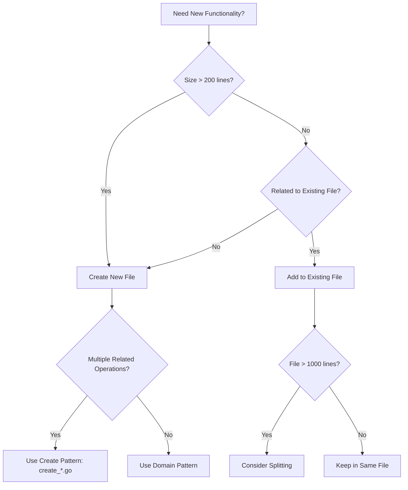
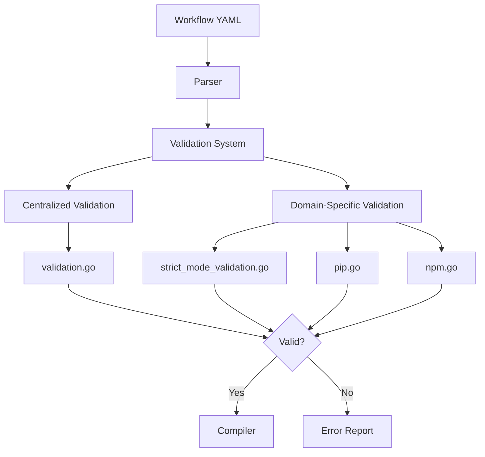
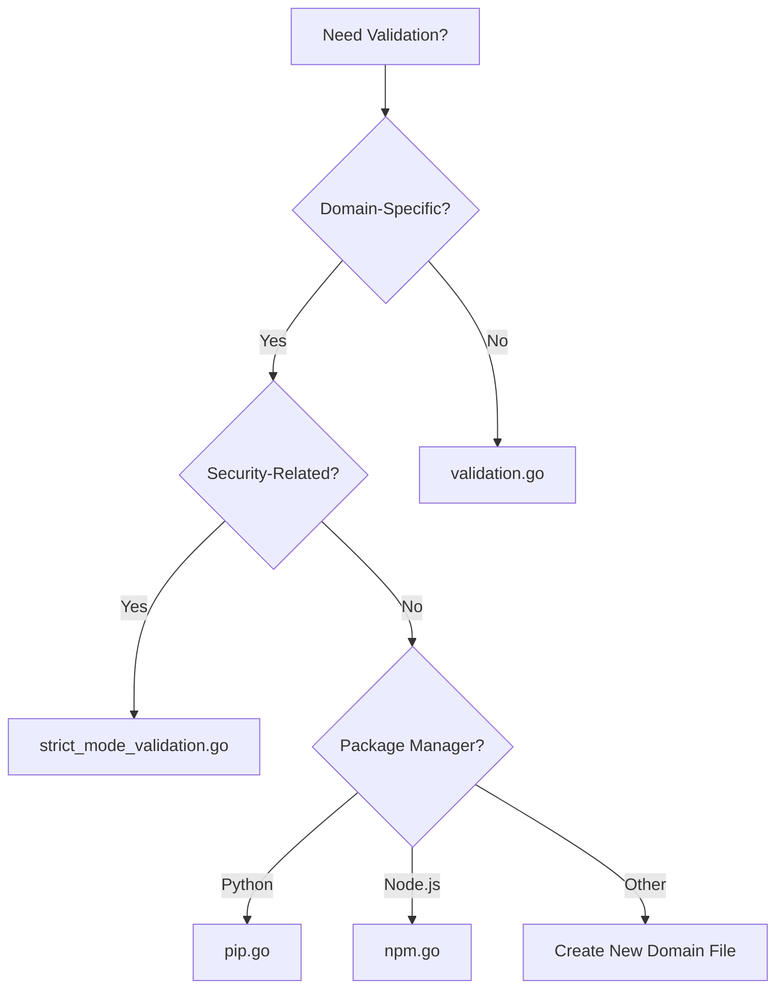
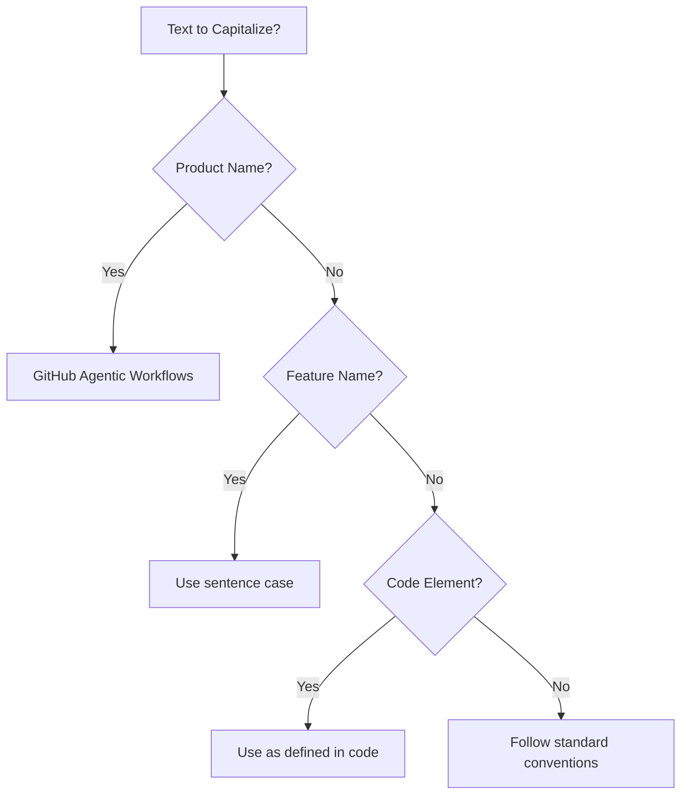
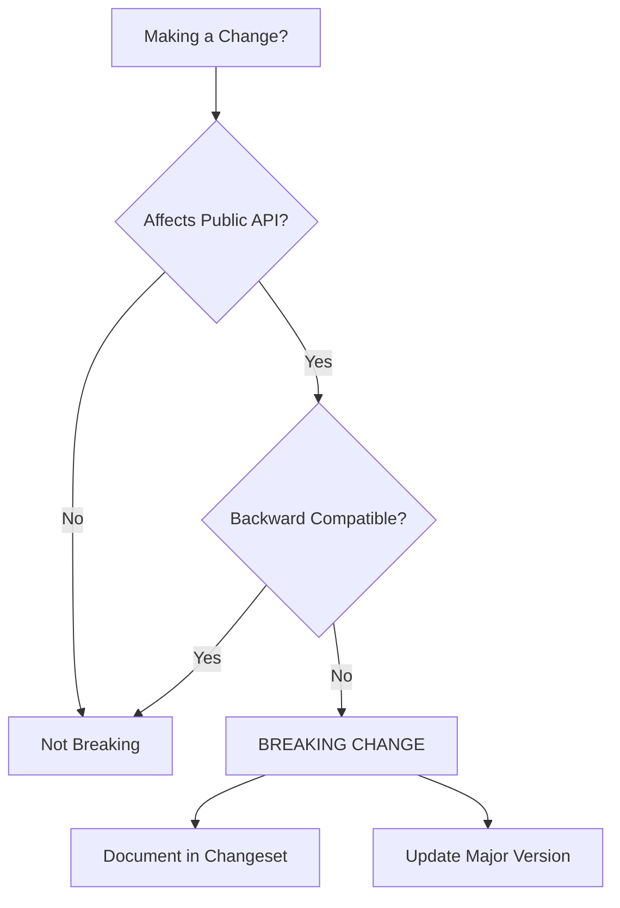
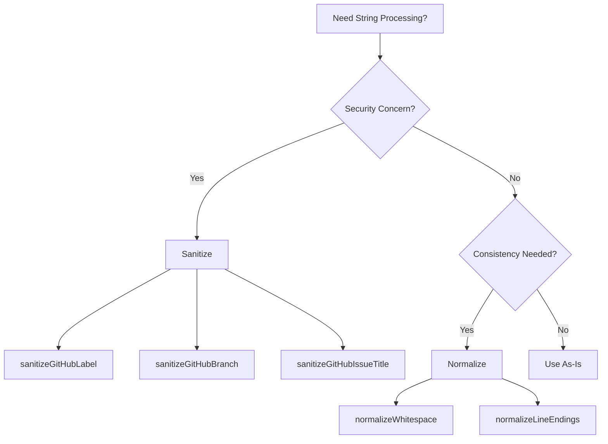
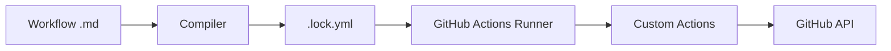
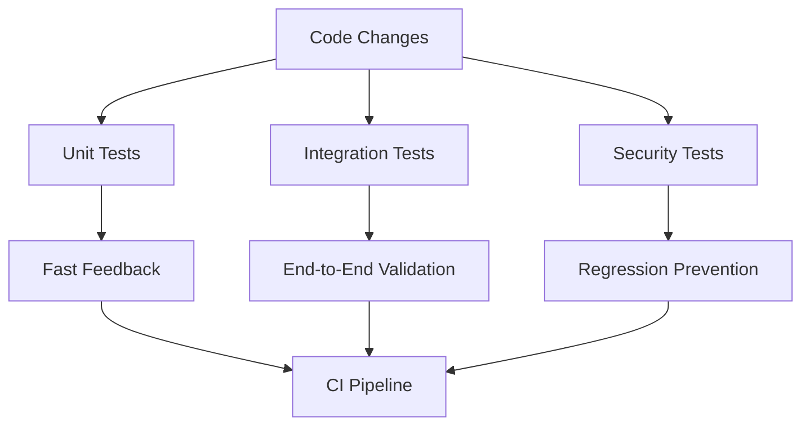
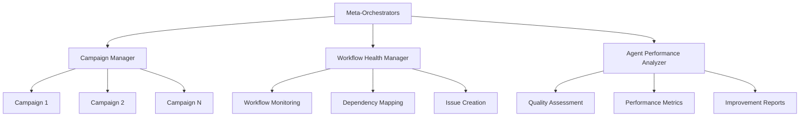

# Developer Instructions

This document consolidates development guidelines, architectural patterns, and implementation standards for GitHub Agentic Workflows. It provides comprehensive guidance for contributing to the codebase while maintaining consistency, security, and code quality.

## Table of Contents

- [Code Organization Patterns](#code-organization-patterns)
- [Validation Architecture](#validation-architecture)
- [Development Standards](#development-standards)
- [String Processing](#string-processing)
- [YAML Handling](#yaml-handling)
- [Safe Output Messages](#safe-output-messages)
- [Custom GitHub Actions](#custom-github-actions)
- [Security Best Practices](#security-best-practices)
- [Testing Framework](#testing-framework)
- [Repo-Memory System](#repo-memory-system)
- [Hierarchical Agent Management](#hierarchical-agent-management)
- [GitHub Actions Cost Estimation](#github-actions-cost-estimation)
- [Release Management](#release-management)
- [Quick Reference](#quick-reference)

---

## Code Organization Patterns

### Recommended Patterns

The codebase exhibits several well-organized patterns that should be emulated:

#### 1. Create Functions Pattern (`create_*.go`)

**Pattern**: One file per GitHub entity creation operation

**Examples**:
- `create_issue.go` - GitHub issue creation logic
- `create_pull_request.go` - Pull request creation logic
- `create_discussion.go` - Discussion creation logic
- `create_code_scanning_alert.go` - Code scanning alert creation
- `create_agent_task.go` - Agent task creation logic

**Why it works**:
- Clear separation of concerns
- Enables quick location of specific functionality
- Prevents files from becoming too large
- Facilitates parallel development
- Makes testing straightforward

#### 2. Engine Separation Pattern

**Pattern**: Each AI engine has its own file with shared helpers in `engine_helpers.go`

**Examples**:
- `copilot_engine.go` (971 lines) - GitHub Copilot engine
- `claude_engine.go` (340 lines) - Claude engine
- `codex_engine.go` (639 lines) - Codex engine
- `custom_engine.go` (300 lines) - Custom engine support
- `engine_helpers.go` (424 lines) - Shared engine utilities

**Why it works**:
- Engine-specific logic is isolated
- Shared code is centralized
- Allows addition of new engines without affecting existing ones
- Clear boundaries reduce merge conflicts

#### 3. Test Organization Pattern

**Pattern**: Tests live alongside implementation files with descriptive names

**Examples**:
- Feature tests: `feature.go` + `feature_test.go`
- Integration tests: `feature_integration_test.go`
- Specific scenario tests: `feature_scenario_test.go`

**Why it works**:
- Tests are co-located with implementation
- Clear test purpose from filename
- Encourages comprehensive testing
- Separates integration from unit tests

### File Creation Decision Tree



### File Size Guidelines

- **Small (50-200 lines)**: Utilities, helpers, simple features
- **Medium (200-500 lines)**: Domain-specific logic, focused features
- **Large (500-1000 lines)**: Complex features, comprehensive implementations
- **Very Large (1000+ lines)**: Consider splitting if not cohesive

**Implementation**: See specs/code-organization.md for complete guidelines

---

## Validation Architecture

The validation system ensures workflow configurations are correct, secure, and compatible with GitHub Actions before compilation. Validation is organized into two main patterns:

1. **Centralized validation** - General-purpose validation in `validation.go`
2. **Domain-specific validation** - Specialized validation in dedicated files

### Validation Flow



### Centralized Validation: `validation.go`

**Location**: `pkg/workflow/validation.go` (782 lines)

**Purpose**: General-purpose validation that applies across the entire workflow system

**Key Validation Functions**:
- `validateExpressionSizes()` - Ensures GitHub Actions expression size limits
- `validateContainerImages()` - Verifies Docker images exist and are accessible
- `validateRuntimePackages()` - Validates runtime package dependencies
- `validateGitHubActionsSchema()` - Validates against GitHub Actions YAML schema
- `validateNoDuplicateCacheIDs()` - Ensures unique cache identifiers
- `validateSecretReferences()` - Validates secret reference syntax
- `validateRepositoryFeatures()` - Checks repository capabilities (issues, discussions)

### Domain-Specific Validation

#### Strict Mode Validation: `strict_mode_validation.go`

**Purpose**: Enforces security and safety constraints in strict mode

**Validation Functions**:
- `validateStrictMode()` - Main strict mode orchestrator
- `validateStrictPermissions()` - Refuses write permissions
- `validateStrictNetwork()` - Requires explicit network configuration
- `validateStrictMCPNetwork()` - Requires network config on custom MCP servers
- `validateStrictBashTools()` - Refuses bash wildcard tools

#### Package Validation

- **Python/pip**: `pip.go` - Validates Python package availability on PyPI
- **Node.js/npm**: `npm.go` - Validates npm packages used with npx

### Where to Add Validation



**Implementation**: See specs/validation-architecture.md for complete architecture

---

## Development Standards

### Capitalization Guidelines



**Rules**:
- **Product Name**: "GitHub Agentic Workflows" (always capitalize)
- **Feature Names**: Use sentence case (e.g., "safe output messages")
- **File Names**: Use lowercase with hyphens (e.g., `code-organization.md`)
- **Code Elements**: Follow language conventions (e.g., `camelCase` in JavaScript, `snake_case` in Python)

**Implementation**: See specs/capitalization.md and `cmd/gh-aw/capitalization_test.go`

### Breaking Change Rules



**Breaking Changes**:
- Removing or renaming CLI commands, flags, or options
- Changing default behavior that users depend on
- Removing support for configuration formats
- Changing exit codes or error messages that tools parse

**Non-Breaking Changes**:
- Adding new optional flags or commands
- Adding new output formats
- Internal refactoring with same external behavior
- Adding new features that don't affect existing functionality

**Implementation**: See specs/breaking-cli-rules.md for complete rules

---

## String Processing

### Sanitize vs Normalize



**Sanitize**: Remove or replace characters that could cause security issues or break GitHub API constraints

**Key Functions**:
- `sanitizeGitHubLabel()` - Ensures labels meet GitHub requirements (no emoji, length limits)
- `sanitizeGitHubBranch()` - Validates branch names against Git ref rules
- `sanitizeGitHubIssueTitle()` - Ensures issue titles don't contain problematic characters

**Normalize**: Standardize format for consistency without security implications

**Key Functions**:
- `normalizeWhitespace()` - Standardizes whitespace (spaces, tabs, newlines)
- `normalizeLineEndings()` - Converts CRLF to LF
- `normalizeMarkdown()` - Standardizes markdown formatting

**Implementation**: See specs/string-sanitization-normalization.md and `pkg/workflow/strings.go`

---

## YAML Handling

### YAML 1.1 vs 1.2 Gotchas

**Critical Issue**: GitHub Actions uses YAML 1.1, but many Go YAML libraries default to YAML 1.2

**Key Differences**:
- `on` keyword: YAML 1.1 treats as boolean `true`, YAML 1.2 treats as string
- `yes`/`no`: YAML 1.1 treats as booleans, YAML 1.2 treats as strings
- Octal numbers: Different parsing rules

**Solution**: Use `goccy/go-yaml` library which supports YAML 1.1

```go
import "github.com/goccy/go-yaml"

// Correct YAML 1.1 parsing
var workflow map[string]interface{}
err := yaml.Unmarshal(data, &workflow)
```

**Affected Keywords**:
- Workflow triggers: `on`, `push`, `pull_request`
- Boolean values: `yes`, `no`, `true`, `false`, `on`, `off`
- Null values: `null`, `~`

**Implementation**: See specs/yaml-version-gotchas.md and `pkg/workflow/compiler.go`

---

## Safe Output Messages

The safe output message system provides structured communication between AI agents and GitHub API operations.

### Message Categories

| Category | Purpose | Footer | Example |
|----------|---------|--------|---------|
| **Issues** | Create/update issues | With issue number | `> AI generated by [Workflow](url) for #123` |
| **Pull Requests** | Create/update PRs | With PR number | `> AI generated by [Workflow](url) for #456` |
| **Discussions** | Create discussions | With discussion number | `> AI generated by [Workflow](url)` |
| **Comments** | Add comments | Context-aware | `> AI generated by [Workflow](url) for #123` |

### Staged Mode Indicator

The 🎭 emoji consistently marks preview mode across all safe output types, enabling clear distinction between test runs and live operations.

### Message Structure

```yaml
safe_outputs:
  create_issue:
    title: "Issue title"
    body: |
      ## Description

      Content here

      ---
      > AI generated by [WorkflowName](run_url)
```

**Implementation**: See specs/safe-output-messages.md and `pkg/workflow/safe_outputs.go`

---

## Custom GitHub Actions

### Architecture



### Build System

The custom actions build system is **entirely implemented in Go** in `pkg/cli/actions_build_command.go`. There are no JavaScript build scripts.

**Key Commands**:
- `make actions-build` - Build all custom actions
- `make actions-validate` - Validate action configuration
- `make actions-clean` - Clean build artifacts

**Directory Structure**:
```
actions/
└── setup/
    ├── action.yml
    ├── setup.sh
    ├── js/
    └── sh/
```

**Implementation**: See specs/actions.md and `pkg/cli/actions_build_command.go`

---

## Security Best Practices

### Template Injection Prevention

**Key Rule**: Never directly interpolate user input into GitHub Actions expressions or shell commands

**Vulnerable Pattern**:
```yaml
# ❌ UNSAFE - User input in expression
- run: echo "Title: ${{ github.event.issue.title }}"
```

**Safe Pattern**:
```yaml
# ✅ SAFE - Use environment variables
- env:
    TITLE: ${{ github.event.issue.title }}
  run: echo "Title: ${TITLE}"
```

### GitHub Actions Security

**Best Practices**:
- Always pin actions to specific commit SHAs, not tags
- Use minimal permissions with `permissions:` block
- Validate all external inputs
- Never log secrets or tokens
- Use GitHub's OIDC for cloud authentication

**Example**:
```yaml
permissions:
  contents: read
  issues: write
  pull-requests: write

steps:
  - uses: actions/checkout@a1b2c3d4... # Pinned SHA
```

**Implementation**: See specs/github-actions-security-best-practices.md and specs/template-injection-prevention.md

---

## Testing Framework

### Test Strategy



### Test Types

| Test Type | Purpose | Location | Run Frequency |
|-----------|---------|----------|---------------|
| **Unit Tests** | Test individual functions | `*_test.go` | Every commit |
| **Integration Tests** | Test component interactions | `*_integration_test.go` | Pre-merge |
| **Security Regression Tests** | Prevent security issues | `security_regression_test.go` | Every commit |
| **Fuzz Tests** | Find edge cases | `*_fuzz_test.go` | Continuous |
| **Benchmark Tests** | Performance tracking | `*_benchmark_test.go` | Pre-release |

### Test Maintenance

The testing framework is designed to be:
- **Self-validating**: The validation script ensures all tests work correctly
- **Comprehensive**: Covers all aspects of functionality and interface design
- **Maintainable**: Clear structure and documentation for future updates
- **Scalable**: Tests can be added incrementally as functionality is implemented
- **Security-focused**: Security regression tests prevent reintroduction of vulnerabilities

### Visual Regression Testing

Visual regression tests ensure console output formatting remains consistent across code changes. The system uses golden files to capture expected output for table layouts, box rendering, tree structures, and error formatting.

**Golden Test Commands**:
```bash
# Run golden tests
go test -v ./pkg/console -run='^TestGolden_'

# Update golden files (only when intentionally changing output)
make update-golden
```

**Test Coverage**:
- Table rendering with various configurations
- Box formatting with different widths and content
- Tree structures for hierarchical data
- Error messages with context and suggestions
- Message formatting (success, info, warning, error)
- Layout composition and emphasis boxes

**When to Update Golden Files**:
- ✅ Intentionally improving console output formatting
- ✅ Fixing visual bugs in rendering
- ✅ Adding new columns or fields to tables
- ❌ Tests fail unexpectedly during development
- ❌ Making unrelated code changes

**Implementation**: See specs/visual-regression-testing.md and `pkg/console/golden_test.go`

---

## Repo-Memory System

The repo-memory feature provides persistent, git-backed storage for AI agents across workflow runs. Agents can maintain state, notes, and artifacts in dedicated git branches with automatic synchronization.

### Architecture Overview

```mermaid
graph TD
    A[Agent Job Start] --> B[Clone memory/{id} branch]
    B --> C[Agent reads/writes files]
    C --> D[Upload artifact: repo-memory-{id}]
    D --> E[Push Repo Memory Job]
    E --> F[Download artifact]
    F --> G[Validate files]
    G --> H[Commit to memory/{id}]
    H --> I[Push to repository]
```

### Path Conventions

| Pattern | Format | Example | Purpose |
|---------|--------|---------|---------|
| **Memory Directory** | `/tmp/gh-aw/repo-memory/{id}` | `/tmp/gh-aw/repo-memory/default` | Runtime directory for agent |
| **Artifact Name** | `repo-memory-{id}` | `repo-memory-default` | GitHub Actions artifact |
| **Branch Name** | `memory/{id}` | `memory/default` | Git branch for storage |

### Data Flow

1. **Clone Phase**: Clones `memory/{id}` branch to local directory
2. **Execution Phase**: Agent reads/writes files in memory directory
3. **Upload Phase**: Uploads directory as GitHub Actions artifact
4. **Download Phase**: Downloads artifact and validates constraints
5. **Push Phase**: Commits files to `memory/{id}` branch and pushes

### Key Configuration

```yaml
repo-memory:
  - id: default
    create-orphan: true
    allow-artifacts: true

  - id: campaigns
    create-orphan: true
    max-file-size: 1MB
    max-files: 100
```

**Validation Constraints**:
- Maximum file size limits
- Maximum file count limits
- Allowed/blocked file patterns
- Size and count tracking in commit messages

**Implementation**: See specs/repo-memory.md and `pkg/workflow/repo_memory.go`

---

## Hierarchical Agent Management

The hierarchical agent system provides meta-orchestration capabilities to manage multiple agents and workflows at scale. Specialized meta-orchestrator workflows oversee, coordinate, and optimize the agent ecosystem.

### Meta-Orchestrator Architecture



### Meta-Orchestrator Roles

| Role | File | Purpose | Schedule |
|------|------|---------|----------|
| **Campaign Manager** | `campaign-manager.md` | Strategic management of campaigns | Daily |
| **Workflow Health Manager** | `workflow-health-manager.md` | Monitor workflow health | Daily |
| **Agent Performance Analyzer** | `agent-performance-analyzer.md` | Analyze agent quality | Daily |

**Key Capabilities**:
- Cross-campaign coordination
- Workflow health monitoring
- Performance trend analysis
- Strategic priority management
- Proactive maintenance
- Quality assessment

**Implementation**: See specs/agents/hierarchical-agents.md and `.github/workflows/` meta-orchestrator files

---

## GitHub Actions Cost Estimation

The cost estimation system helps users understand resource consumption before deploying scheduled automation, enabling informed decisions about workflow frequency and tool usage.

### When to Include Cost Estimation

Cost estimation tables should be included for:

- **Scheduled workflows** that run on cron schedules (`on: schedule`)
- **High-frequency workflows** (hourly, daily, multiple times per day)
- **Workflows using expensive tools** (Playwright, extensive file operations)
- **Documentation examples** demonstrating scheduled automation
- **Any workflow** where monthly minutes usage may approach or exceed the free tier

Cost estimation is optional for:

- Event-driven workflows (triggered by issues, PRs, pushes)
- Manual workflows (`workflow_dispatch` only)
- One-time or rarely-executed automation

### Cost Estimation Architecture

```mermaid
graph TD
    A[Workflow Definition] --> B[Base Execution Time]
    A --> C[Tool Multipliers]
    A --> D[Schedule Frequency]
    
    B --> E[Simple: 2min]
    B --> F[Medium: 3-5min]
    B --> G[Complex: 5-10min]
    
    C --> H[Playwright: +5min]
    C --> I[repo-memory: +1min]
    C --> J[Network APIs: +2min]
    
    D --> K[Hourly: 720/month]
    D --> L[Daily: 30/month]
    D --> M[Weekly: 4/month]
    
    B --> N[Monthly Cost Calculation]
    C --> N
    D --> N
    
    N --> O{Free Tier Check}
    O -->|< 1,500 min| P[✅ Acceptable]
    O -->|1,500-2,000 min| Q[⚠️ Monitor]
    O -->|> 2,000 min| R[❌ Optimization Required]
```



### Cost Estimation Formula

```
Monthly Minutes = (Base Time + Tool Overhead) × Schedule Frequency
Free Tier Impact = (Monthly Minutes / 2,000) × 100%
```

**Base Execution Time**:
- Simple workflows (basic API calls): ~2 minutes
- Medium workflows (data processing): ~3-5 minutes
- Complex workflows (extensive analysis): ~5-10 minutes

**Tool Multipliers**:
| Tool/Feature | Additional Minutes | Reason |
|--------------|-------------------|--------|
| Playwright | +5 minutes | Browser automation containerization |
| repo-memory | +1 minute | Git branch operations |
| Network API calls | +2 minutes | External HTTP requests |
| cache-memory | +0.5 minutes | Artifact operations |
| Multiple MCP servers (3+) | +1-2 minutes | Tool initialization overhead |
| File processing (large repos) | +2-3 minutes | Checkout and scanning |

**Schedule Frequencies**:
| Schedule | Runs/Month | Example Cron |
|----------|------------|--------------|
| Hourly | 720 | `"0 * * * *"` |
| Every 6 hours | 120 | `"0 */6 * * *"` |
| Daily | 30 | `"0 2 * * *"` |
| Weekdays only | 22 | `"0 2 * * 1-5"` |
| Weekly | 4 | `"0 2 * * 1"` |

### Cost Table Template

Include this table in workflow documentation:

```markdown
## Estimated Cost

- **Base execution time**: ~X minutes per run
- **Tool overhead**: +Y minutes (list tools)
- **Total per run**: ~(X+Y) minutes
- **Schedule**: [Frequency] (N runs/month)
- **Monthly total**: ~Z minutes (~H hours)
- **Free tier impact**: P% of free tier

### Free Tier Comparison

- **Public repositories**: 2,000 minutes/month (free tier)
- **This workflow**: Z minutes/month
- **Status**: ✅ Within free tier / ⚠️ Exceeds free tier
```

### Example: Hourly Monitoring

```markdown
## Estimated Cost

- **Base execution time**: ~3 minutes per run
- **Tool overhead**: +2 minutes (network API calls)
- **Total per run**: ~5 minutes
- **Schedule**: Hourly (720 runs/month)
- **Monthly total**: ~3,600 minutes (~60 hours)
- **Free tier impact**: 180% (exceeds free tier by 1,600 minutes)

### Optimization Suggestions

⚠️ **This workflow exceeds the free tier.** Consider:

1. **Reduce frequency**: Hourly → Every 6 hours (saves 2,400 min/month)
2. **Use path filters**: Skip runs when files unchanged
3. **Add pre-activation checks**: Exit early when no work needed
```

### Optimization Strategies

When monthly usage exceeds 1,500 minutes (75% of free tier):

**1. Reduce Frequency**:
- Hourly → Every 6 hours (saves 80% of runs)
- Daily → Weekdays only (saves 25% of runs)
- Consider business hours only

**2. Add Conditional Execution**:
```yaml
pre-activation:
  - name: Check if work needed
    run: |
      if [ no_changes_detected ]; then
        echo "Skipping workflow"
        exit 1
      fi
```

**3. Use Path Filters**:
```yaml
on:
  schedule:
    - cron: "0 * * * *"
  push:
    paths:
      - 'src/**'
      - 'config/**'
```

**4. Optimize Tool Usage**:
- Parallel jobs instead of sequential
- Cache dependencies
- Set `timeout-minutes` to prevent runaway jobs
- Batch network calls

**5. Alternative Triggers**:
- Replace schedule with webhook events
- Use `repository_dispatch` for external triggers
- Implement manual review gates

### Cost Tracking

Monitor actual usage:

```bash
gh aw logs --workflow [name] --stats
```

Provides:
- Average execution time
- Token usage
- Actual cost per run
- Monthly projection

### Agent Guidelines

When creating scheduled workflows:

1. **Always calculate cost** using the formula above
2. **Include cost table** in workflow documentation
3. **Add optimization suggestions** when monthly usage exceeds 1,500 minutes
4. **Consider weekday-only schedules** for business workflows
5. **Recommend monitoring** for workflows approaching free tier limits
6. **Test with lower frequency** initially before increasing

**Implementation**: See examples/cost-estimation-table.md for detailed templates and examples

---

## Release Management

### Changesets

Use changesets to document changes and manage versioning:

```bash
# Create a changeset
npx changeset

# Release new version
npx changeset version
npx changeset publish
```

**Changeset Format**:
```markdown
---
"gh-aw": patch
---

Brief description of the change
```

**Version Types**:
- **major**: Breaking changes
- **minor**: New features (backward compatible)
- **patch**: Bug fixes and minor improvements

### End-to-End Feature Testing

For manual feature testing in pull requests:

1. Use `.github/workflows/dev.md` as test workflow
2. Add test scenarios as comments in PR
3. Dev Hawk will analyze and verify behavior
4. Do not merge dev.md changes - it remains a reusable test harness

**Implementation**: See specs/changesets.md and specs/end-to-end-feature-testing.md

---

## Quick Reference

### File Locations

| Feature | Implementation File | Test File |
|---------|-------------------|-----------|
| Validation | `pkg/workflow/validation.go` | `pkg/workflow/validation_test.go` |
| Safe Outputs | `pkg/workflow/safe_outputs.go` | `pkg/workflow/safe_outputs_test.go` |
| String Processing | `pkg/workflow/strings.go` | `pkg/workflow/strings_test.go` |
| Actions Build | `pkg/cli/actions_build_command.go` | `pkg/cli/actions_build_command_test.go` |
| Schema Validation | `pkg/parser/schemas/` | Various test files |

### Common Patterns

**Creating a new GitHub entity handler**:
1. Create `create_<entity>.go` in `pkg/workflow/`
2. Implement `Create<Entity>()` function
3. Add validation in `validation.go` or domain-specific file
4. Create corresponding test file
5. Update safe output messages

**Adding new validation**:
1. Determine if centralized or domain-specific
2. Add validation function in appropriate file
3. Call from main validation orchestrator
4. Add tests for valid and invalid cases
5. Document validation rules

**Adding new engine**:
1. Create `<engine>_engine.go` in `pkg/workflow/`
2. Implement engine interface
3. Use `engine_helpers.go` for shared functionality
4. Add engine-specific tests
5. Register engine in engine factory

---

## Additional Documentation

For detailed specifications, see individual files in `specs/`:

### Architecture & Organization
- [Code Organization Patterns](../../specs/code-organization.md)
- [Validation Architecture](../../specs/validation-architecture.md)
- [Layout System](../../specs/layout.md)
- [Go Type Patterns](../../specs/go-type-patterns.md)

### Core Features
- [Safe Output Messages Design](../../specs/safe-output-messages.md)
- [Repo-Memory System](../../specs/repo-memory.md)
- [MCP Gateway](../../specs/mcp-gateway.md)
- [MCP Logs Guardrails](../../specs/mcp_logs_guardrails.md)
- [Custom Actions Build](../../specs/actions.md)

### Testing & Quality
- [Testing Framework](../../specs/testing.md)
- [Visual Regression Testing](../../specs/visual-regression-testing.md)
- [End-to-End Feature Testing](../../specs/end-to-end-feature-testing.md)
- [Security Review](../../specs/security_review.md)
- [GoSec Integration](../../specs/gosec.md)

### Security & Standards
- [GitHub Actions Security](../../specs/github-actions-security-best-practices.md)
- [Template Injection Prevention](../../specs/template-injection-prevention.md)
- [String Sanitization](../../specs/string-sanitization-normalization.md)
- [Schema Validation](../../specs/schema-validation.md)

### Development Guidelines
- [Capitalization Guidelines](../../specs/capitalization.md)
- [Breaking Change Rules](../../specs/breaking-cli-rules.md)
- [CLI Command Patterns](../../specs/cli-command-patterns.md)
- [Styles Guide](../../specs/styles-guide.md)
- [Changesets](../../specs/changesets.md)
- [Labels](../../specs/labels.md)
- [GitHub Actions Cost Estimation](examples/cost-estimation-table.md)

### Advanced Topics
- [Hierarchical Agents](../../specs/agents/hierarchical-agents.md)
- [Hierarchical Agents Quickstart](../../specs/agents/hierarchical-agents-quickstart.md)
- [Gastown Multi-Agent Orchestration](../../specs/gastown.md)
- [mdflow Comparison](../../specs/mdflow-comparison.md)
- [mdflow Deep Research](../../specs/mdflow.md)

### Technical Details
- [YAML Version Gotchas](../../specs/yaml-version-gotchas.md)
- [Validation Refactoring](../../specs/validation-refactoring.md)
- [Workflow Refactoring Patterns](../../specs/workflow-refactoring-patterns.md)
- [Safe Output Handlers Refactoring](../../specs/safe-output-handlers-refactoring.md)
- [Artifact Naming Compatibility](../../specs/artifact-naming-compatibility.md)
- [Safe Output Environment Variables](../../specs/safe-output-environment-variables.md)

---

**Last Updated**: 2026-01-16
