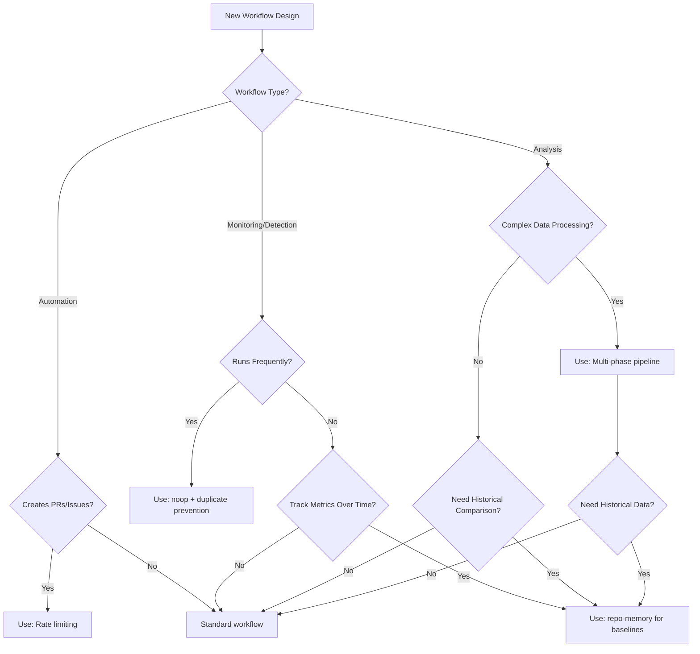

# Proven High-Impact Agentic Workflow Patterns

This document catalogs proven patterns from high-scoring research scenarios (5.0/5.0 rating) that consistently deliver exceptional value. These patterns are battle-tested, team-friendly, and should be considered for new workflows requiring similar capabilities.

## Pattern Selection Decision Tree



## Pattern 1: Repo-Memory for Baselines

**Rating**: ⭐⭐⭐⭐⭐ (Used in 4/11 high-scoring scenarios)

### What It Does

Stores baseline metrics in persistent git-backed storage, compares new measurements against historical data, and detects regressions or improvements over time.

### When to Use

- **Performance monitoring** - Track API response times, build speeds, test durations
- **Visual regression testing** - Compare screenshots across commits
- **Flaky test detection** - Track test failure patterns over 30+ days
- **Cost analysis** - Monitor resource usage trends
- **Quality metrics** - Track code coverage, linting violations over time

### When NOT to Use

- One-time analysis without historical comparison needs
- Workflows that don't require trend detection
- Short-lived experiments (use cache-memory instead for 7-day retention)

### Code Example

```yaml
# Workflow frontmatter (single repo-memory)
tools:
  repo-memory:
    branch-name: memory/performance-baselines
    create-orphan: true
  cache-memory: true

# Multiple repo-memory (using array format with id)
tools:
  repo-memory:
    - id: performance
      branch-name: memory/performance
    - id: baselines
      branch-name: memory/baselines

# In workflow instructions:
# 1. Load baseline from repo-memory
# 2. Run current measurement
# 3. Compare and detect regressions
# 4. Update baseline in repo-memory
```

```bash
# Example agent implementation (single repo-memory at /tmp/gh-aw/repo-memory/default/)
BASELINE_FILE="/tmp/gh-aw/repo-memory/default/api-response-times.json"

# Load baseline (or create if first run)
if [ -f "$BASELINE_FILE" ]; then
  BASELINE=$(cat "$BASELINE_FILE" | jq '.avg_response_ms')
else
  BASELINE=0
fi

# Measure current performance
CURRENT=$(curl -w "%{time_total}" -s -o /dev/null https://api.example.com/endpoint)

# Compare and detect regression
if [ "$CURRENT" -gt "$(echo "$BASELINE * 1.2" | bc)" ]; then
  echo "⚠️ Performance regression: ${CURRENT}ms vs baseline ${BASELINE}ms"
  # Create issue via safe-outputs
fi

# Update baseline
echo "{\"avg_response_ms\": $CURRENT, \"updated\": \"$(date -I)\"}" > "$BASELINE_FILE"
```

### Real-World Example

**API Performance Monitor (BE-2)**: Tracks response times for 30 days, detects >20% regressions, creates issues with historical charts. Repo-memory stores daily measurements in `/performance-baselines/api-metrics.json`.

### Benefits

- ✅ Unlimited retention (vs 7 days for cache-memory)
- ✅ Git history provides audit trail
- ✅ Multiple workflows can share baselines
- ✅ Data survives cache expiration

---

## Pattern 2: Noop for Healthy States

**Rating**: ⭐⭐⭐⭐⭐ (Prevents issue spam)

### What It Does

Produces a "no operation" completion message when monitoring detects no problems, avoiding silent workflow runs while preventing unnecessary issue creation.

### When to Use

- **Monitoring workflows** running hourly/daily
- **Health checks** that usually succeed
- **Compliance scanners** where violations are rare
- **Scheduled audits** with infrequent findings
- Any workflow where "nothing wrong" is the common case

### When NOT to Use

- Workflows that always produce actionable output
- One-time analysis tasks
- Workflows that must create issues/PRs on every run

### Code Example

```yaml
# Workflow frontmatter (noop is enabled by default when create-issue is present)
safe-outputs:
  create-issue:
    max: 3
  # noop: true  # Enabled automatically, but can be explicitly set
```

```bash
# Example agent implementation
ISSUES_FOUND=$(security-scan --quiet | wc -l)

if [ "$ISSUES_FOUND" -eq 0 ]; then
  # No problems detected - use noop to log completion
  echo '{"type": "noop", "message": "Security scan complete - no vulnerabilities found"}' | gh aw safe-output
  exit 0
fi

# Create issues only when problems exist
for issue in $(security-scan --format=json); do
  echo "$issue" | gh aw safe-output
done
```

### Real-World Example

**Deployment Monitor (DO-1)**: Runs after every deployment, only creates issues when failures detected. Uses noop for successful deployments to maintain transparency without spam.

### Benefits

- ✅ Prevents "silent success" confusion
- ✅ Workflow conclusion shows completion message
- ✅ Maintains audit trail without issue spam
- ✅ Team-friendly - only interrupts when needed

---

## Pattern 3: Rate Limiting for Automated PRs

**Rating**: ⭐⭐⭐⭐⭐ (Team-friendly automation)

### What It Does

Limits automated PR creation to N per day/week, prioritizing by severity (CVSS score, impact level), to prevent overwhelming the team with automated changes.

### When to Use

- **Security scanners** creating fix PRs
- **Dependency updates** (like Renovate/Dependabot)
- **Code modernization** tools
- **Linting/formatting** auto-fixes
- Any automation that generates multiple PRs

### When NOT to Use

- Critical security hotfixes (bypass rate limits)
- Manual workflow_dispatch runs
- Workflows creating 1-2 PRs maximum
- User-triggered operations

### Code Example

```yaml
# Workflow frontmatter
safe-outputs:
  create-pull-request:
    max: 3  # Daily limit
    labels: [automated, security-fix]

tools:
  cache-memory: true  # Track PR count across runs
```

```bash
# Example agent implementation
CACHE_FILE="/tmp/gh-aw/cache-memory/pr-count.json"
TODAY=$(date -I)

# Load daily PR count
if [ -f "$CACHE_FILE" ]; then
  CACHED_DATE=$(jq -r '.date' "$CACHE_FILE")
  if [ "$CACHED_DATE" = "$TODAY" ]; then
    PR_COUNT=$(jq -r '.count' "$CACHE_FILE")
  else
    PR_COUNT=0  # Reset for new day
  fi
else
  PR_COUNT=0
fi

# Sort vulnerabilities by CVSS score (highest first)
VULNS=$(scan-results --format=json | jq -s 'sort_by(-.cvss_score)')

# Create PRs up to daily limit, prioritizing by severity
echo "$VULNS" | jq -c '.[]' | while IFS= read -r vuln && [ "$PR_COUNT" -lt 3 ]; do
  echo "$vuln" | gh aw safe-output --type=create-pull-request
  PR_COUNT=$((PR_COUNT + 1))
done

# Save updated count
echo "{\"date\": \"$TODAY\", \"count\": $PR_COUNT}" > "$CACHE_FILE"

# Log remaining items
REMAINING=$(($(echo "$VULNS" | jq 'length') - PR_COUNT))
if [ "$REMAINING" -gt 0 ]; then
  echo "⏳ $REMAINING vulnerabilities deferred to next run (daily limit: 3 PRs)"
fi
```

### Real-World Example

**Security Scanner (DO-2)**: Scans dependencies daily, limits to 3 PRs/day prioritized by CVSS score. Tracks count in cache-memory, carries forward lower-priority fixes to next day.

### Benefits

- ✅ Prevents PR flood overwhelming reviewers
- ✅ Ensures critical issues addressed first
- ✅ Maintains team velocity
- ✅ Predictable review workload

---

## Pattern 4: Multi-Phase Analysis Pipelines

**Rating**: ⭐⭐⭐⭐⭐ (Complex statistical analysis)

### What It Does

Breaks complex analysis into distinct phases (data collection → processing → scoring → historical tracking → reporting), with clear separation of concerns and intermediate state persistence.

### When to Use

- **Statistical analysis** requiring multiple passes
- **Machine learning** workflows (train, evaluate, deploy)
- **Complex reporting** with aggregation and formatting
- **Research workflows** with exploration and validation phases
- Workflows where each phase has distinct logic/tools

### When NOT to Use

- Simple linear analysis (single pass sufficient)
- Workflows with tight timing requirements
- Tasks that don't benefit from phase separation

### Code Example

```yaml
# Workflow frontmatter
tools:
  cache-memory: true
  repo-memory:
    id: analysis-results
    create-orphan: true
```

```bash
# Phase 1: Data Collection
collect_data() {
  echo "Phase 1: Collecting test results..."
  gh api "/repos/$REPO/actions/runs?per_page=100" \
    | jq '.workflow_runs[] | {run_id, conclusion, created_at}' \
    > /tmp/gh-aw/cache-memory/raw-data.json
}

# Phase 2: Processing
process_data() {
  echo "Phase 2: Processing test results..."
  cat /tmp/gh-aw/cache-memory/raw-data.json \
    | jq -s 'group_by(.run_id) | map({
        test: .[0].name,
        failure_rate: (map(select(.conclusion == "failure")) | length) / length,
        recent_failures: map(select(.conclusion == "failure")) | length
      })' \
    > /tmp/gh-aw/cache-memory/processed.json
}

# Phase 3: Scoring Algorithm
score_results() {
  echo "Phase 3: Applying scoring algorithm..."
  cat /tmp/gh-aw/cache-memory/processed.json \
    | jq 'map(. + {
        flakiness_score: (
          (.failure_rate * 100) + 
          (.recent_failures * 10)
        )
      }) | sort_by(-.flakiness_score)' \
    > /tmp/gh-aw/cache-memory/scored.json
}

# Phase 4: Historical Tracking
track_history() {
  echo "Phase 4: Updating historical records..."
  HISTORY="/tmp/gh-aw/repo-memory/analysis-results/history.json"
  TODAY=$(date -I)
  
  # Merge with historical data
  jq -s '.[0] + {("'$TODAY'"): .[1]}' \
    "$HISTORY" /tmp/gh-aw/cache-memory/scored.json \
    > "$HISTORY.tmp" && mv "$HISTORY.tmp" "$HISTORY"
}

# Phase 5: Generate Report
generate_report() {
  echo "Phase 5: Generating report..."
  cat /tmp/gh-aw/cache-memory/scored.json \
    | jq -r '
      "# Flakiness Analysis Report\n\n" +
      "Date: " + (now | strftime("%Y-%m-%d")) + "\n\n" +
      "## Top 10 Flaky Tests\n\n" +
      (.[0:10] | map("- **\(.test)**: Score \(.flakiness_score) (Failure rate: \(.failure_rate * 100)%)") | join("\n"))
    ' > /tmp/gh-aw/cache-memory/report.md
}

# Phase 6: Create Issue
create_issue() {
  echo "Phase 6: Creating issue..."
  REPORT=$(cat /tmp/gh-aw/cache-memory/report.md)
  echo "{
    \"type\": \"create-issue\",
    \"title\": \"[flaky-tests] Weekly Flakiness Report\",
    \"body\": $(echo "$REPORT" | jq -Rs .)
  }" | gh aw safe-output
}

# Execute pipeline
collect_data
process_data
score_results
track_history
generate_report
create_issue
```

### Real-World Example

**Flaky Test Analyzer (QA-2)**: 6-phase pipeline collecting test results, calculating failure rates, applying scoring algorithm, tracking 30-day history, generating trend charts, and creating prioritized issues.

### Benefits

- ✅ Clear separation of concerns
- ✅ Debuggable intermediate state
- ✅ Reusable phase components
- ✅ Easier to extend/modify
- ✅ Testable in isolation

---

## Pattern 5: Smart Duplicate Prevention

**Rating**: ⭐⭐⭐⭐⭐ (30-day cache window)

### What It Does

Hashes issue content or incident data, maintains a 30-day cache of created issues/alerts, checks cache before creating new items to prevent spam from recurring problems.

### When to Use

- **Monitoring systems** detecting recurring incidents
- **Security scanners** finding same vulnerabilities
- **Compliance checkers** with persistent violations
- **Error tracking** for recurring bugs
- Any workflow that might detect the same problem multiple times

### When NOT to Use

- Issues that should be created on every occurrence
- Time-sensitive alerts requiring immediate notification
- Workflows running less than monthly
- When issue uniqueness is already guaranteed

### Code Example

```yaml
# Workflow frontmatter
tools:
  cache-memory: true

safe-outputs:
  create-issue:
    max: 5
```

```bash
# Example agent implementation
CACHE_FILE="/tmp/gh-aw/cache-memory/issue-hashes.json"
CACHE_DAYS=30

# Initialize cache if missing
if [ ! -f "$CACHE_FILE" ]; then
  echo '{"issues": []}' > "$CACHE_FILE"
fi

# Clean old entries (>30 days)
NOW=$(date +%s)
jq --arg now "$NOW" --arg days "$CACHE_DAYS" '
  .issues |= map(select(
    ($now | tonumber) - (.created | tonumber) < ($days | tonumber) * 86400
  ))
' "$CACHE_FILE" > "$CACHE_FILE.tmp" && mv "$CACHE_FILE.tmp" "$CACHE_FILE"

# Check if issue already exists
create_issue_if_new() {
  local title="$1"
  local body="$2"
  
  # Hash issue content for deduplication
  HASH=$(echo -n "$title$body" | sha256sum | cut -d' ' -f1)
  
  # Check if hash exists in cache
  if jq -e --arg hash "$HASH" '.issues[] | select(.hash == $hash)' "$CACHE_FILE" > /dev/null; then
    echo "⏭️ Skipping duplicate issue: $title (hash: ${HASH:0:8})"
    return
  fi
  
  # Create new issue
  echo "{
    \"type\": \"create-issue\",
    \"title\": \"$title\",
    \"body\": \"$body\"
  }" | gh aw safe-output
  
  # Add to cache
  jq --arg hash "$HASH" --arg now "$NOW" --arg title "$title" '
    .issues += [{
      "hash": $hash,
      "title": $title,
      "created": ($now | tonumber)
    }]
  ' "$CACHE_FILE" > "$CACHE_FILE.tmp" && mv "$CACHE_FILE.tmp" "$CACHE_FILE"
  
  echo "✅ Created new issue: $title"
}

# Example usage
scan_results | while IFS= read -r vuln; do
  TITLE="[Security] $(echo "$vuln" | jq -r '.title')"
  BODY="$(echo "$vuln" | jq -r '.description')"
  create_issue_if_new "$TITLE" "$BODY"
done
```

### Real-World Example

**Deployment Monitor (DO-1)** + **Security Scanner (DO-2)**: Hash incident details (deployment ID + error type) and vulnerability fingerprints, maintain 30-day cache. Skip creating issues for problems already reported in last month.

### Benefits

- ✅ Prevents issue spam from recurring problems
- ✅ Maintains signal-to-noise ratio
- ✅ Team stays focused on new issues
- ✅ Automatic cleanup after 30 days

---

## Pattern Combinations

Many high-scoring workflows combine multiple patterns:

### Example: Comprehensive Monitoring Workflow

```yaml
# Combines: repo-memory + noop + duplicate prevention
tools:
  repo-memory:
    id: monitoring-baselines
  cache-memory: true

safe-outputs:
  create-issue:
    max: 3
  noop: true  # Explicit for clarity
```

1. Load baseline from repo-memory
2. Run current checks
3. Compare against baseline
4. Check duplicate cache
5. Create issues only for new problems
6. Use noop if everything healthy
7. Update baseline and cache

### Example: Automated Fix Workflow

```yaml
# Combines: rate limiting + duplicate prevention
tools:
  cache-memory: true

safe-outputs:
  create-pull-request:
    max: 3
```

1. Scan for issues
2. Check duplicate cache (don't fix same issue twice)
3. Sort by priority
4. Create PRs up to daily limit
5. Track PR count in cache-memory

---

## Pattern Anti-Patterns (What NOT to Do)

### ❌ Don't: Create Issues for Every Run

```yaml
# BAD: No noop, creates issue even when healthy
safe-outputs:
  create-issue:
    max: 999  # Too high
```

**Fix**: Use noop pattern, set reasonable max (1-5)

### ❌ Don't: Unlimited Automated PRs

```yaml
# BAD: No rate limiting
safe-outputs:
  create-pull-request:
    max: 100  # Will overwhelm team
```

**Fix**: Use rate limiting pattern (max: 3-5 per day)

### ❌ Don't: Forget Duplicate Prevention

```bash
# BAD: Creates issue every time
for vuln in $(scan); do
  create_issue "$vuln"
done
```

**Fix**: Use duplicate prevention pattern with hash cache

### ❌ Don't: Monolithic Analysis Scripts

```bash
# BAD: Everything in one giant function
analyze_everything() {
  # 500 lines of mixed logic...
}
```

**Fix**: Use multi-phase pipeline pattern

### ❌ Don't: Discard Historical Data

```bash
# BAD: Only current measurement
CURRENT_VALUE=$(measure)
if [ "$CURRENT_VALUE" -gt 100 ]; then
  create_issue
fi
```

**Fix**: Use repo-memory for baselines pattern

---

## Quick Pattern Reference

| Pattern | Best For | Key Feature | Tools Needed |
|---------|----------|-------------|--------------|
| **Repo-Memory Baselines** | Performance tracking, regression detection | Unlimited retention, git history | `repo-memory` |
| **Noop for Healthy States** | Monitoring, health checks | Transparency without spam | `noop` (auto-enabled) |
| **Rate Limiting** | Automated PRs, dependency updates | Team-friendly automation | `cache-memory`, `max` limits |
| **Multi-Phase Pipelines** | Complex analysis, statistics | Clear separation of concerns | `cache-memory` for intermediate state |
| **Duplicate Prevention** | Recurring issues, monitoring | 30-day cache, hash-based | `cache-memory` |

---

## Sources & References

These patterns are extracted from high-scoring research scenarios:

- **BE-2**: API Performance Monitor (repo-memory for baselines)
- **DO-1**: Deployment Monitor (noop + duplicate prevention)
- **DO-2**: Security Scanner (rate limiting + duplicate prevention)
- **QA-2**: Flaky Test Analyzer (multi-phase pipeline + repo-memory)

Research discussion: [githubnext/gh-aw#10248](https://github.com/githubnext/gh-aw/discussions/10248)

---

**Last Updated**: 2026-01-17
