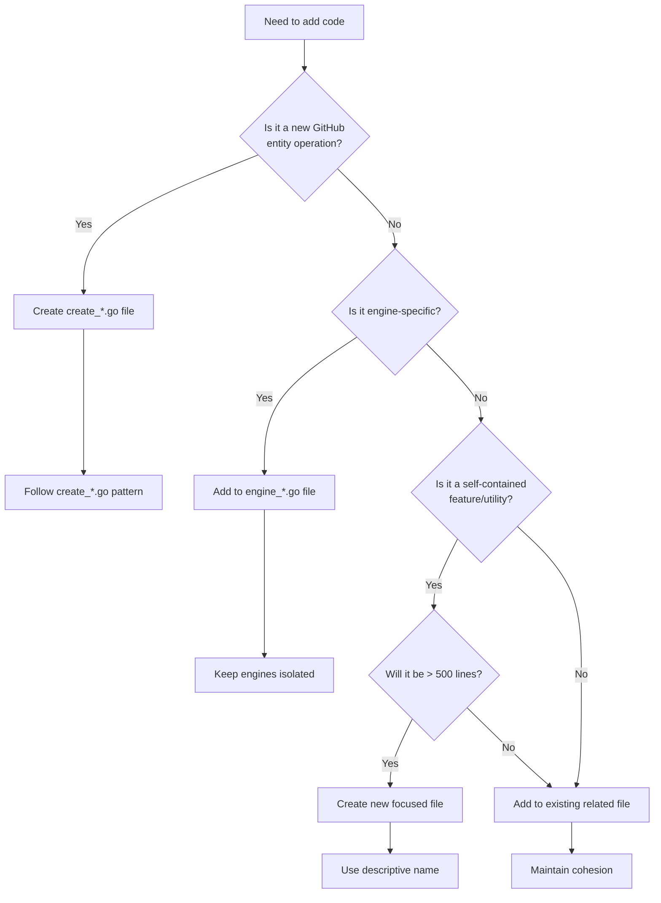
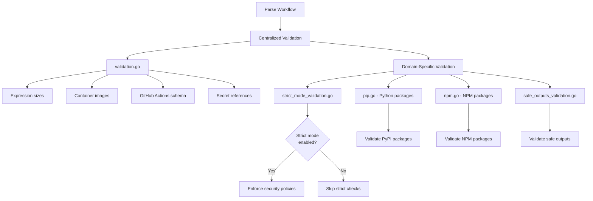
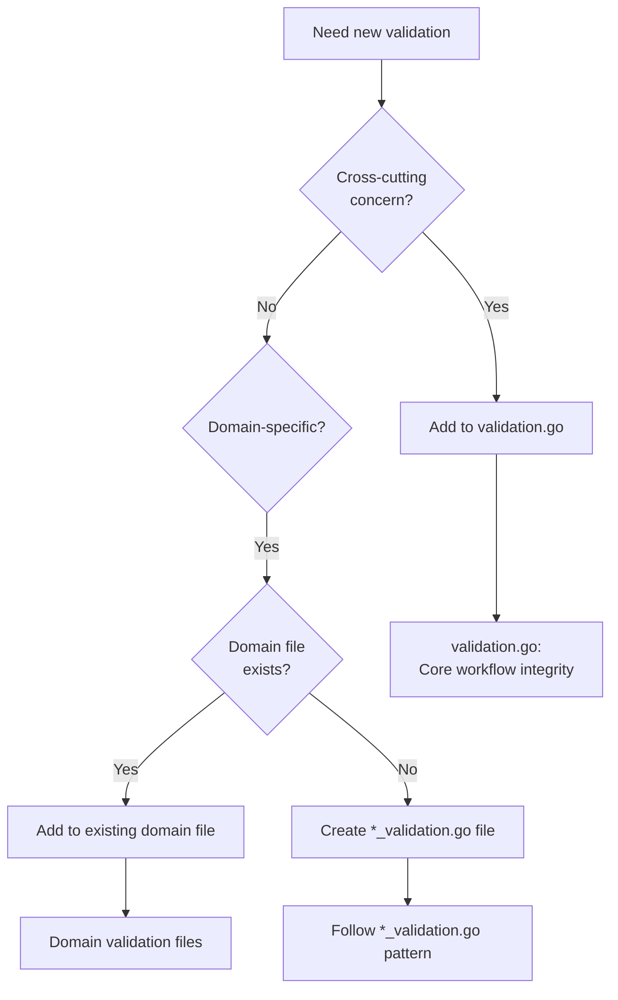
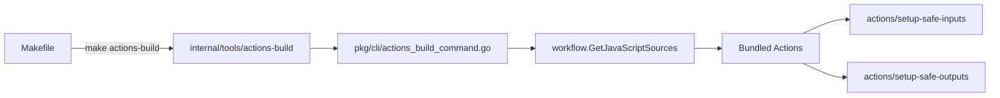
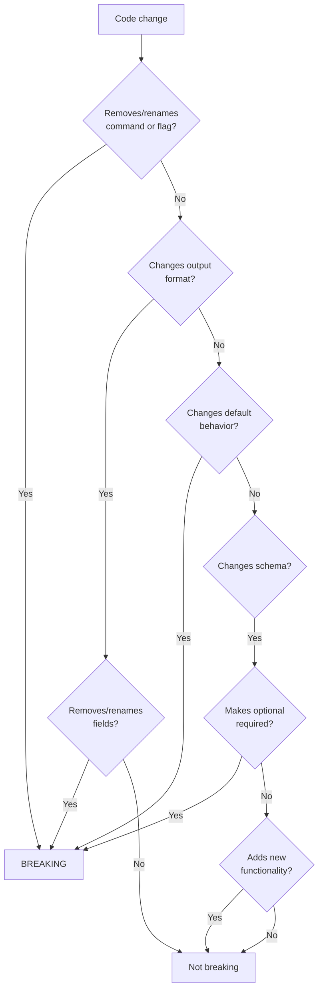
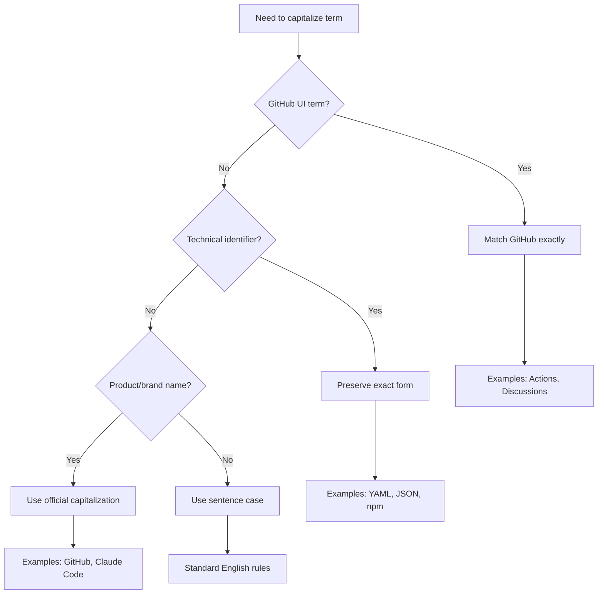
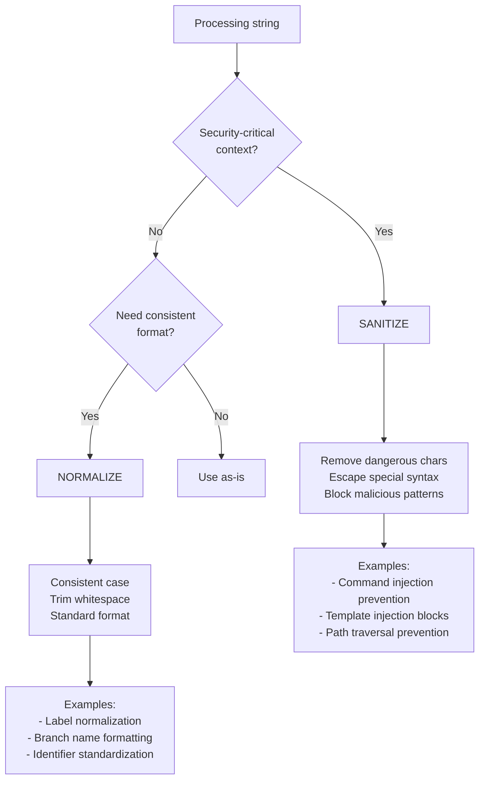

# Developer Instructions

This document consolidates design specifications and implementation documentation for GitHub Agentic Workflows (`gh-aw`). It provides essential guidance for developers working on the codebase.

## Table of Contents

1. [Code Organization Patterns](#code-organization-patterns)
2. [Validation Architecture](#validation-architecture)
3. [Custom Actions Build System](#custom-actions-build-system)
4. [Breaking Changes](#breaking-changes)
5. [Capitalization Guidelines](#capitalization-guidelines)
6. [Safe Output Messages](#safe-output-messages)
7. [Schema Validation](#schema-validation)
8. [String Processing](#string-processing)
9. [Template Injection Prevention](#template-injection-prevention)
10. [Testing Guidelines](#testing-guidelines)
11. [End-to-End Feature Testing](#end-to-end-feature-testing)
12. [GitHub Actions Security](#github-actions-security)
13. [YAML Version Compatibility](#yaml-version-compatibility)
14. [MCP Logs Guardrails](#mcp-logs-guardrails)
15. [Changesets](#changesets)
16. [Common Patterns](#common-patterns)

---

## Code Organization Patterns

The codebase follows specific organization patterns for maintainability and clarity.

### Should I Create a New File?



**Key Implementation Files**:
- Create operations: `pkg/workflow/create_*.go`
- Engines: `pkg/engines/copilot_engine.go`, `pkg/engines/claude_engine.go`, etc.
- Engine helpers: `pkg/engines/engine_helpers.go`

### Excellent Patterns to Follow

#### 1. Create Functions Pattern

One file per GitHub entity creation operation:
- `create_issue.go` - Issue creation logic
- `create_pull_request.go` - PR creation logic
- `create_discussion.go` - Discussion creation logic
- `create_agent_task.go` - Agent task creation

**Benefits**: Clear separation, easy location, prevents large files, facilitates parallel development.

#### 2. Engine Separation Pattern

Each AI engine has its own file:
- `copilot_engine.go` (971 lines) - GitHub Copilot engine
- `claude_engine.go` (340 lines) - Claude engine
- `codex_engine.go` (639 lines) - Codex engine
- `engine_helpers.go` (424 lines) - Shared utilities

**Benefits**: Engine isolation, centralized shared code, clear boundaries.

#### 3. Test Organization

Tests live alongside implementation:
- `feature.go` + `feature_test.go`
- `feature_integration_test.go` for integration tests
- `feature_scenario_test.go` for specific scenarios

**File Size Guidelines**:
- Target: 200-400 lines per file
- Acceptable: Up to 600 lines if cohesive
- Refactor if: > 800 lines or multiple unrelated responsibilities

### Anti-Patterns to Avoid

❌ **God files**: Single files with multiple unrelated responsibilities
❌ **Scattered functionality**: Related code split across many small files
❌ **Premature splitting**: Creating files for features < 100 lines
❌ **Inconsistent naming**: Not following established patterns

See [specs/code-organization.md](../../specs/code-organization.md) for complete details.

---

## Validation Architecture

Validation ensures workflow configurations are correct and secure before compilation.

### Validation Flow



### Where to Add New Validation



**Key Implementation Files**:
- Centralized: `pkg/workflow/validation.go` (782 lines)
- Strict mode: `pkg/workflow/strict_mode_validation.go` (190 lines)
- Python: `pkg/workflow/pip.go` (225 lines)
- NPM: `pkg/workflow/npm.go` (90 lines)
- Safe outputs: `pkg/workflow/safe_outputs_validation.go`

**Validation Functions in validation.go**:
- `validateExpressionSizes()` - GitHub Actions expression limits
- `validateContainerImages()` - Docker image verification
- `validateGitHubActionsSchema()` - YAML schema validation
- `validateSecretReferences()` - Secret syntax validation
- `validateRepositoryFeatures()` - Repository capability checks

See [specs/validation-architecture.md](../../specs/validation-architecture.md) for complete details.

---

## Custom Actions Build System

The build system manages custom GitHub Actions in the `actions/` directory.

### Architecture



**Key Points**:
- **Pure Go implementation** - No JavaScript build scripts
- Reuses workflow compiler's bundler infrastructure
- Invoked via Makefile during development
- Actions stored in `actions/` directory

**Build Commands**:
- `make actions-build` - Build all actions
- `make actions-validate` - Validate action.yml files
- `make actions-clean` - Remove generated files

**Implementation**:
- Build system: `pkg/cli/actions_build_command.go`
- JavaScript sources: `pkg/workflow/js.go` (embedded via `//go:embed`)
- Internal tool: `internal/tools/actions-build/main.go`

**Directory Structure**:
```
actions/
├── setup-safe-inputs/
│   ├── action.yml
│   ├── index.js (generated)
│   └── src/index.js
└── setup-safe-outputs/
    ├── action.yml
    ├── index.js (generated)
    └── src/index.js
```

See [specs/actions.md](../../specs/actions.md) for complete details.

---

## Breaking Changes

### Is This Breaking?



### Breaking Changes (Major Version)

**Always breaking**:
- Command/flag removal or renaming
- Output format changes (JSON field removal/rename)
- Default value changes
- Schema changes (removing fields, making optional required)
- Exit code changes

**Required**:
- `major` changeset type
- CHANGELOG.md documentation with migration guidance
- Maintainer review

### Non-Breaking Changes (Minor/Patch)

**Not breaking**:
- Adding new commands/flags
- Adding new fields to output
- Adding new optional schema fields
- Deprecations (with warnings, keeping functionality)

**Examples**:
- Add `--json` flag (minor)
- Fix bug in validation (patch)
- Add new optional schema field (minor)

See [specs/breaking-cli-rules.md](../../specs/breaking-cli-rules.md) for complete details.

---

## Capitalization Guidelines

### Decision Flow



**Rules**:
- GitHub features: Match GitHub UI exactly ("GitHub Actions", "Discussions")
- Technical identifiers: Preserve exact form ("YAML", "JSON", "npm", not "NPM")
- Product names: Use official capitalization ("GitHub Copilot", "Claude Code")
- General text: Sentence case

**Key Terms**:
- GitHub Actions (not "Github Actions" or "github actions")
- npm (not "NPM")
- YAML (not "yaml" or "Yaml")
- JSON Schema (not "json schema")

**Implementation**: `cmd/gh-aw/capitalization_test.go`

See [specs/capitalization.md](../../specs/capitalization.md) for complete details.

---

## Safe Output Messages

Safe output messages provide a structured system for creating GitHub resources from AI agents.

**Core Files**:
- Implementation: `pkg/workflow/safe_outputs.go`
- Processing: `pkg/workflow/create_*.go` (create_issue, create_pull_request, etc.)

**Safe Output Types**:
- `create_issue` - Create GitHub issues
- `create_pull_request` - Create pull requests
- `create_discussion` - Create discussions
- `create_pr_review_comment` - Add PR review comments
- `noop` - Log completion without action
- `missing_tool` - Report missing capabilities

**Message Format**:
```
🛠️ [tool_name](arguments...)
Preview: (content...)
```

**Preview Mode**: Messages in preview mode show `🎭` emoji to distinguish test runs.

**Validation**: `pkg/workflow/safe_outputs_validation.go`

**Design Principles**:
- Structured and parsable format
- Clear visual distinction (emoji markers)
- Consistent patterns across all types
- Validation at compilation time

See [specs/safe-output-messages.md](../../specs/safe-output-messages.md) for complete details.

---

## Schema Validation

Schema validation ensures workflow configurations conform to expected structure.

**Schema Locations**:
- Main schema: `pkg/parser/schemas/workflow.schema.json`
- Frontmatter: `pkg/parser/schemas/frontmatter.schema.json`
- Safe outputs: `pkg/parser/schemas/safe-outputs.schema.json`

**Validation Layers**:
1. **Parse-time**: JSON Schema validation during parsing
2. **Compile-time**: Semantic validation during compilation
3. **Runtime**: Value validation during execution

**Schema Updates**:
- Breaking: Removing fields, making optional required
- Non-breaking: Adding optional fields, adding enum values

**Implementation**: `pkg/parser/validate.go`

See [specs/schema-validation.md](../../specs/schema-validation.md) for complete details.

---

## String Processing

### Sanitize vs Normalize Decision



**Sanitization** (Security):
- Remove/escape dangerous characters
- Prevent injection attacks
- Block malicious patterns
- **Never** lose security-critical information

**Normalization** (Consistency):
- Standard formatting
- Case conversion
- Whitespace trimming
- May modify for consistency

**Implementation**: `pkg/workflow/strings.go` (153 lines)

**Key Functions**:
- `SanitizeForShell()` - Prevent command injection
- `NormalizeLabel()` - Consistent label format
- `SanitizePath()` - Prevent path traversal

See [specs/string-sanitization-normalization.md](../../specs/string-sanitization-normalization.md) for complete details.

---

## Template Injection Prevention

Prevents malicious template injection in GitHub Actions expressions.

**Attack Vectors**:
- User-controlled input in `${{ }}` expressions
- Malicious workflow file modifications
- Compromised external data sources

**Prevention Mechanisms**:
1. **Input validation**: Sanitize user inputs
2. **Expression escaping**: Escape `${{` sequences
3. **Context restriction**: Limit expression contexts
4. **Static analysis**: Detect dangerous patterns

**Implementation**:
- Sanitization: `pkg/workflow/strings.go`
- Validation: `pkg/workflow/validation.go`
- Tests: `pkg/workflow/template_injection_test.go`

**Dangerous Patterns**:
- `${{ github.event.issue.title }}` (user-controlled)
- `${{ env.USER_INPUT }}` (unvalidated)
- Raw string concatenation in expressions

**Safe Patterns**:
- `${{ env.VALIDATED_INPUT }}` (after sanitization)
- Using intermediary script files
- Passing values via arguments, not inline

See [specs/template-injection-prevention.md](../../specs/template-injection-prevention.md) for complete details.

---

## Testing Guidelines

**Test Organization**:
- Unit tests: `*_test.go` alongside implementation
- Integration tests: `*_integration_test.go`
- Scenario tests: `*_scenario_test.go`

**Test Commands**:
- `make test` - Run all tests
- `go test ./...` - Run tests recursively
- `go test -v ./pkg/workflow` - Verbose output for package

**Testing Patterns**:
- Table-driven tests for multiple cases
- Helper functions for common setup
- Clear test names describing scenarios
- Isolated tests without shared state

**Test Coverage**:
- Focus on critical paths
- Edge cases and error conditions
- Security-sensitive code

**Key Test Files**:
- `pkg/workflow/validation_test.go`
- `pkg/workflow/safe_outputs_test.go`
- `pkg/workflow/template_injection_test.go`

See [specs/testing.md](../../specs/testing.md) for complete details.

---

## End-to-End Feature Testing

Test new features using workflow files in `.github/workflows/`.

**Test Workflows**:
- `.github/workflows/dev.md` - Development testing with Claude Sonnet
- `.github/workflows/dev-hawk.md` - Development testing with Haiku (fast iteration)

**Testing Process**:
1. Add test scenario to dev.md or dev-hawk.md
2. Commit and push (triggers workflow run)
3. Monitor workflow execution
4. Validate safe outputs produced
5. Remove test scenario (don't merge changes)

**Guidelines**:
- Keep dev.md/dev-hawk.md minimal and reusable
- Don't merge test-specific changes
- Use for validating end-to-end functionality
- Test both preview and live modes

**Workflow Structure**:
```yaml
---
engine: claude-sonnet-4-5
strict: true
preview: true
---

Test scenario description here.
```

See [specs/end-to-end-feature-testing.md](../../specs/end-to-end-feature-testing.md) for complete details.

---

## GitHub Actions Security

Security best practices for GitHub Actions workflows.

**Key Principles**:
1. **Least privilege**: Minimal permissions
2. **Input validation**: Sanitize all inputs
3. **Secret management**: Secure secret handling
4. **Dependency pinning**: Pin action versions to commit SHAs
5. **Code review**: Review workflow changes

**Permission Model**:
```yaml
permissions:
  contents: read
  issues: write
  pull-requests: write
```

**Dangerous Patterns**:
- `permissions: write-all`
- Unvalidated `${{ github.event.* }}` usage
- Secrets in logs or outputs
- Unpinned action versions

**Safe Patterns**:
- Pinned actions: `uses: actions/checkout@a1234567...`
- Validated inputs: Sanitize before use
- Secret handling: Use secrets context, never log
- Minimal permissions: Grant only required access

**Implementation**:
- Security validation: `pkg/workflow/validation.go`
- Strict mode: `pkg/workflow/strict_mode_validation.go`

See [specs/github-actions-security-best-practices.md](../../specs/github-actions-security-best-practices.md) for complete details.

---

## YAML Version Compatibility

Ensure compatibility between different YAML parser versions.

**Parser**: `gopkg.in/yaml.v3`

**Common Gotchas**:
- Indentation sensitivity (spaces only, no tabs)
- Anchor/alias behavior (`&anchor`, `*alias`)
- Multiline string handling (literal `|` vs folded `>`)
- Boolean interpretation (`true`/`false`/`yes`/`no`)
- Number format handling

**Best Practices**:
- Use consistent indentation (2 spaces)
- Quote strings when ambiguous
- Test with actual yaml.v3 parser
- Validate generated YAML

**Implementation**: `pkg/workflow/compiler.go`

**Testing**: Validate compiled YAML parses correctly with yaml.v3

See [specs/yaml-version-gotchas.md](../../specs/yaml-version-gotchas.md) for complete details.

---

## MCP Logs Guardrails

Guardrails for MCP (Model Context Protocol) server logs.

**Purpose**: Prevent sensitive information leakage in MCP logs

**Implementation**: `pkg/cli/mcp_logs_guardrail.go`

**Protected Data**:
- API keys and tokens
- User credentials
- File paths (may expose structure)
- Personal information

**Log Sanitization**:
- Redact sensitive patterns
- Mask authentication data
- Filter file system paths

**Configuration**:
- Enable via `--mcp-logs-secure` flag
- Automatic in CI environments
- Configurable redaction patterns

See [specs/mcp_logs_guardrails.md](../../specs/mcp_logs_guardrails.md) for complete details.

---

## Changesets

Use changesets to document changes for release notes.

**Changeset Types**:
- `major` - Breaking changes
- `minor` - New features
- `patch` - Bug fixes

**Creating Changesets**:
```bash
npx changeset add
```

**Process**:
1. Make code changes
2. Create changeset with description
3. Commit changeset file (`.changeset/*.md`)
4. Changeset included in next release

**Changeset Format**:
```markdown
---
"gh-aw": minor
---

Add support for custom MCP servers
```

**Release Process**:
- Changesets aggregated during release
- CHANGELOG.md automatically updated
- Version bump based on changeset types

See [specs/changesets.md](../../specs/changesets.md) for complete details.

---

## Common Patterns

### Development Commands

**Build**:
- `make` or `make build` - Build the project
- `make test` - Run tests
- `make lint` - Run linting

**Actions**:
- `make actions-build` - Build custom actions
- `make actions-validate` - Validate actions
- `make actions-clean` - Clean generated files

**CLI Usage**:
- `gh aw compile <file>` - Compile workflow
- `gh aw validate <file>` - Validate workflow
- `gh aw status <run-id>` - Check run status

### File Path References

When adding or modifying code, reference specific implementation files:
- Code organization: `pkg/workflow/create_*.go`, `pkg/engines/*_engine.go`
- Validation: `pkg/workflow/validation.go`, `pkg/workflow/*_validation.go`
- Safe outputs: `pkg/workflow/safe_outputs.go`, `pkg/workflow/create_*.go`
- Testing: Files ending in `_test.go`, `*_integration_test.go`

### Quick Reference

**Adding New Validation**:
1. Determine if centralized or domain-specific
2. Add to `validation.go` or create `*_validation.go`
3. Add tests in `*_test.go`
4. Document in specs/validation-architecture.md

**Adding New Safe Output**:
1. Add type to safe output schema
2. Implement in `create_*.go` file
3. Add validation in `safe_outputs_validation.go`
4. Add tests
5. Document in specs/safe-output-messages.md

**Making Breaking Change**:
1. Create `major` changeset
2. Document in CHANGELOG.md with migration guide
3. Get maintainer review
4. Follow breaking-cli-rules.md guidelines

---

## Additional Resources

For detailed specifications, see individual files in `specs/`:
- [specs/README.md](../../specs/README.md) - Specifications index
- [specs/code-organization.md](../../specs/code-organization.md) - Detailed code organization
- [specs/validation-architecture.md](../../specs/validation-architecture.md) - Complete validation details
- [specs/actions.md](../../specs/actions.md) - Custom actions system
- [specs/safe-output-messages.md](../../specs/safe-output-messages.md) - Safe outputs specification
- [specs/github-actions-security-best-practices.md](../../specs/github-actions-security-best-practices.md) - Security guidelines

**Last Updated**: 2025-12-15
