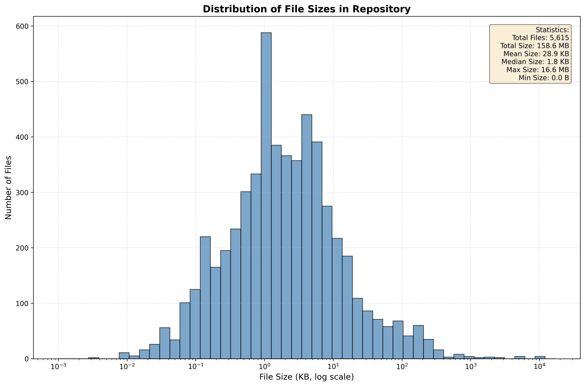

# File Size Histogram Analysis

This document contains the histogram chart of file sizes in the repository and the code used to generate it.

## Histogram Chart



## Summary Statistics

The analysis found **5,615 files** in the repository with the following statistics:

- **Total Size**: 158.6 MB
- **Mean Size**: 28.9 KB
- **Median Size**: 1.8 KB
- **Maximum Size**: 16.6 MB
- **Minimum Size**: 0.0 B

## Analysis Insights

The histogram uses a logarithmic scale on the x-axis to better visualize the wide range of file sizes. Key observations:

1. **Distribution**: Most files in the repository are relatively small (1-10 KB range), as evidenced by the large peak on the left side of the histogram.

2. **Median vs Mean**: The median file size (1.8 KB) is significantly smaller than the mean (28.9 KB), indicating that a few large files are pulling the average up.

3. **Large Files**: The maximum file size is 16.6 MB, which is the compiled `gh-aw` binary.

4. **File Count**: With 5,615 files totaling 158.6 MB, the repository has a healthy distribution of code, documentation, dependencies, and build artifacts.

## Code Used to Generate the Chart

The histogram was generated using the Python script `generate_file_size_histogram.py`. Here's the complete code:

### Script: generate_file_size_histogram.py

```python
#!/usr/bin/env python3
"""
Generate a histogram of file sizes in the repository.

This script walks through all files in the repository (excluding .git),
calculates their sizes, and generates a histogram chart.
"""

import os
import matplotlib.pyplot as plt
import numpy as np
from pathlib import Path


def get_file_sizes(root_dir):
    """
    Walk through the directory and collect file sizes.
    
    Args:
        root_dir: Root directory to start the walk
        
    Returns:
        List of file sizes in bytes
    """
    file_sizes = []
    
    for dirpath, dirnames, filenames in os.walk(root_dir):
        # Skip .git directory
        if '.git' in dirnames:
            dirnames.remove('.git')
        
        for filename in filenames:
            filepath = os.path.join(dirpath, filename)
            try:
                size = os.path.getsize(filepath)
                file_sizes.append(size)
            except (OSError, IOError):
                # Skip files we can't read
                pass
    
    return file_sizes


def format_bytes(bytes_value):
    """Format bytes into human-readable format."""
    for unit in ['B', 'KB', 'MB', 'GB']:
        if bytes_value < 1024.0:
            return f"{bytes_value:.1f} {unit}"
        bytes_value /= 1024.0
    return f"{bytes_value:.1f} TB"


def generate_histogram(file_sizes, output_path='file_size_histogram.png'):
    """
    Generate a histogram of file sizes.
    
    Args:
        file_sizes: List of file sizes in bytes
        output_path: Path to save the histogram image
    """
    if not file_sizes:
        print("No files found!")
        return
    
    # Convert to KB for better readability
    file_sizes_kb = [size / 1024 for size in file_sizes]
    
    # Create figure and axis
    fig, ax = plt.subplots(figsize=(12, 8))
    
    # Create histogram with logarithmic bins for better distribution
    # Use logarithmic scale to handle wide range of file sizes
    max_size = max(file_sizes_kb)
    min_size = min([s for s in file_sizes_kb if s > 0]) if any(s > 0 for s in file_sizes_kb) else 0.001
    
    # Create logarithmic bins
    bins = np.logspace(np.log10(max(min_size, 0.001)), np.log10(max_size), 50)
    
    # Plot histogram
    n, bins, patches = ax.hist(file_sizes_kb, bins=bins, edgecolor='black', alpha=0.7, color='steelblue')
    
    # Set logarithmic scale for x-axis
    ax.set_xscale('log')
    
    # Labels and title
    ax.set_xlabel('File Size (KB, log scale)', fontsize=12)
    ax.set_ylabel('Number of Files', fontsize=12)
    ax.set_title('Distribution of File Sizes in Repository', fontsize=14, fontweight='bold')
    
    # Add grid for better readability
    ax.grid(True, alpha=0.3, linestyle='--')
    
    # Add statistics text box
    stats_text = f"""Statistics:
    Total Files: {len(file_sizes):,}
    Total Size: {format_bytes(sum(file_sizes))}
    Mean Size: {format_bytes(np.mean(file_sizes))}
    Median Size: {format_bytes(np.median(file_sizes))}
    Max Size: {format_bytes(max(file_sizes))}
    Min Size: {format_bytes(min(file_sizes))}"""
    
    ax.text(0.98, 0.97, stats_text, transform=ax.transAxes,
            fontsize=10, verticalalignment='top', horizontalalignment='right',
            bbox=dict(boxstyle='round', facecolor='wheat', alpha=0.5))
    
    # Tight layout to prevent label cutoff
    plt.tight_layout()
    
    # Save the figure
    plt.savefig(output_path, dpi=300, bbox_inches='tight')
    print(f"Histogram saved to: {output_path}")
    
    # Print summary statistics
    print(f"\nSummary Statistics:")
    print(f"  Total Files: {len(file_sizes):,}")
    print(f"  Total Size: {format_bytes(sum(file_sizes))}")
    print(f"  Mean Size: {format_bytes(np.mean(file_sizes))}")
    print(f"  Median Size: {format_bytes(np.median(file_sizes))}")
    print(f"  Max Size: {format_bytes(max(file_sizes))}")
    print(f"  Min Size: {format_bytes(min(file_sizes))}")
    
    return output_path


def main():
    """Main function to run the script."""
    # Get the repository root directory
    repo_root = Path(__file__).parent
    
    print(f"Analyzing files in: {repo_root}")
    
    # Collect file sizes
    print("Collecting file sizes...")
    file_sizes = get_file_sizes(repo_root)
    
    print(f"Found {len(file_sizes)} files")
    
    # Generate histogram
    output_path = repo_root / 'file_size_histogram.png'
    generate_histogram(file_sizes, str(output_path))
    
    print(f"\nHistogram chart generated successfully!")


if __name__ == '__main__':
    main()
```

### How to Run

To regenerate the histogram, simply run:

```bash
python3 generate_file_size_histogram.py
```

### Dependencies

The script requires the following Python packages:
- `matplotlib` - For creating the histogram chart
- `numpy` - For numerical operations and logarithmic binning

Install them using:
```bash
pip install matplotlib numpy
```

### Features

1. **Logarithmic Scale**: Uses a logarithmic scale for the x-axis to better visualize files ranging from bytes to megabytes.

2. **Smart Binning**: Automatically creates 50 logarithmic bins to distribute files evenly across the scale.

3. **Statistics Box**: Displays key statistics directly on the chart for easy reference.

4. **High Resolution**: Saves the chart at 300 DPI for high-quality output.

5. **Error Handling**: Gracefully skips files that cannot be read due to permissions or other errors.

6. **Git Exclusion**: Automatically excludes the `.git` directory from analysis.

### Output

The script generates:
- `file_size_histogram.png` - A high-quality histogram chart
- Console output with summary statistics
