# ✨ GitHub Agentic Workflows

Write agentic workflows in natural language markdown, and run them safely in GitHub Actions. From [GitHub Next](https://githubnext.com/) and [Microsoft Research](https://www.microsoft.com/en-us/research/group/research-software-engineering-rise/).

> [!CAUTION]
> This extension is a research demonstrator. It is in early development and may change significantly. Using agentic workflows in your repository requires careful attention to security considerations and careful human supervision, and even then things can still go wrong. Use it with caution, and at your own risk.

## 🚀 Quick Start

Ready to get your first agentic workflow running? Follow our step-by-step [Quick Start Guide](docs/quick-start.md) to install the extension, add a sample workflow, and see it in action.

## 📖 Overview

Learn about the concepts behind agentic workflows, explore available workflow types, and understand how AI can automate your repository tasks. See [Concepts](docs/concepts.md).

## 🔧 How It Works

GitHub Agentic Workflows transforms natural language markdown files into GitHub Actions that are executed by AI agents. Here's a simple example:

**Input:** Create `.github/workflows/issue-responder.md`
```markdown
---
on:
  issues:
    types: [opened]
permissions:
  issues: write
safe-outputs:
  add-issue-comment:
---

# Issue Auto-Responder

When a new issue is opened, analyze it and:
1. Determine if it's a bug report, feature request, or question
2. Add an appropriate welcome comment with next steps
3. Ask for additional details if the issue is unclear
```

**Output:** The tool compiles this into a standard GitHub Actions workflow that runs an AI agent:

```mermaid
graph TB
    A["📝 Markdown Workflow<br/>.github/workflows/issue-responder.md"] --> B["🔄 gh aw compile"]
    B --> C["⚙️ GitHub Actions YAML<br/>.github/workflows/issue-responder.lock.yml"]
    C --> D["🚀 GitHub Actions Runner"]
    D --> E["🤖 AI Agent (Claude/Codex)"]
    E --> F["📊 Analyzes Issue Content"]
    F --> G["💬 Posts Intelligent Comment"]
    
    style A fill:#e1f5fe
    style C fill:#f3e5f5
    style E fill:#fff3e0
    style G fill:#e8f5e8
```



The AI agent reads your repository context, understands the issue content, and takes appropriate actions - all defined in natural language rather than complex code.

## 📚 Samples

Explore ready-to-use agentic workflows for research, development, and automation tasks. See [Samples](docs/samples.md) for a complete list of demonstrator workflows including:

- **Research & Planning**: Weekly research, team status reports, daily planning, and issue triage
- **Coding & Development**: Dependency updates, documentation maintenance, QA tasks, test coverage improvements, performance optimization, and accessibility reviews

## 📖 Documentation

For complete documentation, examples, and guides, see the [Documentation](docs/index.md).

## 🤝 Contributing

We welcome contributions to GitHub Agentic Workflows! Here's how you can help:

- **🐛 Report bugs and request features** by filing issues in this repository
- **📖 Improve documentation** by contributing to our docs
- **🔧 Contribute code** by following our [Development Guide](DEVGUIDE.md)
- **💡 Share ideas** in the `#continuous-ai` channel in the [GitHub Next Discord](https://gh.io/next-discord)

For development setup and contribution guidelines, see [CONTRIBUTING.md](CONTRIBUTING.md).

## 💬 Share Feedback

We welcome your feedback on GitHub Agentic Workflows! Please file bugs and feature requests as issues in this repository,
and share your thoughts in the `#continuous-ai` channel in the [GitHub Next Discord](https://gh.io/next-discord).
