# Campaign Flow Diagrams

## Campaign Lifecycle Flow


## Discovery Precomputation Detail


## Component Architecture

```mermaid
graph LR
    subgraph "Campaign Spec (.campaign.md)"
        Spec[YAML Frontmatter]
        Spec --> ID[id: security-q1-2025]
        Spec --> Workflows[workflows: [...]]
        Spec --> Governance[governance: {...}]
        Spec --> Project[project-url]
    end
    
    subgraph "Compilation"
        Compiler[BuildOrchestrator]
        Compiler --> GenWorkflow[Generate WorkflowData]
        GenWorkflow --> Tools[Configure Tools]
        GenWorkflow --> SafeOutputs[Configure Safe Outputs]
        GenWorkflow --> Prompt[Generate Prompt]
    end
    
    subgraph "Runtime"
        Discovery[Discovery Precomputation]
        Agent[AI Agent]
        Workers[Worker Workflows]
        ProjectBoard[GitHub Project Board]
        
        Discovery --> Manifest[Manifest JSON]
        Manifest --> Agent
        Agent --> Workers
        Agent --> ProjectBoard
    end
    
    Spec --> Compiler
    Compiler --> Lock[.campaign.lock.yml]
    Lock --> Discovery
    
    style Spec fill:#e1f5e1
    style Discovery fill:#e1f0ff
    style Agent fill:#fff4e1
    style ProjectBoard fill:#ffe1f0
```

## Governance Budget Flow


## Worker-Orchestrator Communication


## Validation Layers

```mermaid
graph TB
    CampaignSpec[Campaign Spec] --> Layer1[Layer 1: JSON Schema]
    
    Layer1 --> TypeCheck[Type Checking]
    Layer1 --> RequiredFields[Required Fields]
    Layer1 --> EnumValidation[Enum Validation]
    
    TypeCheck --> Layer2[Layer 2: Semantic Rules]
    RequiredFields --> Layer2
    EnumValidation --> Layer2
    
    Layer2 --> IDFormat[ID Format: lowercase-hyphen]
    Layer2 --> URLStructure[URL Structure: GitHub Project]
    Layer2 --> KPIConsistency[KPI Consistency: 1 primary]
    Layer2 --> GovernanceLimits[Governance: non-negative]
    
    IDFormat --> Layer3[Layer 3: Context Checks]
    URLStructure --> Layer3
    KPIConsistency --> Layer3
    GovernanceLimits --> Layer3
    
    Layer3 --> WorkflowExists[Workflows Exist]
    Layer3 --> LockFilesCompiled[Lock Files Compiled]
    Layer3 --> RepoMemoryValid[Repo-Memory Paths Valid]
    
    WorkflowExists --> Result{Valid?}
    LockFilesCompiled --> Result
    RepoMemoryValid --> Result
    
    Result -->|Pass| Success[✅ Validation Passed]
    Result -->|Fail| Errors[❌ Actionable Errors]
    
    style Layer1 fill:#e1f0ff
    style Layer2 fill:#fff4e1
    style Layer3 fill:#ffe1f0
    style Success fill:#e1f5e1
    style Errors fill:#ffe1e1
```



## Error Scenarios


## Multi-Repository Discovery (Proposed)


---

## Legend

- 🟢 **Green**: User input, success states
- 🔵 **Blue**: Discovery/precomputation steps
- 🟡 **Yellow**: AI agent execution
- 🔴 **Red**: Decision points, budget checks
- 🟣 **Purple**: External systems (GitHub, Project)

## Usage

These diagrams illustrate:

1. **Campaign Lifecycle Flow** - Overall campaign execution from spec to status update
2. **Discovery Precomputation Detail** - How discovery runs before the agent
3. **Component Architecture** - Key components and their relationships
4. **Governance Budget Flow** - How budgets control campaign operations
5. **Worker-Orchestrator Communication** - Contract between workers and orchestrators
6. **Validation Layers** - Multi-layer validation approach
7. **Error Scenarios** - Common failure modes and recovery
8. **Multi-Repository Discovery** - How cross-repo discovery should work

## Tools

- **Mermaid** - All diagrams use Mermaid syntax for easy rendering
- **GitHub Markdown** - Renders automatically in GitHub
- **VS Code** - Use Mermaid preview extensions
- **Draw.io/Excalidraw** - Export to other formats if needed

## Next Steps

1. Add these diagrams to user-facing documentation
2. Create animated GIFs for complex flows
3. Add architecture decision records (ADRs)
4. Include in onboarding materials
