# Campaign Flow Architecture

This diagram illustrates the complete campaign flow with orchestrator and worker workflows in GitHub Agentic Workflows (gh-aw).

## Campaign Flow Diagram

```mermaid
graph TB
    subgraph "Campaign Spec Definition"
        CampaignSpec["Campaign Spec<br/>.campaign.md<br/><br/>• id, name, objective<br/>• workflows (worker list)<br/>• tracker-label<br/>• project-url<br/>• memory-paths<br/>• governance (budgets)<br/>• KPIs"]
    end

    subgraph "Compilation Phase"
        CampaignSpec -->|"gh aw compile"| Compiler["Workflow Compiler<br/>(BuildOrchestrator)"]
        Compiler --> OrchestratorMD["Orchestrator Workflow<br/>.campaign.g.md<br/><br/>Generated with:<br/>• Discovery steps<br/>• Safe outputs config<br/>• GitHub tools<br/>• Repo-memory config"]
        OrchestratorMD -->|"compile"| OrchestratorLock["Orchestrator Lock<br/>.campaign.g.lock.yml<br/><br/>GitHub Actions YAML"]
    end

    subgraph "Runtime Execution: Orchestrator"
        Trigger["Trigger:<br/>• Schedule (daily)<br/>• workflow_dispatch<br/>• Concurrency-limited"]
        
        Trigger --> Phase0{"Phase 0:<br/>Workflow Execution"}
        
        Phase0 -->|"if workflows configured"| DispatchWorkers["Dispatch Workers<br/>via dispatch_workflow<br/><br/>Sequential execution"]
        DispatchWorkers --> Worker1["Worker 1<br/>workflow_dispatch"]
        DispatchWorkers --> Worker2["Worker 2<br/>workflow_dispatch"]
        DispatchWorkers --> Worker3["Worker N<br/>workflow_dispatch"]
        
        Phase0 --> PreDiscovery["Pre-Discovery<br/>(JavaScript)<br/><br/>• Search GitHub API<br/>• Filter by tracker-label<br/>• Apply budgets<br/>• Generate manifest"]
        
        PreDiscovery --> Manifest["Discovery Manifest<br/>.gh-aw/campaign.discovery.json<br/><br/>• total_items<br/>• needs_add_count<br/>• needs_update_count<br/>• items (normalized)"]
        
        Manifest --> Phase1["Phase 1: Read State<br/>(Discovery - NO WRITES)<br/><br/>• Read manifest<br/>• Read project board<br/>• Parse discovered items"]
        
        Phase1 --> Phase2["Phase 2: Make Decisions<br/>(Planning - NO WRITES)<br/><br/>• Determine status from GitHub state<br/>• Calculate date fields<br/>• Apply write budget<br/>• Deterministic ordering"]
        
        Phase2 --> Phase3["Phase 3: Write State<br/>(Execution - WRITES ONLY)<br/><br/>• update-project (add/update)<br/>• Record outcomes"]
        
        Phase3 --> Phase4["Phase 4: Report & Status<br/><br/>• create-project-status-update<br/>• Summary of run<br/>• KPI trends<br/>• Next steps"]
        
        Phase4 --> RepoMemory["Repo-Memory Updates<br/>memory/campaigns/<id>/<br/><br/>• cursor.json (checkpoint)<br/>• metrics/*.json (snapshots)"]
    end

    subgraph "Worker Workflows"
        Worker1 --> WorkerExecution["Worker Execution<br/><br/>• Focus on single task<br/>• Create issues/PRs<br/>• Add tracker label<br/>• Write to repo-memory"]
        Worker2 --> WorkerExecution
        Worker3 --> WorkerExecution
        
        WorkerExecution --> WorkerOutputs["Worker Outputs<br/><br/>Issues/PRs with:<br/>• Tracker label<br/>• Campaign metadata<br/>• Status information"]
    end

    subgraph "GitHub Project Board"
        Phase3 --> ProjectBoard["GitHub Projects v2<br/><br/>Fields:<br/>• status (Todo/In Progress/Done)<br/>• campaign_id<br/>• worker_workflow<br/>• repository<br/>• priority, size<br/>• start_date, end_date"]
        
        ProjectBoard --> ProjectStatus["Project Status Updates<br/><br/>• ON_TRACK / AT_RISK / OFF_TRACK<br/>• KPI progress<br/>• Most important findings<br/>• What was learned<br/>• Next steps"]
    end

    WorkerOutputs -.->|"discovered in next run"| PreDiscovery

    style CampaignSpec fill:#e1f5ff
    style OrchestratorLock fill:#fff4e6
    style ProjectBoard fill:#f3e5f5
    style WorkerOutputs fill:#e8f5e9
    style Manifest fill:#fff9c4
    style RepoMemory fill:#fce4ec
```

## Key Flow Components

### 1. Campaign Spec (`.campaign.md`)
- **Purpose**: Declarative campaign configuration
- **Location**: `.github/workflows/*.campaign.md`
- **Key Fields**:
  - `id`: Unique campaign identifier
  - `workflows`: List of worker workflow IDs to execute
  - `tracker-label`: Label for discovering worker outputs (e.g., `campaign:security-q1-2025`)
  - `project-url`: GitHub Project board URL
  - `memory-paths`: Repo-memory patterns for campaign data
  - `governance`: Budgets (max items per run, max updates, etc.)
  - `kpis`: Key Performance Indicators with baseline/target/timeframe

### 2. Orchestrator Workflow (Generated)
- **Generated File**: `.campaign.g.md` (markdown) → `.campaign.g.lock.yml` (compiled)
- **Purpose**: Coordinates campaign execution
- **Triggers**:
  - Daily schedule (`cron: "0 18 * * *"`)
  - Manual via `workflow_dispatch`
  - Concurrency-limited (one run at a time per ref)

### 3. Worker Workflows
- **Purpose**: Execute specific campaign tasks
- **Requirements**:
  - Must have `workflow_dispatch` trigger (for orchestrator dispatch)
  - Should NOT have other triggers (cron, push, PR) when controlled by campaign
  - Create issues/PRs with tracker label
  - Write results to repo-memory if applicable
- **Execution**: Sequential, fire-and-forget (orchestrator doesn't wait for completion)

### 4. Discovery & Manifest
- **Pre-Discovery**: JavaScript step runs before agent
- **Discovery Manifest**: `.gh-aw/campaign.discovery.json`
  - Contains normalized items from GitHub searches
  - Pre-sorted by `updated_at` for deterministic processing
  - Includes counts: `needs_add_count`, `needs_update_count`
  - Respects governance budgets

### 5. Execution Phases
1. **Phase 0**: Workflow Execution (optional)
   - Dispatch worker workflows via `dispatch_workflow`
   - Sequential execution
   
2. **Phase 1**: Read State (Discovery)
   - Read discovery manifest
   - Read current project board state
   - NO WRITES
   
3. **Phase 2**: Make Decisions (Planning)
   - Map GitHub state → project status
   - Calculate date fields
   - Apply write budgets
   - Deterministic ordering
   - NO WRITES
   
4. **Phase 3**: Write State (Execution)
   - Execute `update-project` operations
   - Add new items or update existing
   - Record outcomes
   - WRITES ONLY
   
5. **Phase 4**: Report & Status
   - Create project status update
   - Report KPI trends, progress, next steps
   - Update repo-memory (cursor, metrics)

### 6. GitHub Project Board
- **Purpose**: Authoritative campaign state
- **Fields**:
  - `status`: Todo, In Progress, Done
  - `campaign_id`: Campaign identifier
  - `worker_workflow`: Source workflow name
  - `repository`: Owner/repo format
  - `priority`: High/Medium/Low
  - `size`: Small/Medium/Large
  - `start_date`: YYYY-MM-DD (item creation date)
  - `end_date`: YYYY-MM-DD (completion date or today for open items)

### 7. Repo-Memory
- **Location**: `memory/campaigns/<campaign-id>/`
- **Cursor**: `cursor.json` - Checkpoint for incremental discovery
- **Metrics**: `metrics/*.json` - Append-only snapshots per run
  - Required fields: `campaign_id`, `date`, `tasks_total`, `tasks_completed`
  - Optional: `tasks_in_progress`, `tasks_blocked`, `velocity_per_day`, `estimated_completion`

## Flow Types

### Active Execution Flow (with workers)
1. Campaign spec lists workflows in `workflows` field
2. Orchestrator dispatches workers in Phase 0
3. Workers execute tasks, create outputs with tracker label
4. Orchestrator discovers outputs in next run
5. Orchestrator updates project board with worker results

### Discovery-Only Flow (no workers)
1. Campaign spec has `tracker-label` but no `workflows`
2. Workers run independently (keep their own triggers)
3. Workers create outputs with tracker label
4. Orchestrator discovers outputs via tracker label
5. Orchestrator updates project board with discovered items

### Governance & Budgets
- **Max Discovery Items Per Run**: Limits how many items to scan
- **Max Discovery Pages Per Run**: Limits API pagination
- **Max Project Updates Per Run**: Throttles project board writes
- **Max Comments Per Run**: Limits comment safe outputs
- **Opt-Out Labels**: Labels that exclude items from campaign tracking
- **Do Not Downgrade Done Items**: Prevents moving Done → In Progress

## Safe Outputs Used

Orchestrator safe outputs:
- `create-issues` (max: 1) - Epic issue creation
- `add-comments` (max: configurable) - Comment on issues/PRs
- `update-projects` (max: configurable) - Project board updates
- `create-project-status-updates` (max: 1) - Status reporting
- `dispatch-workflow` (max: 3) - Worker dispatch

Worker safe outputs (varies by workflow):
- `create-issues`, `create-pull-requests`
- `add-comments`
- Custom safe outputs per workflow needs

## State Management Principles

1. **Workers are immutable and campaign-agnostic**: Don't know about campaigns
2. **GitHub Project board is authoritative**: Single source of truth for campaign state
3. **Correlation is explicit**: Via `tracker-label` and metadata
4. **Reads and writes are separate**: Never interleave
5. **Idempotent operation**: Safe to re-run
6. **Only predefined fields may be updated**: Schema-driven
7. **Deterministic processing**: Oldest items first, tie-break by ID

## References

- Campaign Specs: `pkg/campaign/spec.go`
- Orchestrator Builder: `pkg/campaign/orchestrator.go`
- Discovery Logic: `actions/setup/js/campaign_discovery.cjs`
- Project Updates: `actions/setup/js/update_project.cjs`
- Flow Documentation: `docs/src/content/docs/guides/campaigns/flow.md`
