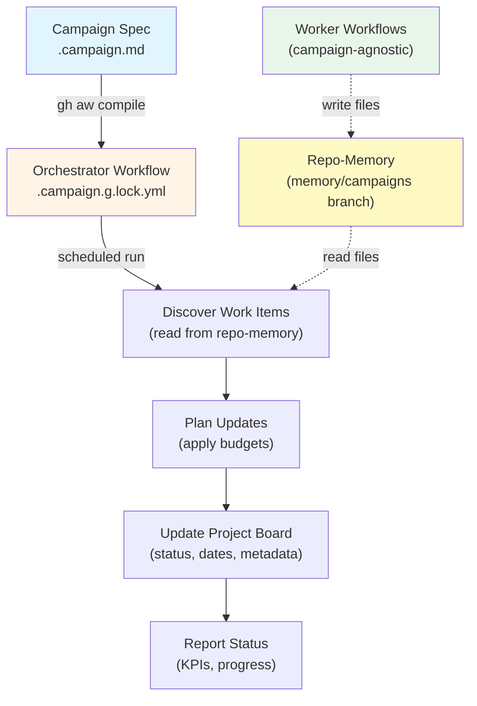

# Campaign Flow Architecture

This diagram shows how a campaign orchestrator coordinates worker workflows and tracks progress through a GitHub Project board.

## Campaign Flow Diagram



## How It Works

### Campaign Spec
Define a campaign in `.github/workflows/*.campaign.md`:
```yaml
---
id: security-audit
memory-paths:
  - memory/campaigns/security-audit/**
cursor-glob: memory/campaigns/security-audit/cursor.json
project-url: https://github.com/orgs/org/projects/1
---
```

### Orchestrator
The orchestrator runs on a schedule (daily) and:
1. **Discovers** work items by reading files from repo-memory
2. **Plans** updates based on GitHub state (open/closed/merged)
3. **Updates** the project board with status and metadata
4. **Reports** KPIs and progress via project status updates

### Workers
Worker workflows are campaign-agnostic and write files to repo-memory (the `memory/campaigns` Git branch). The orchestrator discovers work by reading these files in subsequent runs.

### Project Board
The GitHub Project board is the authoritative state for the campaign, with fields for status, dates, priority, and metadata.

## References

- Campaign Specs: `pkg/campaign/spec.go`
- Orchestrator Builder: `pkg/campaign/orchestrator.go`
- Discovery Logic: `actions/setup/js/campaign_discovery.cjs`
- Project Updates: `actions/setup/js/update_project.cjs`
- Flow Documentation: `docs/src/content/docs/guides/campaigns/flow.md`
