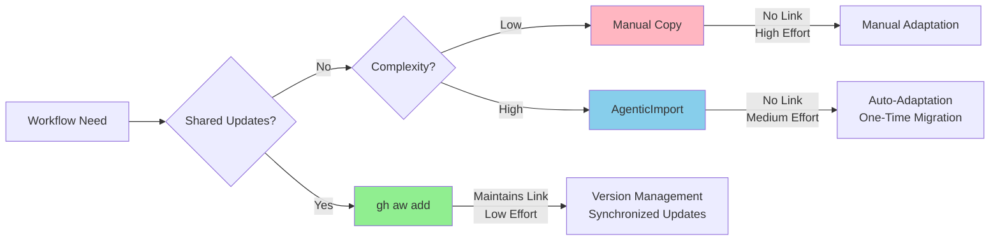

AgenticImport uses AI agents to migrate workflows between repositories with automatic adaptation. Unlike `gh aw add` or shared imports, it creates independent, customized copies without version tracking.

## When to Use

Use AgenticImport for one-time migrations requiring adaptation:

- **Repository forking** - Adapt workflows for different projects
- **Context-specific changes** - Substantial modifications for new environments
- **Cross-organization** - Copy workflows where shared imports aren't practical
- **Experimentation** - Fork workflows as automation starting points

**Don't use** for synchronized updates—use [Packaging & Distribution](/gh-aw/guides/packaging-imports/) with `gh aw add` instead.

## How It Works

The `create-agentic-agent` analyzes source workflows, identifies repository-specific configuration, and adapts them for the target:

```text
┌─────────────────────┐
│  Source Repository  │
│  - release.md       │
└──────────┬──────────┘
           │
           ▼
┌─────────────────────┐
│  AI Agent Analysis  │
│  - Read workflow    │
│  - Understand logic │
│  - Identify deps    │
└──────────┬──────────┘
           │
           ▼
┌─────────────────────┐
│  Target Repository  │
│  - release.md       │
│  (adapted version)  │
└─────────────────────┘
```

## Example Migration

The `release.md` workflow migration from `githubnext/gh-aw` to `githubnext/gh-aw-mcpg`:

```yaml wrap title="Prompt for create-agentic-agent"
Migrate the release.md workflow from githubnext/gh-aw to this repository.

The workflow should:
- Keep the same release automation logic
- Adapt permissions and jobs for our repository structure
- Update any repository-specific references
- Ensure all imports and tools are compatible
```

The agent automatically handles repository names, paths, permissions, and tool configurations.

## Setup

Initialize workflow creation agents:

```bash
gh aw init
```

## AgenticImport vs Traditional Import



**Choose AgenticImport when you need:**
- Complex adaptations (repository-specific config, tool changes)
- One-time migration without ongoing synchronization
- AI-assisted analysis and validation

**Choose `gh aw add` when you need:**
- Synchronized updates across repositories
- Version management with semantic tags
- Minimal customization

## Advanced Patterns

### Merging Workflows

```markdown
Merge issue-triage from org/repo1 and label-management from org/repo2 
into a unified workflow handling both responsibilities.
```

### Splitting Workflows

```markdown
Split multi-responsibility workflow.md into:
- Issue triage (issue-triage.md)
- PR review (pr-review.md)
- Security scanning (security-scan.md)

Extract shared configuration into common imports.
```

### Cross-Organization

```markdown
Migrate ci-doctor from public-org/workflows to our private enterprise 
repository, adapting for internal MCP servers and security policies.
```

## Real-World Example

The `release.md` migration from `githubnext/gh-aw` to `githubnext/gh-aw-mcpg` preserved release automation logic while adapting permissions, repository references, and structure for the target environment.

## Best Practices

**Before Migration:**
- Review source workflow purpose and dependencies
- Identify required secrets, tools, and permissions
- Understand shared imports
- Plan necessary adaptations

**During Migration:**
- Provide target repository context
- Specify security policies and constraints
- Use clear, specific instructions
- Validate incrementally with `gh aw compile`

**After Migration:**
- Test in safe environment ([TrialOps](/gh-aw/guides/trialops/))
- Review and document changes
- Remove `source:` frontmatter field

## Authoring with AI

```bash
# Interactive workflow creation/migration
gh copilot agent --agent create-agentic-workflow

# Compilation debugging
gh copilot agent --agent debug-agentic-workflow
```

## Limitations

- **Point-in-time copies** - Not for continuous synchronization (use `gh aw add`)
- **Requires context** - Agent needs clear target repository instructions
- **Manual validation** - Review and test before production
- **Iteration needed** - Complex workflows may need refinement

## Related

- [Packaging & Distribution](/gh-aw/guides/packaging-imports/) - Shared workflows with version management
- [Custom Agents](/gh-aw/reference/custom-agents/) - Specialized workflow authoring
- [TrialOps](/gh-aw/guides/trialops/) - Safe workflow testing
- [Workflow Structure](/gh-aw/reference/workflow-structure/) - Format reference
