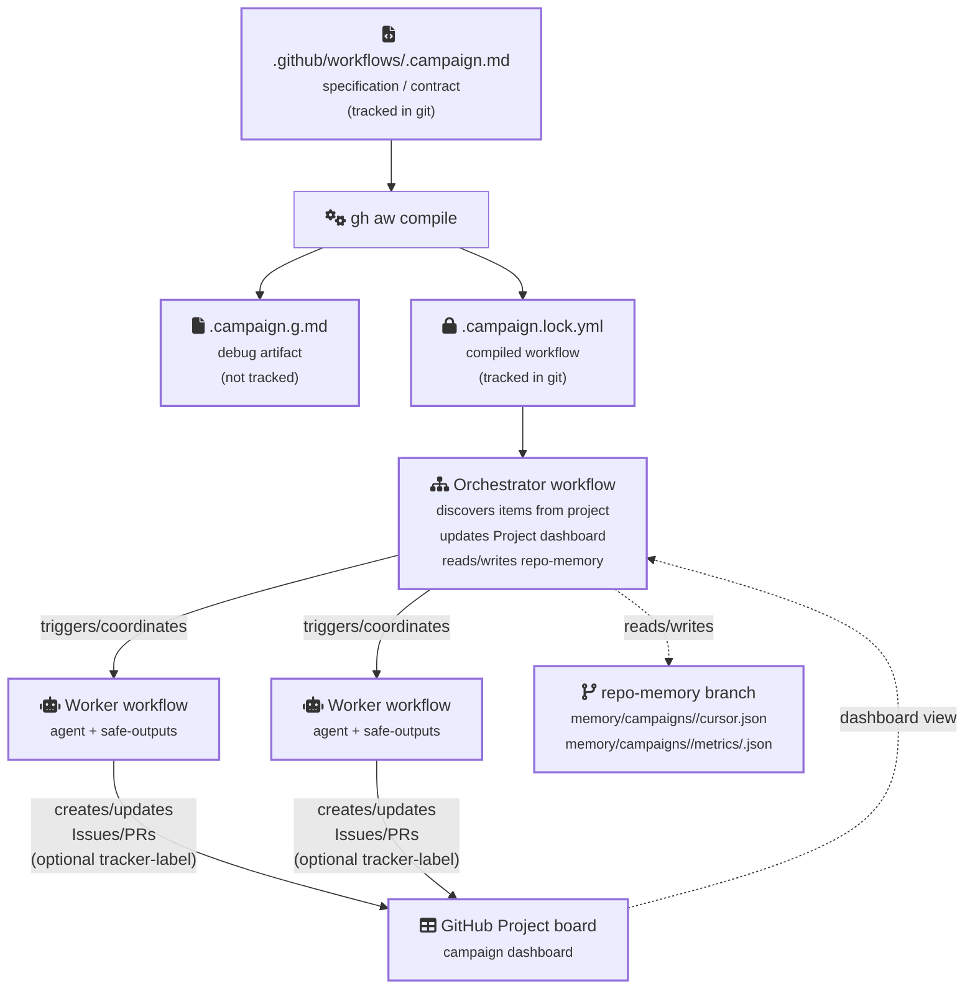

Agentic campaigns are bounded, goal-driven initiatives that run over time and are easy to see, review, and steer. They reuse agentic workflows as repeatable workers, but add a delegation layer: a clear objective, a set of measurable KPIs, governance, and a shared tracker so progress stays consistent across many runs.

While agentic workflows can already run continuously (scheduled, event-driven, and rerunnable), a campaign is what you use when you want that continuous work to be directed at a specific outcome and managed like a project, not just executed like automation.

For example, an agentic workflow might run nightly, decide whether a repo needs a dependency bump, and open a pull request. An agentic campaign uses the same kind of workflow as a worker and adds coordination: it defines what success looks like, tracks progress against KPIs, and maintains a single source of truth for status via a GitHub Project that automatically reflects which tracked items are new, in progress, blocked, or done. It also writes durable checkpoints and metrics so the campaign can resume safely and report progress until the goal is met.

## When to use a campaign

Use a campaign when you need to manage an initiative—scope, progress, and outcomes—across many workflow runs, not just execute automation and inspect each run’s result. Workflows execute; campaigns coordinate work toward a goal with shared tracking and a clear definition of done.

- Example of an agentic workflow (per-event automation):
  > Every time a new discussion is created, classify it and apply labels. If it fails, show an error in the run logs.

- Example of an agentic campaign (ongoing initiative):
  > Over the next two weeks, label and triage 500 existing Actions discussions to a new taxonomy, track completion with a campaign:actions-labeling label, and publish weekly progress updates (done/remaining, top failure reasons).

## Campaign structure

A campaign gives you a dashboard (GitHub Project), a coordinating orchestrator workflow that keeps it in sync, and a spec file that captures the objective, KPIs, governance, and wiring. In the repo, the spec lives at `.github/workflows/<id>.campaign.md` and is the source of truth.

When the spec includes orchestration, the tooling generates an orchestrator workflow and compiles it into a locked `.campaign.lock.yml` workflow. The spec defines what success means (objective), how progress is measured (KPIs, with exactly one marked primary), where progress is shown (GitHub Project URL), and what participates (workflows). Optionally, you can add a tracker label (commonly `campaign:<id>`) to help discover issues and PRs, but the project board remains the canonical source of campaign membership.

**Note:** During compilation, a `.campaign.g.md` file is generated locally as a debug artifact to help developers understand the orchestrator structure, but this file is not committed to git—only the source `.campaign.md` and compiled `.campaign.lock.yml` are tracked.

### Orchestrator architecture

The generated orchestrator workflow consists of two key components:

1. **Discovery precomputation step**: Runs before the agent to gather candidate items from GitHub (issues, PRs, discussions) and writes a normalized manifest file (`.gh-aw/campaign.discovery.json`). This step uses GitHub Script to efficiently query the GitHub API with pagination budgets and cursor-based incremental discovery.

2. **Agent coordination job**: Reads the discovery manifest, makes deterministic decisions about project updates, and executes writes in a separate phase. The agent never performs GitHub-wide searches directly—it only processes the precomputed manifest.

This architecture reduces API traffic, enables deterministic processing with rate limit controls, and ensures consistent campaign coordination across runs.

### Mental model

## How it works

Most campaigns follow the same shape. The GitHub Project is the human-facing status view and the canonical source of campaign membership. The orchestrator workflow has two phases:

1. **Discovery precomputation**: A dedicated GitHub Actions step queries GitHub for candidate items (using tracker label searches and workflow run queries), applies pagination budgets, and writes a normalized manifest (`.gh-aw/campaign.discovery.json`). This manifest contains all discovered items with metadata like URLs, content types, timestamps, and state.

2. **Agent coordination**: The agent reads the discovery manifest, makes deterministic decisions about which items need to be added or updated on the project board, and executes writes using the `update-project` safe output. The agent follows strict phases (read, plan, write, report) to ensure idempotent operation.

Worker workflows do the real work, such as opening pull requests or applying fixes, but they stay campaign-agnostic. Workers can include a `tracker-id` marker in their outputs, and you can configure a tracker label (e.g., `campaign:<id>`) as an ingestion hint to help discover issues and PRs created by workers.

## Memory

Campaigns become repeatable when they also write durable state to repo-memory (a git branch used for snapshots). The recommended layout is `memory/campaigns/<campaign-id>/cursor.json` for the checkpoint (treated as an opaque JSON object) and `memory/campaigns/<campaign-id>/metrics/<date>.json` for append-only metrics snapshots.

Campaign tooling enforces this durability contract at push time: when a campaign writes repo-memory, it must include a cursor and at least one metrics snapshot.

### Cursor-based incremental discovery

The orchestrator uses cursor-based incremental discovery to avoid rescanning the same items repeatedly. The cursor file (`cursor.json`) stores the last processed item boundary (typically an `updatedAt` timestamp and item ID). On subsequent runs, the discovery precomputation step reads this cursor and continues from where it left off, using deterministic ordering (e.g., oldest `updatedAt` first, tie-break by ID).

### Metrics snapshots

Each orchestrator run writes a new metrics snapshot file with the UTC date in the filename (e.g., `metrics/2025-01-05.json`). These snapshots are append-only and must include required fields:
- `campaign_id`: The campaign identifier
- `date`: UTC date in YYYY-MM-DD format
- `tasks_total`: Total number of tasks (>= 0)
- `tasks_completed`: Completed task count (>= 0)

Optional fields include `tasks_in_progress`, `tasks_blocked`, `velocity_per_day`, and `estimated_completion`.

## Next steps

- [Getting started](/gh-aw/guides/campaigns/getting-started/) – create a campaign quickly
- [Campaign specs](/gh-aw/guides/campaigns/specs/) – spec fields (objective/KPIs, governance, memory)
- [Project management](/gh-aw/guides/campaigns/project-management/) – project board setup tips
- [CLI commands](/gh-aw/guides/campaigns/cli-commands/) – CLI reference
- [Comparison with GitHub Security Campaigns](/gh-aw/guides/campaigns/comparison-github-campaigns/) – how agentic campaigns differ from GitHub's security campaigns
