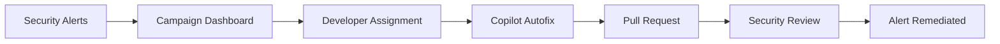
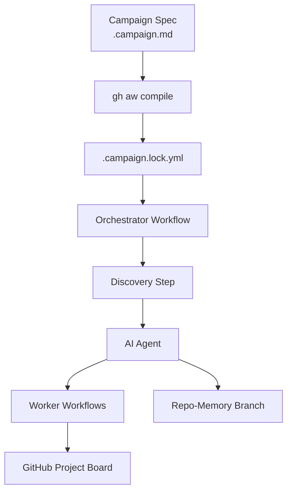
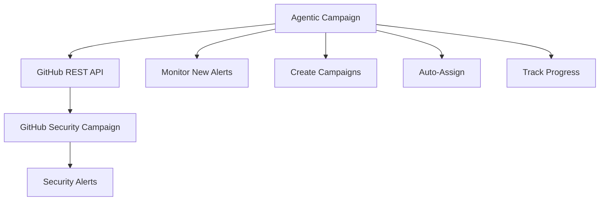

This page compares GitHub Agentic Workflows campaigns (agentic campaigns) with GitHub's Security Campaigns feature. While both use "campaign" terminology, they serve different purposes and operate at different levels.

## Overview

**GitHub Security Campaigns** are built-in GitHub Enterprise Cloud features designed specifically for fixing security alerts at scale. They focus on coordinating security teams and developers to remediate code scanning and secret scanning alerts.

**Agentic campaigns** are flexible automation initiatives that run as GitHub Actions workflows. They coordinate AI agents to work toward any goal over time, with tracking via GitHub Projects.

## Key Differences

| Aspect | GitHub Security Campaigns | Agentic Campaigns |
|--------|--------------------------|-------------------|
| **Availability** | Enterprise Cloud only | Any GitHub account with Actions |
| **Primary Use Case** | Security alert remediation | Any repeatable initiative |
| **Alert Types** | Code scanning, secret scanning | Any work item (issues, PRs, discussions) |
| **Automation** | Alert assignment, Copilot Autofix | AI agents with custom workflows |
| **Project Tracking** | Built-in campaign dashboard | GitHub Projects (manual setup) |
| **Configuration** | Web UI in Security tab | YAML frontmatter in `.campaign.md` |
| **Customization** | Templates for alert types | Fully programmable with workflows |
| **API Access** | REST API for campaigns | GitHub Actions API + Projects v2 |

## Use Case Comparison

### GitHub Security Campaigns

GitHub Security Campaigns excel at:

- **Organizing security work**: Group related alerts for focused remediation
- **Developer notification**: Automatically notify developers about assigned alerts
- **Autofix integration**: Trigger GitHub Copilot Autofix for code scanning alerts
- **Permission management**: Temporarily elevate permissions for alert review
- **Progress tracking**: Built-in views of alert states (open, dismissed, fixed)
- **Training scenarios**: Create campaigns of related alerts for learning

**Example workflow**:
1. Security team creates a campaign for SQL injection alerts
2. Selects alerts from the same CWE category
3. Assigns alerts to developers
4. Copilot Autofix generates suggested fixes
5. Developers review and merge fixes
6. Campaign tracks completion rate

### Agentic Campaigns

Agentic campaigns excel at:

- **Flexible objectives**: Any goal that can be described in natural language
- **Custom coordination**: Define your own orchestration logic
- **Cross-repository work**: Operate across organization repositories
- **Durable state**: Store progress in git branches (repo-memory)
- **AI-driven decisions**: Agents determine next actions based on context
- **Extensible workers**: Reuse workflows as campaign workers
- **Metrics tracking**: Custom KPIs with historical snapshots

**Example workflow**:
1. Define campaign objective (e.g., "Label 500 discussions")
2. Create campaign spec with KPIs and governance
3. Orchestrator discovers items needing work
4. AI agent processes items in batches
5. Workers execute tasks (apply labels, open PRs)
6. Progress tracked on GitHub Project board

## Technical Architecture

### GitHub Security Campaigns



**Key components**:
- Built into GitHub Enterprise Cloud UI
- Uses GitHub's code scanning and secret scanning infrastructure
- Integrates with GitHub Copilot for autofixes
- REST API endpoints for programmatic access
- Webhooks for assignment notifications

### Agentic Campaigns



**Key components**:
- Runs as GitHub Actions workflows
- YAML-based configuration in repository
- AI agents coordinate via orchestrator
- Discovery precomputation for scalability
- Git branches for durable state storage
- GitHub Projects for human-facing dashboards

## When to Use Each

### Use GitHub Security Campaigns When

- You have GitHub Enterprise Cloud
- Your focus is security alert remediation
- You want built-in GitHub integration
- You need Copilot Autofix for code scanning
- You want web UI for campaign management
- You need temporary permission elevation for alerts

### Use Agentic Campaigns When

- You need automation for any type of work
- You want custom AI-driven coordination
- You need cross-repository initiatives
- You want version-controlled campaign specs
- You need custom KPIs and metrics
- You want extensible worker workflows
- You need durable state across runs

## Can They Work Together?

Yes. The two features operate at different layers and can complement each other:

**Example integration**:
1. Use GitHub Security Campaigns for critical security alerts
2. Use agentic campaigns to automate campaign creation:
   - Monitor for new vulnerability types
   - Create security campaigns via REST API
   - Assign alerts to appropriate teams
   - Track remediation progress
   - Report metrics to leadership

:::note
This integration example requires GitHub Enterprise Cloud, as the REST API for creating Security Campaigns is only available in Enterprise Cloud accounts.
:::

**Workflow example**:
```yaml
---
name: "Security Campaign Automation"
engine: copilot

tools:
  github:
    toolsets: [default, code_security]
  
safe-outputs:
  add-comments:
    max: 5

on:
  schedule:
    - cron: "0 9 * * 1"  # Every Monday
---

# Task

Analyze open code scanning alerts in the last 7 days.
Group related alerts by CWE category.
For categories with 5+ alerts, create a GitHub Security Campaign.
Assign alerts to appropriate team members.
Comment on the campaign issue with context.
```

This agentic workflow automates security campaign creation while GitHub Security Campaigns handle the alert remediation workflow.

## Feature Comparison Matrix

### Core Capabilities

| Feature | GitHub Security Campaigns | Agentic Campaigns |
|---------|--------------------------|-------------------|
| Alert grouping | ✅ Native | ➖ Via custom logic |
| Developer notification | ✅ Automatic | ➖ Via safe-outputs |
| Copilot Autofix | ✅ Integrated | ➖ Separate workflow |
| Custom objectives | ➖ Security-focused | ✅ Any goal |
| Multi-repository | ➖ Single org | ✅ Any scope |
| Durable state | ➖ In GitHub DB | ✅ Git branches |
| Custom KPIs | ➖ Fixed metrics | ✅ User-defined |
| API access | ✅ REST API | ✅ Actions + Projects |
| Version control | ➖ No config files | ✅ YAML in repo |
| Self-hosted runners | ➖ N/A | ✅ Supported |

### Workflow Features

| Feature | GitHub Security Campaigns | Agentic Campaigns |
|---------|--------------------------|-------------------|
| Templates | ✅ Alert type templates | ➖ User-created |
| Scheduling | ➖ Manual runs | ✅ Cron + events |
| Batch processing | ➖ UI-based | ✅ Configurable |
| Rate limiting | ➖ GitHub defaults | ✅ Custom governance |
| Progress snapshots | ➖ Live only | ✅ Historical metrics |
| Incremental discovery | ➖ N/A | ✅ Cursor-based |
| Worker coordination | ➖ N/A | ✅ Multi-workflow |

### Team Features

| Feature | GitHub Security Campaigns | Agentic Campaigns |
|---------|--------------------------|-------------------|
| Role-based access | ✅ Built-in | ➖ Via GitHub permissions |
| Temporary permissions | ✅ For alerts | ➖ Standard GitHub |
| Team assignment | ✅ UI-based | ➖ Via safe-outputs |
| Collaboration | ✅ In campaign view | ➖ In Project board |
| Reporting | ✅ Built-in views | ➖ Custom via KPIs |
| Training mode | ✅ Related alerts | ➖ Custom workflows |

## Migration Scenarios

### From Security Campaigns to Agentic Campaigns

If you need more flexibility than GitHub Security Campaigns provide:

**Steps**:
1. Export campaign data via REST API
2. Create campaign spec with similar objective
3. Use tracker labels for item discovery
4. Configure safe-outputs for assignments
5. Migrate progress to GitHub Project
6. Set up repo-memory for state

**Benefits**:
- Custom orchestration logic
- Support for non-security work
- Cross-repository operations
- Historical metrics tracking

**Tradeoffs**:
- No built-in Copilot Autofix
- Manual GitHub Project setup
- Workflow maintenance required

### Using Both Features

Run security campaigns for alerts and agentic campaigns for automation:

**Architecture**:


**Benefits**:
- Leverage Copilot Autofix for security
- Automate campaign management
- Custom metrics and reporting
- Flexible orchestration

## Terminology Clarification

Both features use "campaign" but the meanings differ:

**GitHub Security Campaign**: A curated set of security alerts grouped for remediation. Emphasis on **alert curation** and **developer collaboration**.

**Agentic Campaign**: A goal-driven automation initiative coordinated by AI agents. Emphasis on **continuous automation** and **progress tracking**.

:::note
The term "campaign" in both contexts refers to organized, time-bound initiatives. GitHub Security Campaigns are for security remediation; agentic campaigns are for any repeatable work coordinated by AI.
:::

## Further Reading

### GitHub Security Campaigns
- [About Security Campaigns](https://docs.github.com/en/enterprise-cloud@latest/code-security/securing-your-organization/fixing-security-alerts-at-scale/about-security-campaigns)
- [Creating and Managing Security Campaigns](https://docs.github.com/en/enterprise-cloud@latest/code-security/securing-your-organization/fixing-security-alerts-at-scale/creating-managing-security-campaigns)
- [REST API for Security Campaigns](https://docs.github.com/en/enterprise-cloud@latest/rest/campaigns/campaigns)

### Agentic Campaigns
- [Agentic Campaigns Overview](/gh-aw/guides/campaigns/)
- [Getting Started with Campaigns](/gh-aw/guides/campaigns/getting-started/)
- [Campaign Specs Reference](/gh-aw/guides/campaigns/specs/)
- [Project Management Guide](/gh-aw/guides/campaigns/project-management/)
