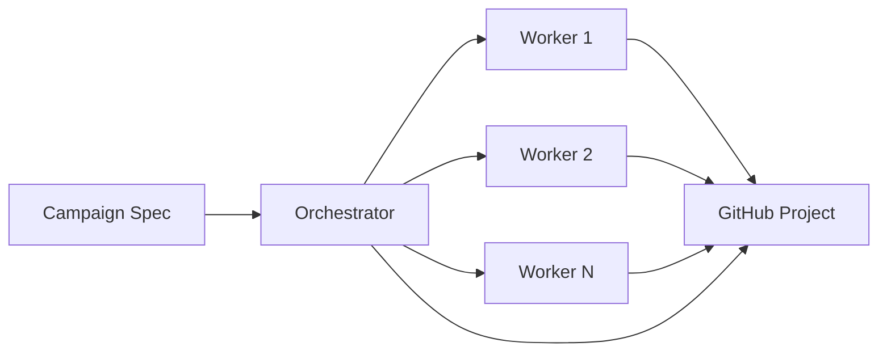

import FeatureCard from '../../../../components/FeatureCard.astro';
import FeatureGrid from '../../../../components/FeatureGrid.astro';

## Overview

Agentic campaigns coordinate AI agents across multiple [agentic workflows](/gh-aw/introduction/overview/) to achieve strategic goals. Think of campaigns as meta-orchestration: they bring together worker workflows, track progress on GitHub Projects, and ensure work progresses systematically toward completion.

**Key benefits:**
- **Goal-driven automation**: Define objectives with measurable KPIs
- **Unified tracking**: Single dashboard showing all campaign work
- **Built-in governance**: Rate limits prevent overwhelming automation
- **No worker changes**: Coordinate existing workflows as-is

## Why use campaigns?

<FeatureGrid columns={2}>
  <FeatureCard icon="goal" title="Strategic Goals" href="/gh-aw/guides/campaigns/specs/#core-fields-what-they-do">
    Define objectives with measurable KPIs that track progress automatically
  </FeatureCard>
  <FeatureCard icon="project" title="Unified Tracking" href="/gh-aw/guides/campaigns/project-management/">
    GitHub Project board shows all work items and real-time status
  </FeatureCard>
  <FeatureCard icon="shield" title="Built-in Governance" href="/gh-aw/guides/campaigns/specs/#governance-pacing--safety">
    Rate limits and safety controls keep automation predictable and safe
  </FeatureCard>
  <FeatureCard icon="workflow" title="Reuse Workflows" href="/gh-aw/guides/campaigns/specs/#workflows">
    Coordinate existing agentic workflows without modification
  </FeatureCard>
</FeatureGrid>

## Quick start

Get your first campaign running in 5 minutes:

```bash
# 1. Create a GitHub Project for tracking
# 2. Write a campaign spec
gh aw campaign new my-campaign

# 3. Compile to generate orchestrator
gh aw compile

# 4. The orchestrator runs on schedule or manually
```

See the [Getting Started guide](/gh-aw/guides/campaigns/getting-started/) for complete instructions.

## How campaigns work

A campaign consists of three components working together:

1. **Campaign Spec** (`.campaign.md`) - Defines objectives, KPIs, workflows, and governance rules
2. **Orchestrator** (`.campaign.lock.yml`) - Auto-generated coordinator that manages the campaign
3. **GitHub Project** - Dashboard displaying real-time progress and work items

### Two orchestration modes

**Passive coordination** (default):
- Orchestrator discovers and tracks work created by independent workflows
- Workers run on their own schedules
- Safer approach for getting started
- Best for existing workflow ecosystems

**Active execution** (`execute-workflows: true`):
- Orchestrator runs workflows directly and creates missing ones
- Drives progress automatically
- More powerful but requires careful governance
- Best for self-contained campaigns

### Orchestration flow



The orchestrator:
- Discovers work items using tracker labels or workflow queries
- Updates the GitHub Project board with current status
- Coordinates worker execution (in active mode)
- Tracks KPIs and reports progress
- Enforces governance limits to prevent overwhelming automation

## Example campaign

Here's a complete campaign spec for upgrading services to a new framework version:

```yaml
---
id: framework-upgrade
name: "Framework Upgrade Campaign"
project-url: "https://github.com/orgs/myorg/projects/42"
tracker-label: "campaign:framework-upgrade"

# Clear objective with measurable success criteria
objective: "Upgrade all 50 services to Framework vNext with zero downtime"

# Track progress with KPIs
kpis:
  - id: services_upgraded
    name: "Services upgraded"
    priority: primary
    baseline: 0
    target: 50
    time-window-days: 30
    direction: increase

# Coordinate worker workflows
workflows:
  - framework-scanner    # Discovers services needing upgrade
  - framework-upgrader   # Creates upgrade PRs

# Enable active execution
execute-workflows: true

# Governance ensures predictable automation
governance:
  max-project-updates-per-run: 20
  max-new-items-per-run: 10
---

# Framework Upgrade Campaign

Systematic upgrade of all services to Framework vNext...
```

When this campaign runs, the orchestrator will:
1. Execute `framework-scanner` to discover services
2. Execute `framework-upgrader` to create upgrade PRs
3. Track all work on the GitHub Project board
4. Report progress against the KPI target (0/50 → 50/50)
5. Enforce governance limits to prevent overwhelming the team

See more examples in the [Campaign Specs](/gh-aw/guides/campaigns/specs/) reference.

## Common use cases

<FeatureGrid columns={2}>
  <FeatureCard icon="package" title="Migration Projects" badge="systematic">
    Coordinate repository migrations, dependency upgrades, and framework transitions with automated tracking and progress reporting
  </FeatureCard>
  <FeatureCard icon="shield-check" title="Security Fixes" badge="time-bound">
    Systematically resolve vulnerabilities across repositories with clear metrics and deadline tracking
  </FeatureCard>
  <FeatureCard icon="beaker" title="Quality Improvements" badge="ongoing">
    Incrementally improve test coverage, documentation, accessibility, and code quality with continuous monitoring
  </FeatureCard>
  <FeatureCard icon="tools" title="Large Refactorings" badge="phased">
    Execute complex architectural changes across multiple repositories with milestone tracking and coordination
  </FeatureCard>
</FeatureGrid>

### When to use campaigns vs standalone workflows

| Use Case | Best Approach |
|----------|---------------|
| **One-off task** | Standalone workflow |
| **Recurring maintenance** | Standalone workflow |
| **Multi-step initiative with KPIs** | Campaign |
| **Cross-repository coordination** | Campaign |
| **Long-running goals (weeks/months)** | Campaign |

## Key features explained

### Strategic Goals
Define clear objectives with measurable KPIs that track progress automatically. See how to structure effective goals in [Campaign Specs](/gh-aw/guides/campaigns/specs/#core-fields-what-they-do).

### Unified Tracking  
GitHub Project board shows all work items and real-time status. Configure custom fields, swimlanes, and views in [Project Management](/gh-aw/guides/campaigns/project-management/).

### Built-in Governance
Rate limits and safety controls keep automation predictable and safe. Learn about governance policies in [Campaign Specs](/gh-aw/guides/campaigns/specs/#governance-pacing--safety).

### Reuse Workflows
Coordinate existing agentic workflows without modification. Workers remain campaign-agnostic; orchestrators handle all coordination logic.

## Next steps

- **[Quick start](/gh-aw/guides/campaigns/getting-started/)** - Create your first campaign in 5 steps
- **[Campaign specs](/gh-aw/guides/campaigns/specs/)** - Learn the specification format and configuration options
- **[Project management](/gh-aw/guides/campaigns/project-management/)** - Set up GitHub Project boards for campaign dashboards
- **[CLI commands](/gh-aw/guides/campaigns/cli-commands/)** - Reference for campaign compilation and management
