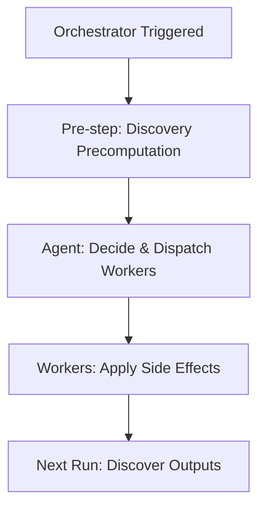

:::caution[File format deprecated]
This guide describes the deprecated `.campaign.md` file format. For current project tracking, use the `project` field in workflow frontmatter. See [Project Tracking](/gh-aw/reference/frontmatter/#project-tracking-project).
:::

Campaign orchestrators execute on a schedule to coordinate worker workflows and discover outputs. Orchestrators are dispatch-only: they can coordinate, but all GitHub writes (Projects, issues/PRs, comments) happen in worker workflows.

## Execution flow



Each run follows this sequence:

1. **Pre-step** - A deterministic discovery script runs (via `actions/github-script`) and writes `./.gh-aw/campaign.discovery.json`
2. **Agent** - Reads the discovery manifest and campaign spec, then dispatches worker workflows via `safe-outputs.dispatch-workflow`
3. **Workers** - Create/update issues/PRs, apply labels, and update Project boards using their own safe-outputs

## Campaign states

| State | Description | Execution |
|-------|-------------|-----------|
| `planned` | Draft configuration under review | Not running |
| `active` | Production campaign | Runs on schedule |
| `paused` | Temporarily stopped | Not running |
| `completed` | Objectives achieved | Not running |
| `archived` | Historical reference | Not running |

:::caution
The `state` field is documentation only. To stop execution, disable the workflow in GitHub Actions settings.
:::

## Worker workflows

Worker workflows perform campaign tasks (scanning, analysis, remediation). The orchestrator dispatches them via `workflow_dispatch` and discovers their outputs.

### Requirements

Worker workflows in the campaign's `workflows` list must:

- Accept `workflow_dispatch` as the **only** trigger
- Remove all other triggers (`schedule`, `push`, `pull_request`)
- Label created items with the campaign tracker label (defaults to `z_campaign_<campaign-id>`)
- Accept standardized inputs: `campaign_id` (string) and `payload` (string JSON)

```yaml
# Worker workflow configuration
on:
  workflow_dispatch:
    inputs:
      campaign_id:
        description: 'Campaign identifier'
        required: true
        type: string
      payload:
        description: 'JSON payload with work details'
        required: true
        type: string
```

### Independent workflows

Workflows not in the `workflows` list can keep their original triggers. The campaign discovers their outputs via tracker labels without controlling execution.

```yaml
# Campaign spec
workflows:
  - vulnerability-scanner  # Orchestrator controls this one
  # dependency-check runs independently with its cron schedule
```

`tracker-label` is optional; when omitted it defaults to `z_campaign_<campaign-id>`.

## Discovery and governance

Discovery finds items created by workers based on tracker labels. Governance limits control the pace of work.

```yaml
governance:
  max-discovery-items-per-run: 50
  max-project-updates-per-run: 10
```

When limits are reached:
- Discovery cursor saves the current position
- Remaining items are deferred to the next run
- Status update reports deferred count
- Campaign continues on next schedule

The campaign processes items incrementally across multiple runs until all are handled.

## Pausing and ending campaigns

### Pause temporarily

1. Update spec: `state: paused`
2. Disable workflow in Actions settings

### Complete permanently

1. Run orchestrator one final time for completion status
2. Update spec: `state: completed`
3. Disable workflow in Actions settings
4. Optionally delete `.campaign.lock.yml` (keep `.campaign.md` for history)

### Archive for reference

```yaml
---
id: security-q1-2025
state: archived
---

Completed 2025-03-15. Final metrics:
- Tasks: 200/200
- Duration: 90 days
- Velocity: 7.5 tasks/day
```

## Troubleshooting

**Worker dispatch fails**
- Verify workflow exists and has `workflow_dispatch` trigger
- Check workflow file name matches spec
- Ensure no compilation errors in worker

**Discovery finds no items**
- Verify tracker label matches campaign ID
- Check workers are creating items with correct labels
- Confirm discovery scope includes correct repos/orgs

**Project updates hit limit**
- Increase `max-project-updates-per-run` in governance (used as a pacing signal for generated instructions)
- Accept incremental processing across multiple runs
- Verify the worker workflow token has required Projects permissions

**Items processed multiple times**
- Ensure workers use deterministic keys
- Check for duplicate labels on items
- Verify idempotency logic in worker code

## Advanced: Pre-existing workflows

### Converting scheduled workflows

When adding an existing scheduled workflow to a campaign:

**Before** (independent):
```yaml
on:
  schedule: daily
  workflow_dispatch:
```

**After** (campaign-controlled):
```yaml
on:
  workflow_dispatch:  # Only this trigger
  # schedule: daily   # Removed - campaign controls timing
```

### Event-driven workflows

Workflows triggered by code events (`push`, `pull_request`) should not be campaign-controlled. These respond to specific events, not campaign schedules.

**Recommended**: Keep them independent and let the campaign discover their outputs.

**Not recommended**: Adding them to campaign's `workflows` list requires removing event triggers, which defeats their purpose.

## Further reading

- [Campaign specs](/gh-aw/guides/campaigns/specs/) - Configuration reference
- [Getting started](/gh-aw/guides/campaigns/getting-started/) - Create your first campaign
- [CLI commands](/gh-aw/guides/campaigns/cli-commands/) - Management commands
