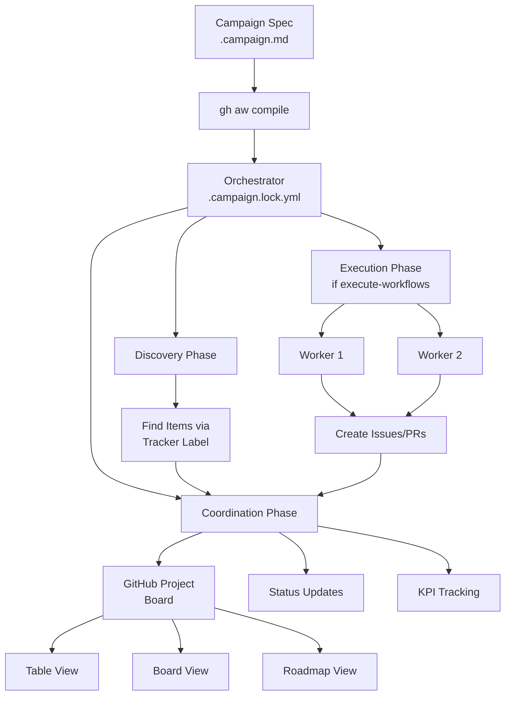
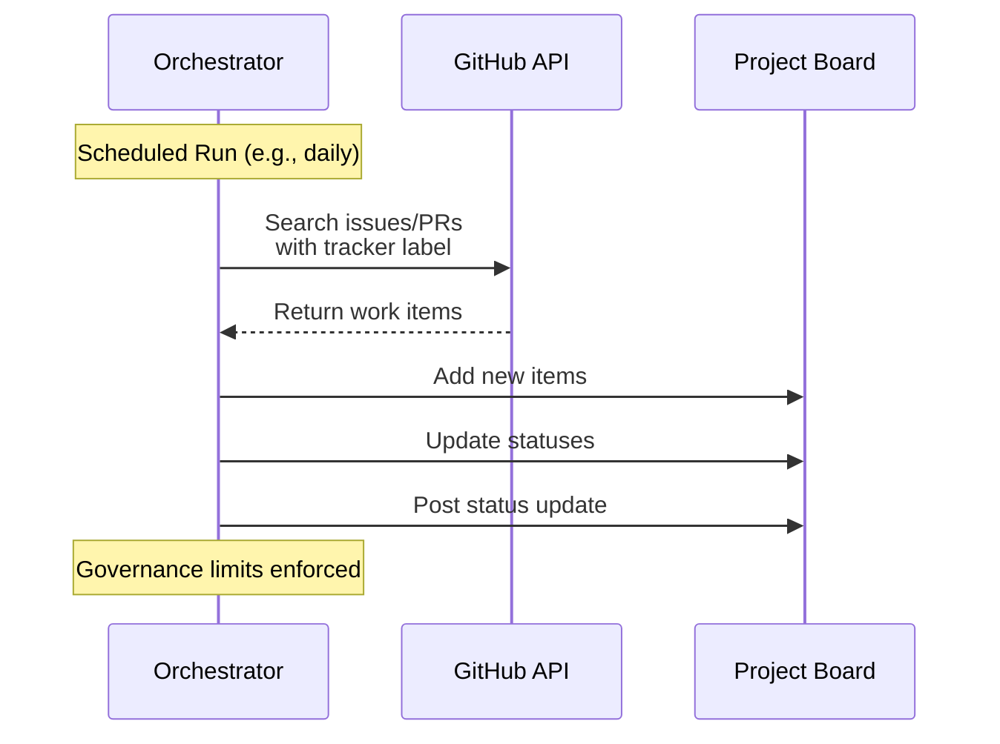
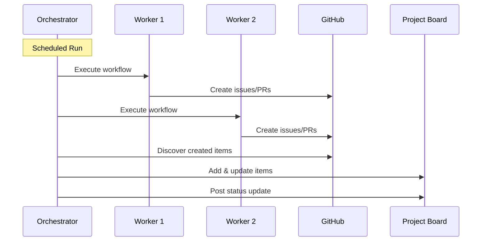

Agentic campaigns coordinate AI agents across multiple workflows to achieve strategic goals with measurable progress tracking.

They provide a meta-orchestration layer: define objectives with KPIs, track progress on GitHub Projects, and optionally execute workflows to drive work forward.

## Campaign architecture



## Campaign components

### 1. Campaign Spec (`.campaign.md`)

The specification file defines:
- **Objectives**: What success looks like
- **KPIs**: How to measure progress  
- **Workflows**: Which workers to coordinate
- **Governance**: Rate limits and safety controls

```yaml
---
id: my-campaign
objective: "Upgrade all services to Framework vNext"
kpis:
  - id: services_upgraded
    target: 50
workflows:
  - scanner
  - upgrader
---
```

### 2. Orchestrator (`.campaign.lock.yml`)

Auto-generated GitHub Actions workflow that:
- **Discovers** work items via tracker labels or queries
- **Executes** worker workflows (if active mode enabled)
- **Coordinates** progress by updating project board
- **Reports** KPIs and campaign status
- **Enforces** governance limits

### 3. Worker Workflows

Specialized agentic workflows that:
- Run independently or triggered by orchestrator
- Create issues, PRs, comments using safe-outputs
- Apply tracker labels for discovery
- Remain campaign-agnostic (no campaign-specific logic)

### 4. GitHub Project

Dashboard providing:
- Real-time work item tracking
- Custom fields (Worker, Priority, Status, Dates)
- Multiple views (Table, Board, Roadmap)
- Status updates and progress reports

## Campaign execution flow

### Passive mode (default)



**Flow details**:
1. **Trigger**: Scheduled (cron) or manual workflow dispatch
2. **Discovery**: Query GitHub for items with tracker label
3. **Filtering**: Apply governance limits (max items, opt-out labels)
4. **Coordination**: Update project board with current state
5. **Reporting**: Create status update with KPI progress

**Worker workflows run independently** - they're not triggered by the orchestrator.

### Active mode (`execute-workflows: true`)



**Flow details**:
1. **Trigger**: Scheduled or manual
2. **Execution**: Run each configured workflow sequentially
3. **Collection**: Gather outputs from workflow runs
4. **Discovery**: Find items created by workers
5. **Coordination**: Update project board
6. **Reporting**: Create status update

**Worker workflows are triggered and managed by orchestrator**.

## Orchestration phases

### Phase 0: Workflow Execution (Active Mode Only)

Only runs when `execute-workflows: true`:

1. Check if each configured workflow exists
2. Create missing workflows (generate from campaign objective)
3. Test newly created workflows
4. Execute workflows sequentially
5. Collect outputs for coordination

### Phase 1: Discovery

Discover work items using tracker labels or workflow queries:

```yaml
# Discovery uses tracker label
tracker-label: "campaign:framework-upgrade"
```

Queries GitHub API for:
- Issues with tracker label
- Pull requests with tracker label
- Items already on project board (to update status)

**Governance applied**:
- `max-discovery-items-per-run`: Limit items scanned
- `max-discovery-pages-per-run`: Limit API pagination
- `opt-out-labels`: Exclude certain items

### Phase 2: Coordination

Update GitHub Project board:

1. **Add new items**: Items not yet on board (up to `max-new-items-per-run`)
2. **Update existing items**: Sync status, custom fields
3. **Respect governance**: Stop at `max-project-updates-per-run`
4. **Apply custom fields**: Worker, Priority, Status, Dates

```yaml
# Custom fields populated automatically
fields:
  worker_workflow: "scanner"
  priority: "High"
  status: "In Progress"
  start_date: "2026-01-12"
```

### Phase 3: Status Reporting

Create project status update:

- **Summary**: Items discovered, processed, remaining
- **KPI progress**: Current vs target for each KPI
- **Trends**: Velocity, completion rate
- **Next steps**: Remaining work and blockers
- **Status indicator**: `ON_TRACK`, `AT_RISK`, `OFF_TRACK`, `COMPLETE`

## Orchestration modes comparison

| Aspect | Passive Mode | Active Mode |
|--------|--------------|-------------|
| **Workers** | Run independently | Triggered by orchestrator |
| **Discovery** | Find existing work | Find created work + existing |
| **Bootstrapping** | Requires existing workflows | Can create missing workflows |
| **Control** | Less control, more flexible | More control, more automation |
| **Risk** | Lower (observe only) | Higher (executes actions) |
| **Best for** | Existing ecosystems | Self-contained campaigns |

## Memory (optional)

Campaigns can write durable state to repo-memory (a git branch):
- **Cursor file**: `memory/campaigns/<id>/cursor.json` - Checkpoint for incremental discovery
- **Metrics snapshots**: `memory/campaigns/<id>/metrics/<date>.json` - Append-only progress tracking

This allows campaigns to resume where they left off and track progress over time.

## Next steps

- [Getting started](/gh-aw/guides/campaigns/getting-started/) – create a campaign quickly
- [Campaign specs](/gh-aw/guides/campaigns/specs/) – spec fields and configuration
- [Project management](/gh-aw/guides/campaigns/project-management/) – project board setup
- [CLI commands](/gh-aw/guides/campaigns/cli-commands/) – CLI reference
