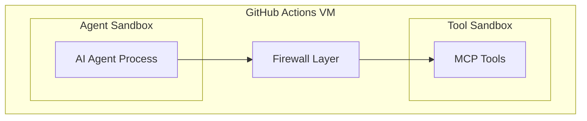

Dynamic command execution is a core feature of GitHub Agentic Workflows, enabling AI agents to generate contextual commands at runtime. This design pattern is intentional and necessary for adaptive automation, though it produces obfuscation warnings from static security scanners like [zizmor](https://github.com/woodruffw/zizmor).

## Why Dynamic Execution is Intentional

Agentic workflows enable AI agents to make contextual decisions and execute appropriate commands based on runtime conditions. This requires dynamic command generation rather than hardcoded scripts.

**Key Benefits:**

1. **Contextual Adaptation**: Agents analyze repository state, issue content, PR details, and other runtime context to determine appropriate actions
2. **Flexible Automation**: Single workflow definitions handle diverse scenarios without requiring separate hardcoded scripts for each case
3. **Reduced Maintenance**: Natural language workflow descriptions replace complex conditional logic and script management
4. **Intelligent Decision Making**: AI engines evaluate context and select optimal commands dynamically

**Example Scenario:**

A triage workflow might need to:
- Run different test commands based on detected language (npm test, pytest, cargo test)
- Execute repository-specific scripts found in package.json or Makefile
- Analyze CI logs and run targeted diagnostic commands
- Generate custom reports based on issue patterns

Hardcoding all possible command variations would be impractical. Dynamic execution enables agents to adapt intelligently.

## Security Considerations

While dynamic execution provides flexibility, it introduces security considerations that static analysis tools detect as potential obfuscation. Understanding the difference between intentional patterns and actual security issues is critical.

### Expected Obfuscation Warnings

Static security scanners like zizmor detect dynamic command execution patterns and report them as potential obfuscation vulnerabilities. In the context of agentic workflows, these warnings are **expected and acceptable**:

- **Affected Workflows**: All 63 agentic workflows in this repository generate 126 low-priority obfuscation warnings
- **Root Cause**: AI-generated commands are constructed at runtime from agent outputs
- **Risk Level**: Low - mitigated by multiple layers of runtime safety controls
- **Status**: Intentional pattern, not a security flaw

### Runtime Safety Controls

Agentic Workflows implement defense-in-depth security controls that execute at runtime, complementing (and in some cases replacing) static analysis:

#### 1. Sandboxed Execution Environment

All agent processes run in isolated sandboxes with restricted permissions:



- Containerized execution prevents escape to host system
- Process-level isolation between agent and tools
- Limited filesystem access and network restrictions

#### 2. Permission Scoping

Workflows default to read-only permissions, with write operations restricted to safe outputs:

```yaml wrap
permissions:
  contents: read      # Read-only by default
  issues: read
  pull-requests: read

safe-outputs:
  create-issue:      # Explicit write operations only
  add-comment:
```

The AI agent never has direct write access to repository resources.

#### 3. Command Allow-listing

Shell commands require explicit allow-listing in workflow frontmatter:

```yaml wrap
tools:
  bash: ["git status", "npm test", "echo"]
```

Agents cannot execute arbitrary commands - only pre-approved operations are permitted.

#### 4. Secret Verification

Token fields require GitHub Actions secret expressions:

```yaml wrap
github-token: ${{ secrets.CUSTOM_PAT }}  # ✅ Valid
github-token: ghp_plaintext              # ❌ Compilation error
```

Plaintext tokens or environment variable references fail at compile time, preventing credential leakage.

#### 5. Output Sanitization and Validation

Agent outputs pass through multiple validation layers:

- **Sanitization**: Removes control characters, neutralizes @mentions, limits size
- **Threat Detection**: AI-powered analysis identifies prompt injection and malicious patterns
- **Safe Output Jobs**: Separate execution context validates and applies changes
- **Audit Logging**: All agent commands and outputs are logged for review

See [Safe Outputs Security Model](/gh-aw/reference/safe-outputs/) for detailed information.

#### 6. Network Isolation

Fine-grained network controls restrict both agent and tool network access:

```yaml wrap
network:
  allowed: ["api.github.com", "npm.registry.org"]

tools:
  web:
    network:
      allowed: ["example.com"]
```

Egress filtering prevents unauthorized data exfiltration.

### Trade-offs and Accepted Risks

The dynamic execution model involves conscious trade-offs:

| Aspect | Trade-off | Mitigation |
|--------|-----------|------------|
| **Static Auditability** | Commands not visible in workflow YAML | Audit logs capture actual execution; lock files show compilation artifacts |
| **Obfuscation Warnings** | Security scanners flag dynamic patterns | Runtime controls provide actual security; warnings expected and documented |
| **Execution Predictability** | Agent outputs vary based on context | Safe outputs enforce operation boundaries; deterministic patterns where needed |
| **Review Complexity** | Cannot review exact commands before execution | Read-only defaults; manual approval gates for sensitive operations |

**Accepted**: Reduced static auditability in exchange for flexible, context-aware automation

**Mitigated by**: Runtime monitoring, audit logs, permission scoping, sandboxed execution

## When to Be Concerned

Not all obfuscation warnings are acceptable. Investigate when:

### 1. Unexpected Dynamic Execution in Non-Agentic Workflows

Static workflows should use hardcoded commands. Dynamic execution in traditional GitHub Actions workflows may indicate:

- Unintentional complexity or poor design
- Potential security vulnerability (untrusted input in commands)
- Supply chain compromise

**Action**: Review workflow purpose; refactor to static commands if possible

### 2. Missing Safety Checks in Agent Execution

Agentic workflows should have layered safety controls. Warnings combined with:

- No command allow-listing (`bash: ["*"]` or missing `bash` configuration)
- Write permissions without safe outputs
- Unrestricted network access (`network: {}` or wildcard domains)
- Missing audit logging

**Action**: Add explicit safety controls; use strict mode

### 3. Overly Permissive Permissions

Dynamic execution with excessive permissions increases risk:

```yaml wrap
# ⚠️ High Risk
permissions:
  contents: write
  issues: write
  pull-requests: write
tools:
  bash: ["*"]
```

**Action**: Apply least privilege; use safe outputs for write operations

### 4. Custom or Unverified MCP Tools

Dynamic execution in third-party MCP tools without proper sandboxing:

- No container isolation
- Unrestricted network access
- Elevated privileges

**Action**: Verify tool security; use containerized tools with network restrictions

## Best Practices

When working with dynamic execution in agentic workflows:

1. **Use Strict Mode**: Enable `strict: true` to enforce security defaults
2. **Minimize Permissions**: Default to read-only; use safe outputs for writes
3. **Allow-list Commands**: Explicitly define permitted shell commands
4. **Enable Threat Detection**: Use built-in threat detection for agent outputs
5. **Monitor Audit Logs**: Regularly review workflow execution logs with `gh aw logs`
6. **Apply Network Restrictions**: Limit network access to required domains only
7. **Use Manual Approval Gates**: Require human review for sensitive operations
8. **Pin Dependencies**: Lock Actions and containers to specific SHAs

## Understanding Zizmor Findings

When running zizmor on compiled workflows:

```bash wrap
gh aw compile --zizmor              # Scan with warnings
gh aw compile --strict --zizmor     # Block on findings
```

**Expected Output**: Low-priority obfuscation warnings for agentic workflows

**What to Review**:
- High/Critical severity findings (always investigate)
- Obfuscation warnings in non-agentic workflows
- Permission or secret exposure issues
- Supply chain vulnerabilities

**What to Accept**:
- Low-priority obfuscation warnings from AI-generated command patterns
- Dynamic execution in sandboxed agent contexts
- Runtime command construction with proper safety controls

## See Also

- [Security Best Practices](/gh-aw/guides/security/) - Comprehensive security guidance
- [Safe Outputs Reference](/gh-aw/reference/safe-outputs/) - Safe output security model
- [Threat Detection Guide](/gh-aw/guides/threat-detection/) - Threat detection configuration
- [Network Configuration](/gh-aw/reference/network/) - Network isolation controls
- [Sandbox Configuration](/gh-aw/reference/sandbox/) - Sandboxed execution details
- [Strict Mode](/gh-aw/reference/frontmatter/#strict-mode-strict) - Strict mode validation
