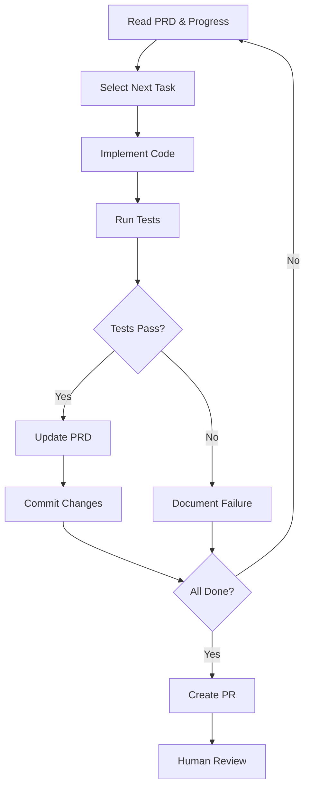

The Ralph Loop pattern enables AI agents to work autonomously on complex, multi-step features by iterating until all requirements are met. This tutorial walks you through setting up your first Ralph Loop workflow.

## What You'll Build

By the end of this tutorial, you'll have:
- A working Ralph Loop workflow
- A structured PRD for a feature
- Autonomous iteration with progress tracking
- Safe, tested commits with human review gates

**Time Required:** 30-45 minutes  
**Prerequisites:** Repository with gh-aw installed, basic familiarity with GitHub Actions

## Tutorial Overview

1. [Understand the Pattern](#step-1-understand-the-pattern)
2. [Create Your PRD](#step-2-create-your-prd)
3. [Convert PRD to JSON](#step-3-convert-prd-to-json)
4. [Create the Workflow](#step-4-create-the-workflow)
5. [Set Up Progress Tracking](#step-5-set-up-progress-tracking)
6. [Run Your First Loop](#step-6-run-your-first-loop)
7. [Monitor and Review](#step-7-monitor-and-review)

## Step 1: Understand the Pattern

### The Ralph Loop Cycle



### Key Principles

1. **Fresh Context Each Iteration** - Each run starts clean, reading state from files
2. **Test Before Commit** - Never commit failing code
3. **Learn from Failures** - Document what didn't work for next iteration
4. **Atomic Progress** - One task at a time, fully tested
5. **Human Gates** - Always review before merging

## Step 2: Create Your PRD

Let's build a simple feature: a health check endpoint for your API.

Create `prds/health-check.md`:

```markdown
# Feature: API Health Check

## Overview
Add a health check endpoint that returns system status and database connectivity.

## User Stories

### US-001: Basic Health Endpoint
**As a** DevOps engineer  
**I want** a /health endpoint  
**So that** I can monitor service availability

**Acceptance Criteria:**
- [ ] GET /api/health endpoint returns 200 OK
- [ ] Response includes: status, timestamp, version
- [ ] Response format is JSON
- [ ] Endpoint requires no authentication
- [ ] Unit tests pass with 100% coverage

**Estimate:** 20 minutes

### US-002: Database Health Check
**As a** DevOps engineer  
**I want** database connectivity status  
**So that** I can detect database issues

**Acceptance Criteria:**
- [ ] Health response includes database_status field
- [ ] Status is "healthy" if database connection succeeds
- [ ] Status is "unhealthy" if database connection fails
- [ ] Endpoint still returns 200 even if database is down
- [ ] Includes database response time in milliseconds
- [ ] Unit tests pass with 100% coverage

**Estimate:** 30 minutes
```

### PRD Best Practices

✅ **Do:**
- Write specific, testable acceptance criteria
- Include time estimates (15-45 minutes per story)
- Use clear success conditions
- Break large features into small stories

❌ **Don't:**
- Use vague criteria like "should work well"
- Create stories that take hours to implement
- Skip the "Estimate" field
- Forget about tests in acceptance criteria

## Step 3: Convert PRD to JSON

The agent needs a machine-readable format. Create `prds/health-check-prd.json`:

```json
{
  "feature": "API Health Check",
  "status": "pending",
  "created_at": "2026-01-22T10:00:00Z",
  "updated_at": "2026-01-22T10:00:00Z",
  "user_stories": [
    {
      "id": "US-001",
      "title": "Basic Health Endpoint",
      "priority": 1,
      "status": "pending",
      "estimate_minutes": 20,
      "acceptance_criteria": [
        {
          "id": "AC-001-1",
          "description": "GET /api/health endpoint returns 200 OK",
          "completed": false
        },
        {
          "id": "AC-001-2",
          "description": "Response includes: status, timestamp, version",
          "completed": false
        },
        {
          "id": "AC-001-3",
          "description": "Response format is JSON",
          "completed": false
        },
        {
          "id": "AC-001-4",
          "description": "Endpoint requires no authentication",
          "completed": false
        },
        {
          "id": "AC-001-5",
          "description": "Unit tests pass with 100% coverage",
          "completed": false
        }
      ]
    },
    {
      "id": "US-002",
      "title": "Database Health Check",
      "priority": 2,
      "status": "pending",
      "estimate_minutes": 30,
      "acceptance_criteria": [
        {
          "id": "AC-002-1",
          "description": "Health response includes database_status field",
          "completed": false
        },
        {
          "id": "AC-002-2",
          "description": "Status is 'healthy' if database connection succeeds",
          "completed": false
        },
        {
          "id": "AC-002-3",
          "description": "Status is 'unhealthy' if database connection fails",
          "completed": false
        },
        {
          "id": "AC-002-4",
          "description": "Endpoint still returns 200 even if database is down",
          "completed": false
        },
        {
          "id": "AC-002-5",
          "description": "Includes database response time in milliseconds",
          "completed": false
        },
        {
          "id": "AC-002-6",
          "description": "Unit tests pass with 100% coverage",
          "completed": false
        }
      ]
    }
  ]
}
```

> [!TIP]
> You can automate this conversion with a workflow that parses markdown PRDs and generates JSON. For now, we'll create it manually to understand the structure.

## Step 4: Create the Workflow

Create `.github/workflows/ralph-feature-builder.md`:

```markdown
---
on:
  workflow_dispatch:
    inputs:
      prd_file:
        description: 'Path to PRD JSON file (e.g., prds/health-check-prd.json)'
        required: true
        type: string
      max_iterations:
        description: 'Maximum number of iterations'
        required: false
        type: string
        default: '15'
      progress_file:
        description: 'Path to progress tracking file'
        required: false
        type: string
        default: 'prds/progress.txt'

engine: copilot
permissions:
  contents: write
  pull-requests: write

safe-outputs:
  commit-changes:
    branch: "ralph/{{inputs.prd_file | replace('prds/', '') | replace('-prd.json', '')}}"
    message-prefix: "ralph: "
    
  create-pull-request:
    title: "[ralph] {{inputs.prd_file | replace('prds/', '') | replace('-prd.json', '')}}"
    body: |
      ## Ralph Loop Implementation
      
      **PRD:** {{inputs.prd_file}}
      **Progress:** {{inputs.progress_file}}
      
      This PR was created by the Ralph Loop workflow. Please review:
      - All acceptance criteria are met
      - Tests are comprehensive
      - Code follows project conventions
      
      See commit history for iteration details.
    labels: [ralph-loop, automated, needs-review]

tools:
  github:
    mode: remote
    toolsets: [default]
---

## Ralph Loop: Autonomous Feature Development

You are an autonomous AI developer implementing a feature using the Ralph Loop pattern.

### Your Mission
Work through the PRD at `{{inputs.prd_file}}` until all user stories are complete, learning from each iteration and committing only tested, working code.

### Iteration Limit
**Maximum iterations:** {{inputs.max_iterations}}

If you reach this limit, stop and document current state.

---

## Process

### 1. Load Context

Read these files to understand your current state:

```bash
# Load the structured PRD
cat {{inputs.prd_file}}

# Load progress history (if exists)
cat {{inputs.progress_file}} 2>/dev/null || echo "No previous progress"

# Check project-specific instructions
cat AGENTS.md 2>/dev/null || echo "No AGENTS.md found"
```

### 2. Select Next Task

From the PRD JSON:
- Find the first user story with `"status": "pending"` or `"status": "in_progress"`
- Within that story, find the first incomplete acceptance criterion (`"completed": false`)
- If all stories are complete, proceed to [Final Steps](#8-final-steps)

### 3. Implement the Task

Write clean, tested code to satisfy the acceptance criterion:

- Follow patterns from existing code
- Write tests first (TDD) or alongside implementation
- Keep changes focused on one criterion at a time
- Follow project conventions in AGENTS.md

### 4. Validate Your Work

Run the project's validation suite:

```bash
# Run tests (adjust command for your project)
npm test           # Node.js
pytest             # Python
go test ./...      # Go
mvn test           # Java

# Run linting if configured
npm run lint       # Node.js
ruff check .       # Python
golangci-lint run  # Go

# Build if applicable
npm run build      # Node.js
go build           # Go
mvn package        # Java
```

**Success criteria:**
- ✅ All tests pass (including new tests)
- ✅ No linting errors
- ✅ Build succeeds (if applicable)
- ✅ Acceptance criterion is fully satisfied

### 5. Update State

#### If Validation Passed ✅

Update `{{inputs.prd_file}}`:
```json
{
  "id": "AC-XXX-N",
  "description": "...",
  "completed": true,
  "completed_at": "<ISO 8601 timestamp>"
}
```

If all criteria in a user story are complete:
```json
{
  "id": "US-XXX",
  "status": "completed",
  ...
}
```

Update `{{inputs.progress_file}}`:
```
## Iteration N - US-XXX: <title>
Time: <timestamp>
Status: ✅ SUCCESS

What I Did:
- <bullet point list>

Tests Added:
- <test names>

Result:
✅ Tests passed: X/X
✅ Committed: "ralph: <description>"

Learnings:
- <insights gained>
```

**Commit the changes:**
```bash
git add .
# Commit message will be prefixed with "ralph: " automatically
```

Use safe-outputs to commit with a descriptive message about what was accomplished.

#### If Validation Failed ❌

**DO NOT COMMIT** anything.

Update `{{inputs.progress_file}}` with detailed failure analysis:
```
## Iteration N - US-XXX: <title>
Time: <timestamp>
Status: ❌ FAILED

What I Attempted:
- <bullet point list>

Problem Encountered:
<detailed description of what failed>

Error Output:
```
<paste relevant error messages>
```

Root Cause Analysis:
<your analysis of why it failed>

Learnings:
- <insights for next iteration>

Next Steps:
1. <specific action>
2. <specific action>
```

Update `{{inputs.prd_file}}` with notes:
```json
{
  "id": "US-XXX",
  "status": "in_progress",
  "notes": "Brief description of blocker"
}
```

### 6. Check Progress

Print a progress summary:

```bash
echo "=== Ralph Loop Progress ==="
echo "Feature: <feature name>"
echo "Iteration: <current number> / {{inputs.max_iterations}}"
echo ""
echo "Completed Stories: <N> / <total>"
echo "Completed Criteria: <N> / <total>"
echo "Percent Complete: <N>%"
echo ""
echo "Current Story: <US-XXX title>"
echo "Status: <completed|in_progress|blocked>"
```

### 7. Decide Next Action

**If all stories complete:**
- Proceed to [Final Steps](#8-final-steps)

**If max iterations reached:**
- Document current state in progress.txt
- Update PRD with remaining work
- Exit (workflow will create PR with current progress)

**Otherwise:**
- Return to [Step 2](#2-select-next-task) for next iteration

---

## 8. Final Steps

When all user stories are complete:

1. **Run full validation suite one more time:**
   ```bash
   npm test && npm run lint && npm run build
   ```

2. **Update PRD status:**
   ```json
   {
     "feature": "...",
     "status": "completed",
     "completed_at": "<ISO 8601 timestamp>"
   }
   ```

3. **Add completion summary to progress.txt:**
   ```
   ## FEATURE COMPLETE
   Total Iterations: <N>
   Total Time: <calculated from timestamps>
   Stories Completed: <N>/<N>
   Commits Made: <N>
   
   Final Status: All acceptance criteria met, all tests passing.
   ```

4. **Commit final state:**
   Use safe-outputs to commit the final PRD and progress file updates.

5. **The workflow will automatically create a PR for human review.**

---

## Important Rules

### NEVER
- ❌ Commit code with failing tests
- ❌ Skip writing tests for new code
- ❌ Ignore linting errors
- ❌ Proceed without updating PRD and progress files
- ❌ Continue past max_iterations limit

### ALWAYS
- ✅ Read progress.txt before starting
- ✅ Run full test suite before committing
- ✅ Document failures in detail
- ✅ Learn from previous iteration mistakes
- ✅ Keep commits atomic and focused
- ✅ Update PRD JSON after every change

### Emergency Exit

If you encounter an unrecoverable error:
1. Document in progress.txt with "BLOCKED" status
2. Update PRD with blocker details
3. Exit gracefully (PR will show partial progress)

---

## Context for Better Performance

### Project Type
Check for project type indicators and adapt your approach:
- `package.json` → Node.js project
- `requirements.txt`, `pyproject.toml` → Python project
- `go.mod` → Go project
- `pom.xml`, `build.gradle` → Java project

### Testing Framework
Identify and use the configured test framework:
- `jest`, `mocha`, `vitest` → Node.js
- `pytest`, `unittest` → Python
- `testing` package → Go
- `junit` → Java

### Code Style
Look for configuration files:
- `.eslintrc`, `.prettierrc` → JavaScript/TypeScript style
- `.ruff.toml`, `pyproject.toml` → Python style
- `.golangci.yml` → Go style

---

**Good luck! Remember: Persistence + Testing = Success** 🚀
```

### Workflow Explanation

**Key Features:**
- **Safe outputs** - Controlled git operations with validation
- **Branch isolation** - Each PRD gets its own branch
- **Progress tracking** - Detailed iteration history
- **Failure handling** - Documents issues without committing broken code
- **Iteration limit** - Prevents infinite loops

## Step 5: Set Up Progress Tracking

Create `prds/progress.txt` (initially empty, or with a header):

```
# Ralph Loop Progress Tracker
Feature: API Health Check
Started: 2026-01-22 10:00:00 UTC

(Iterations will be appended here)
```

## Step 6: Run Your First Loop

### Option 1: GitHub UI

1. Navigate to **Actions** tab in your repository
2. Select **ralph-feature-builder** workflow
3. Click **Run workflow**
4. Fill in inputs:
   - **prd_file:** `prds/health-check-prd.json`
   - **max_iterations:** `15`
5. Click **Run workflow**

### Option 2: GitHub CLI

```bash
gh workflow run ralph-feature-builder.md \
  -f prd_file="prds/health-check-prd.json" \
  -f max_iterations="15"

# Watch the run
gh run watch
```

### What Happens Next

The workflow will:
1. ✅ Read the PRD and progress files
2. ✅ Select US-001 (first pending story)
3. ✅ Implement the basic health endpoint
4. ✅ Write tests
5. ✅ Run validation
6. ✅ Update PRD and progress.txt
7. ✅ Commit if tests pass
8. 🔄 Loop back to step 2 for next task
9. 🏁 Create PR when complete

### Expected Timeline

For the health check feature:
- **Iteration 1** (~5-10 min): Implement basic health endpoint
- **Iteration 2** (~5-10 min): Add database health check
- **Iteration 3** (~2-5 min): Final validation and PR creation

**Total:** ~15-25 minutes of autonomous work

## Step 7: Monitor and Review

### During Execution

**Watch the logs:**
```bash
gh run view --log
```

**Look for:**
- ✅ Test results (all passing)
- 📝 Progress updates (criteria being marked complete)
- ⚠️ Any failures (with detailed analysis)

### After Completion

**Review the PR:**
```bash
# View PR details
gh pr view ralph/health-check

# Review commits
gh pr diff ralph/health-check

# Check the files
gh pr view ralph/health-check --web
```

**What to Check:**
1. **All acceptance criteria met** - Compare PR against original PRD
2. **Test coverage** - New tests for all new code
3. **Code quality** - Follows project conventions
4. **No broken tests** - CI should be green
5. **Progress log** - Iteration history makes sense

### Merge or Request Changes

**If satisfied:**
```bash
gh pr merge ralph/health-check --squash -d
```

**If changes needed:**
```bash
gh pr comment ralph/health-check --body "Please address: ..."
```

Then manually run another iteration or make fixes yourself.

---

## Troubleshooting

### Agent Gets Stuck

**Symptom:** Multiple iterations with no progress

**Solution:**
1. Check `progress.txt` - Are errors repeating?
2. Review AGENTS.md - Add specific guidance for the stuck area
3. Reduce scope - Split the problematic story into smaller pieces
4. Manual intervention - Fix the blocker and let the agent continue

### Tests Keep Failing

**Symptom:** Agent commits are blocked by test failures

**Solution:**
1. Good! The system is working (never commits broken code)
2. Check test output in progress.txt
3. Verify test environment is correctly configured
4. May need to add setup instructions to AGENTS.md

### Too Many Iterations

**Symptom:** Reaches max_iterations without completing

**Solution:**
1. PRD might be too large - Break into smaller features
2. Acceptance criteria might be vague - Be more specific
3. Max iterations too low - Increase for complex features
4. Agent needs more context - Enhance AGENTS.md

### Wrong Implementation Pattern

**Symptom:** Code works but doesn't follow project conventions

**Solution:**
1. Update AGENTS.md with specific patterns
2. Provide example code snippets
3. Point to existing files to copy patterns from

---

## Next Steps

### Enhance Your Setup

1. **Add PRD Converter** - Automate markdown → JSON conversion
2. **Custom Validation** - Add project-specific checks
3. **Scheduled Runs** - Add `schedule: daily` trigger
4. **Multi-Repo Campaigns** - Scale to multiple repositories

### Try Advanced Patterns

1. **Progressive PRD Refinement** - Let agent discover requirements
2. **Integration with ResearchPlanAssign** - Generate PRDs from research
3. **Custom Safe Outputs** - Add deployment or docs updates
4. **Approval Gates** - Require human approval before critical steps

### Learn More

- **[Ralph Loop Guide](/gh-aw/examples/ralph/)** - Complete pattern documentation
- **[Example Implementation](/gh-aw/examples/ralph/tutorial-example/)** - See real iterations
- **[Safe Outputs Reference](/gh-aw/reference/safe-outputs/)** - Configure git operations
- **[Campaigns Guide](/gh-aw/guides/campaigns/)** - Scale to multiple repos

---

## Complete Example

See [`examples/ralph/tutorial-example/`](/gh-aw/examples/ralph/tutorial-example/) for:
- ✅ Complete PRD with multiple user stories
- ✅ Structured prd.json
- ✅ Detailed progress.txt with 4 iterations
- ✅ Project-specific AGENTS.md
- ✅ Mix of successful and failed iterations (realistic!)

---

> [!TIP]
> **Start Small:** Your first Ralph Loop should be a simple, single-story feature you could implement in 30 minutes manually. This lets you validate the workflow before tackling complex features.

> [!WARNING]
> **Review Before Merge:** Ralph Loop is powerful and autonomous, but always review the PR before merging. The agent is persistent but not perfect.

**Ready to build your first Ralph Loop? Start with Step 2!** 🚀
