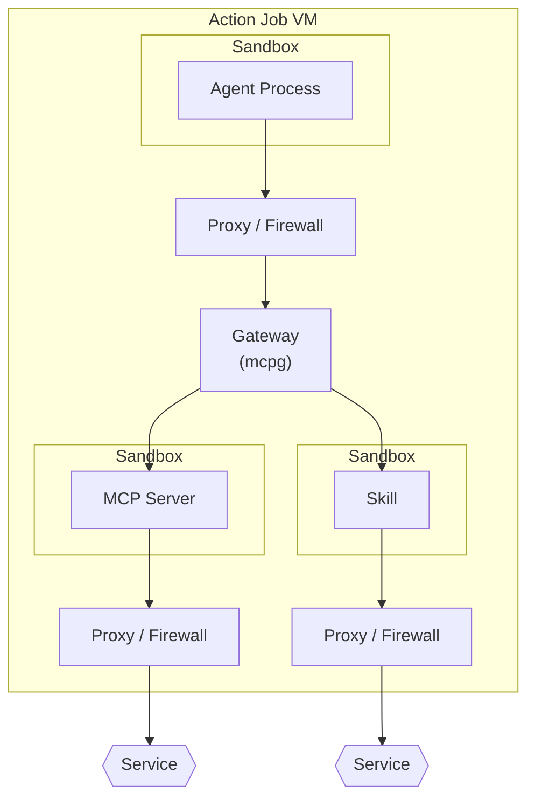

> [!WARNING]
> Using agentic workflows means giving AI agents the ability to make decisions and take actions in your repository. This requires careful attention to security considerations and human supervision.
> Review all outputs carefully and use time-limited trials to evaluate effectiveness for your team.

Security is foundational -- Agentic Workflows inherits GitHub Actions' sandboxing model, scoped permissions, and auditable execution. The attack surface of agentic automation can be subtle (prompt injection, tool invocation side‑effects, data exfiltration), so we bias toward explicit constraints over implicit trust: least‑privilege tokens, allow‑listed tools, and execution paths that always leave human‑visible artifacts (comments, PRs, logs) instead of silent mutation.

A core reason for building Agentic Workflows as a research demonstrator is to closely track emerging security controls in agentic engines under near‑identical inputs, so differences in behavior and guardrails are comparable. Alongside engine evolution, we are working on our own mechanisms:
highly restricted substitutions, Model Context Protocol (MCP) proxy filtering, and hooks‑based security checks that can veto or require review before effectful steps run.

We aim for strong, declarative guardrails -- clear policies the workflow author can review and version -- rather than opaque heuristics. Lock files are fully reviewable so teams can see exactly what was resolved and executed. This will keep evolving; we would love to hear ideas and critique from the community on additional controls, evaluation methods, and red‑team patterns.

This material documents some notes on the security of using partially-automated agentic workflows.

## Security Architecture Overview

The following diagram illustrates the multi-layered security architecture of GitHub Agentic Workflows, showing how agent processes, MCP servers, and skills are isolated within sandboxes and communicate through proxy/firewall layers:



**Key Security Layers:**

1. **Agent Sandbox**: The agent process runs in an isolated sandbox environment with restricted permissions
2. **Primary Proxy/Firewall**: Filters outbound traffic from the agent to the MCP Gateway
3. **MCP Gateway (mcpg)**: Central routing component that manages communication between agents and backend services
4. **MCP Server & Skill Sandboxes**: Each MCP server and skill runs in its own isolated sandbox
5. **Secondary Proxy/Firewalls**: Additional proxy layers control egress traffic from MCP servers and skills to external services
6. **Service Layer**: External services accessed through multiple layers of security controls

This defense-in-depth architecture ensures that even if one layer is compromised, multiple additional security controls remain in place to protect sensitive resources.

> [!NOTE]
> No Docker-in-Docker
> The agent container does not have access to the Docker socket (`/var/run/docker.sock`). This is a critical security feature that prevents container escape attacks and ensures complete isolation between the agent and the host's container runtime. MCP servers are accessed via HTTP through the gateway or use `mode: remote` rather than being spawned via Docker socket.

## Before You Begin

Review workflow contents before installation, treating prompt templates and rule files as code. Assess compiled `.lock.yml` files to understand actual permissions and operations.

GitHub Actions' built-in protections apply to agentic workflows: read-only defaults for fork PRs, restricted secret access, and explicit permissions (unspecified permissions default to `none`). See [GitHub Actions security](https://docs.github.com/en/actions/reference/security/secure-use).

By default, workflows restrict execution to users with `admin`, `maintainer`, or `write` permissions. Use `roles: all` carefully in public repositories.

## Threat Model

Understanding the security risks in agentic workflows helps inform protective measures:

### Primary Threats

- **Command execution**: Workflows run in GitHub Actions' partially-sandboxed environment. Arbitrary shell commands are disallowed by default; specific commands require manual allowlisting. Misconfiguration enables malicious code execution and data exfiltration.

- **Malicious inputs**: Workflows pull data from Issues, PRs, comments, and code that may contain hidden AI payloads. Risk is minimized by restricting expressions in markdown and requiring GitHub MCP access, though returned data can still manipulate AI behavior.

- **Tool exposure**: Default access is GitHub MCP in read-only mode. Unconstrained 3rd-party MCP tools enable data exfiltration or privilege escalation.

- **Supply chain**: Unpinned Actions, npm packages, and container images are vulnerable to tampering.

### Core Security Principles

Agentic Workflows inherit GitHub Actions' security model: isolated repository copies, read-only defaults for forked PRs, restricted secret access, and explicit permissions (default `none`). See [GitHub Actions security](https://docs.github.com/en/actions/reference/security/secure-use).

Compilation-time security measures include:
- Expression restrictions in frontmatter
- Command allowlisting (explicit only)
- Tool allowlisting
- Engine network restrictions via domain allowlists
- Workflow longevity and iteration limits

Apply defense-in-depth consistently: least privilege by default, default-deny approach, separation of concerns (plan/apply with approval gates), and supply chain integrity (pin to immutable SHAs).

## Implementation Guidelines

### Workflow Permissions and Triggers

Configure GitHub Actions with defense in depth:

#### Permission Configuration

Set minimal read-only permissions for agentic processing; use `safe-outputs` for write operations:

```yaml wrap
permissions:
  contents: read
  actions: read

safe-outputs:
  create-issue:
  add-comment:
```

#### Fork Protection for Pull Request Triggers

Pull request workflows block forks by default. Workflows triggered by `pull_request` execute only for same-repository PRs unless explicitly configured:

```yaml wrap
on:
  pull_request:
    types: [opened, synchronize]
    # Default: blocks all forks

    # Allow specific patterns:
    forks: ["trusted-org/*"]

    # Allow all (use with caution):
    # forks: ["*"]
```

The compiler generates repository ID comparison conditions (`github.event.pull_request.head.repo.id == github.repository_id`) for reliable fork detection unaffected by repository renames.

#### workflow_run Trigger Security

Workflows triggered by `workflow_run` include automatic protections against cross-repository attacks and fork execution. The compiler injects repository ID and fork detection checks:

```yaml wrap
on:
  workflow_run:
    workflows: ["CI"]
    types: [completed]
    branches: [main, develop]  # Required to prevent execution on all branches
```

The generated safety condition prevents execution if the triggering workflow_run is from a different repository or fork:

```yaml wrap
if: >
  (user_condition) &&
  ((github.event_name != 'workflow_run') ||
   ((github.event.workflow_run.repository.id == github.repository_id) &&
    (!github.event.workflow_run.repository.fork)))
```

This prevents cross-repository attacks, blocks fork execution, and combines with user conditions via AND logic. Without branch restrictions, compilation emits warnings (or errors in strict mode).

**Production workflows** should use strict mode:

```yaml wrap
strict: true
permissions:
  contents: read
timeout-minutes: 10
# Network automatically uses secure defaults
# Optionally customize: network: { allowed: ["api.example.com"] }
```

Strict mode blocks write permissions and applies secure network defaults automatically (or you can specify custom domains). Use `safe-outputs` for GitHub API interactions. See [Strict Mode Validation](#strict-mode-validation).

### Human in the Loop

Critical operations require human review. Use `manual-approval` to require approval before execution—configure environment protection rules in repository settings. See [Manual Approval Gates](/gh-aw/reference/triggers/#manual-approval-gates-manual-approval).

GitHub Actions cannot approve or merge PRs, ensuring human involvement. Implement plan-apply separation for previewing changes via output issues or PRs. Regularly audit workflow history, permissions, and tool usage.

### Limit operations

#### Strict Mode Validation

Enable strict mode for production workflows via frontmatter or CLI (`gh aw compile --strict`):

```yaml wrap
strict: true
permissions:
  contents: read
# Network defaults to secure defaults if not specified
network:
  allowed: ["api.example.com"]  # Optional: customize allowed domains
```

Strict mode enforces:
1. Blocks write permissions (`contents:write`, `issues:write`, `pull-requests:write`)—use `safe-outputs` instead
2. Applies secure network defaults when not explicitly configured (use `network: defaults` or `network: { allowed: [...] }` to customize)
3. Refuses wildcard `*` in network domains
4. Requires network config for custom MCP containers
5. Enforces Action pinning to commit SHAs
6. Refuses deprecated frontmatter fields

CLI flag takes precedence over frontmatter. See [Frontmatter Reference](/gh-aw/reference/frontmatter/#strict-mode-strict).

#### Limit workflow longevity

Use `stop-after:` to set workflow expiration:

```yaml wrap
on: weekly on monday
  stop-after: "+7d"
```

This workflow expires 7 days after compilation. See [Trigger Events](/gh-aw/reference/triggers/#stop-after-configuration-stop-after).

#### Monitor costs

Use `gh aw logs` to monitor workflow costs—turns, tokens, and other metrics that help track resource usage.

### Repository Access Control

Workflows restrict execution to users with `admin`, `maintainer`, or `write` permissions by default. Checks auto-apply to unsafe triggers (`push`, `issues`, `pull_request`) but skip safe triggers (`schedule`, `workflow_run`).

Customize via `roles:`:

```yaml wrap
roles: [admin, maintainer, write]  # Default
roles: [admin, maintainer]         # Recommended for sensitive operations
roles: all                         # High risk in public repos
```

Permission checks occur at runtime. Failed checks auto-cancel with warnings. Use `roles: all` with caution.

### Authorization and Token Management

Token precedence (highest to lowest): individual safe-output `github-token` → safe-outputs global → top-level → default (`${{ secrets.GH_AW_GITHUB_TOKEN || secrets.GITHUB_TOKEN }}`).

> [!TIP]
> Automatic Secret Validation
> `github-token` fields require GitHub Actions secret expressions. Plaintext tokens or environment variables cause compilation failure.

```yaml wrap
github-token: ${{ secrets.CUSTOM_PAT }}

safe-outputs:
  github-token: ${{ secrets.SAFE_OUTPUT_PAT }}
  create-issue:
    github-token: ${{ secrets.ISSUE_SPECIFIC_PAT }}
```

Use least privilege, rotate PATs regularly, prefer fine-grained PATs, monitor via audit logs, and store as secrets only.

### MCP Tool Hardening

Run MCP servers in sandboxed containers: non-root UIDs, dropped capabilities, seccomp/AppArmor profiles, no privilege escalation. Pin images to digests, scan for vulnerabilities, track SBOMs.

```yaml wrap
tools:
  web:
    mcp:
      container: "ghcr.io/example/web-mcp@sha256:abc123..."
    allowed: [fetch]
```

#### Tool Allow/Disallow

Configure explicit allow-lists:

```yaml wrap
tools:
  github:
    allowed: [issue_read, add_issue_comment]
  bash: ["echo", "git status"]

# Avoid: ["*"] or [":*"] (unrestricted access)
```

#### Egress Filtering

Declarative network allowlists for containerized MCP servers:

```yaml wrap
mcp-servers:
  fetch:
    container: mcp/fetch
    network:
      allowed: ["example.com"]
    allowed: ["fetch"]
```

The compiler generates per-tool Squid proxies; MCP egress is forced through iptables. Only listed domains are reachable. Applies to `mcp.container` stdio servers only.

#### Automatic GitHub Lockdown on Public Repositories

When using the GitHub MCP tool with a custom token (`GH_AW_GITHUB_MCP_SERVER_TOKEN`), lockdown mode is **automatically determined based on repository visibility** to prevent accidental data leakage. This security feature restricts the GitHub token from accessing private repositories when running in public repositories.

**How Automatic Determination Works:**

When `GH_AW_GITHUB_MCP_SERVER_TOKEN` is defined, the system automatically determines lockdown mode at workflow runtime based on repository visibility:

- **Public repositories**: Lockdown mode is automatically enabled. The GitHub MCP server limits surfaced content to items authored by users with push access to the repository.
- **Private/internal repositories**: Lockdown mode is automatically disabled since there's no risk of exposing private repository access.
- **Detection failure**: If repository visibility cannot be determined, the system defaults to lockdown mode for maximum security.

**When using default `GITHUB_TOKEN`**: Automatic determination is skipped and lockdown defaults to disabled (no restriction).

**Minimal Configuration:**

```yaml wrap
tools:
  github:
    # Lockdown is automatically determined for public repos
    # when GH_AW_GITHUB_MCP_SERVER_TOKEN is defined
```

**Manual Override (Optional):**

You can explicitly set lockdown mode if needed:

```yaml wrap
tools:
  github:
    lockdown: true   # Force enable lockdown
    # or
    lockdown: false  # Explicitly disable (use with caution in public repos)
```

> [!CAUTION]
> Disabling Lockdown in Public Repositories
> Explicitly setting `lockdown: false` in a public repository disables this security protection. Only do this if you fully understand the implications and have other controls in place to prevent data leakage.

**Security Benefits:**

- **Prevents token scope leakage**: When using a custom token with private repository access, lockdown mode prevents that access from being used in public repository workflows
- **Defense in depth**: Adds an additional layer of protection beyond token scoping
- **Automatic and transparent**: Works automatically when `GH_AW_GITHUB_MCP_SERVER_TOKEN` is defined
- **Safe by default**: Detection failures default to the most secure setting

See also: [GitHub MCP Tool Configuration](/gh-aw/reference/tools/#github-tools-github) for complete tool configuration options.

### Agent Security and Prompt Injection Defense

#### Sanitized Context Text Usage

**CRITICAL**: Always use `${{ needs.activation.outputs.text }}` instead of raw `github.event` fields. Raw fields enable prompt injection, @mentions, bot triggers, and XML/HTML injection.

Sanitized output provides neutralized @mentions, safe XML format, HTTPS URIs from trusted domains only, 0.5MB/65k line limits, and removed control characters.

```aw wrap
# SECURE
Analyze: "${{ needs.activation.outputs.text }}"

# INSECURE
Title: "${{ github.event.issue.title }}"
```

### Safe Outputs Security Model

Safe outputs separate AI processing from write operations. The agentic portion runs with minimal read-only permissions, while separate jobs handle validated GitHub API operations.

This ensures AI never has direct write access to your repository, preventing unauthorized changes while enabling automation. Agent output is automatically sanitized and validated.

See [Safe Outputs Reference](/gh-aw/reference/safe-outputs/).

### Threat Detection

Automatic threat detection analyzes agent output for prompt injection, secret leaks, and malicious patches. Auto-enabled with safe outputs; uses AI-powered analysis to reduce false positives.

```yaml wrap
safe-outputs:
  create-pull-request:
  threat-detection:
    enabled: true
    prompt: "Focus on SQL injection"  # Optional
    steps:  # Optional additional scanning
      - name: Run TruffleHog
        uses: trufflesecurity/trufflehog@main
```

Add specialized scanners for defense-in-depth. See [Threat Detection Guide](/gh-aw/guides/threat-detection/).

### Automated Security Scanning

[zizmor](https://github.com/zizmorcore/zizmor) scans compiled workflows:

```bash wrap
gh aw compile --zizmor              # Scan with warnings
gh aw compile --strict --zizmor     # Block on findings
```

Analyzes `.lock.yml` for excessive permissions, insecure practices, supply chain vulnerabilities, and misconfigurations. Reports include severity, location, and context in IDE-parseable format. Requires Docker. Best practices: run during development, use `--strict --zizmor` in CI/CD, address High/Critical findings.

### Network Isolation

Network isolation operates at two layers:

1. **MCP Tool Network Controls**: Containerized tools with domain allowlisting
2. **AI Engine Network Permissions**: Configurable network access for engines

See [Network Reference](/gh-aw/reference/network/) and [Engine Network Permissions](#engine-network-permissions).

## Engine Network Permissions

Fine-grained control over AI engine network access, separate from MCP tool permissions.

**Copilot Engine with AWF**: Uses [AWF](https://github.com/githubnext/gh-aw-firewall) firewall wrapper for process-level domain allowlisting, execution wrapping, and activity logging. See [Copilot Engine - Network Permissions](/gh-aw/reference/engines/#network-permissions).

**Best Practices**: Start with `defaults`, add needed ecosystems; prefer ecosystem identifiers over individual domains; listing a domain includes all subdomains; test thoroughly and monitor logs.

### Permission Modes

```yaml wrap
# Basic infrastructure (default)
engine:
  id: copilot
network: defaults

# Ecosystem-based
network:
  allowed: [defaults, python, node, containers]

# Granular domains
network:
  allowed:
    - "api.github.com"
    - "*.company-internal.com"

# Complete denial
network: {}
```

## See also

- [Threat Detection Guide](/gh-aw/guides/threat-detection/) - Comprehensive threat detection configuration and examples
- [Safe Outputs Reference](/gh-aw/reference/safe-outputs/)
- [Network Configuration](/gh-aw/reference/network/)
- [Tools](/gh-aw/reference/tools/)
- [MCPs](/gh-aw/guides/mcps/)
- [Workflow Structure](/gh-aw/reference/workflow-structure/)

## References

- Model Context Protocol: Security Best Practices (2025-06-18) — <https://modelcontextprotocol.io/specification/2025-06-18/basic/security_best_practices>
