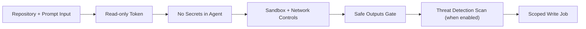

import FeatureCard from '../../components/FeatureCard.astro';
import FeatureGrid from '../../components/FeatureGrid.astro';
import Video from '../../components/Video.astro';
import BlogLinkSection from '../../components/BlogLinkSection.astro';
import WorkflowHero from '../../components/WorkflowHero.astro';

<WorkflowHero />

With GitHub Agentic Workflows (`gh-aw`), developers define AI-powered repository automation in Markdown with YAML frontmatter and run AI agents through GitHub Actions. The `gh-aw` GitHub CLI extension compiles each source file into the `.lock.yml` workflow that GitHub Actions executes.

Use standard GitHub Actions for deterministic builds, tests, linting, deployments, and reproducible scripts. Add an agentic workflow for work that benefits from reasoning or interpretation, such as issue triage, CI investigation, documentation updates, code review, and repository reporting. The two approaches complement each other.

Supported built-in AI engines include GitHub Copilot, Claude Code, OpenAI Codex, and Google Gemini, plus Pi. Choose the engine and authentication method that fit the workflow, then keep the same Markdown-and-frontmatter authoring model.

By default, supported agent jobs use read-only GitHub access and sandboxed execution. Configured writes can be routed through validated safe outputs that run separately with scoped permissions. These controls remain configurable and require careful review.

## Core capabilities

<FeatureGrid columns={3}>
  <FeatureCard icon="cpu" title="AI-Powered Decision Making" href="#gallery">
    Workflows that understand context and adapt to situations
  </FeatureCard>
  <FeatureCard icon="beaker" title="Multiple AI Engines" href="/gh-aw/reference/engines/">
    Built-in support for Copilot, Claude Code, Codex, Gemini, and Pi
  </FeatureCard>
  <FeatureCard icon="server" title="Self-Hosted & ARC Runners" href="/gh-aw/reference/self-hosted-runners/">
    Deploy on Linux self-hosted runners, including ARC with Docker-in-Docker
  </FeatureCard>
  <FeatureCard icon="shield-lock" title="MicroVM Isolation" href="/gh-aw/reference/glossary/#docker-sbx">
    Run agents in KVM-isolated Docker sbx microVMs on compatible runners
  </FeatureCard>
  <FeatureCard icon="key" title="Engine Credential Isolation" href="/gh-aw/introduction/architecture/#agent-workflow-firewall-awf">
    The API proxy isolates supported AI engine credentials from the agent sandbox
  </FeatureCard>
  <FeatureCard icon="shield-check" title="Safe Outputs" href="/gh-aw/reference/safe-outputs/">
    Configured write requests are validated before separate jobs apply them
  </FeatureCard>
  <FeatureCard icon="filter" title="Integrity Filtering" href="/gh-aw/reference/integrity/">
    Reduce prompt-injection risk by filtering untrusted GitHub content
  </FeatureCard>
  <FeatureCard icon="mark-github" title="GitHub Integration" href="/gh-aw/reference/github-tools/">
    Deep integration with Actions, Issues, PRs, Discussions, and repository management
  </FeatureCard>
  <FeatureCard icon="workflow" title="Cost Controls" href="#manage-cost-and-capacity">
    Per-run AI credit budgets, spend visibility, and OpenTelemetry cost analysis
  </FeatureCard>
</FeatureGrid>

## Guardrails Built-In

AI agents can be manipulated by prompt injection, malicious repository content, or compromised tools. GitHub Agentic Workflows defaults to layered controls for the supported agent-job path: sandboxing limits where code can execute, scoped permissions limit what it can request, and gated outputs constrain configured writes to GitHub. Workflow authors can change some controls and must evaluate the resulting risk.



<FeatureGrid columns={3}>
  <FeatureCard title="Sandbox + network firewall" href="/gh-aw/introduction/architecture/#agent-workflow-firewall-awf">
    By default, the agent runs in a container behind the Agent Workflow Firewall;
    explicit opt-outs broaden its access.
  </FeatureCard>
  <FeatureCard title="Threat detection" href="/gh-aw/reference/threat-detection/">
    When enabled, a dedicated job scans proposed outputs and blocks suspicious
    changes before configured writes.
  </FeatureCard>
  <FeatureCard title="Compile-time validation" href="/gh-aw/introduction/architecture/#compilation-time-security">
    Schema validation, expression allowlisting, action pinning, and security
    scanners reject misconfigurations before deployment.
  </FeatureCard>
</FeatureGrid>

See the [Security Architecture](/gh-aw/introduction/architecture/) for a full breakdown of the layered defense-in-depth model.

## Manage Cost and Capacity

Cost control starts with visibility. Use `gh aw logs` and `gh aw audit` to find runs consuming the most time, tokens, and AI Credits (AIC), then tighten prompts, triggers, and model choices before spend drifts upward.

`max-ai-credits` gives each run a hard budget, while [OpenTelemetry](/gh-aw/guides/open-telemetry/) exports traces and token data to OTLP backends for dashboards, alerting, and cost analysis. For optimization over time, compare cost with [outcomes](/gh-aw/reference/outcomes/) so lower spend still produces useful accepted results.

<FeatureGrid columns={3}>
  <FeatureCard icon="pulse" title="Cost Management" href="/gh-aw/reference/cost-management/">
    Track Actions minutes, inference spend, and the heaviest runs before deciding what to optimize
  </FeatureCard>
  <FeatureCard icon="workflow" title="OpenTelemetry" href="/gh-aw/guides/open-telemetry/">
    Export workflow traces to OTLP backends for dashboards, alerts, and spend analysis
  </FeatureCard>
  <FeatureCard icon="tools" title="AI Credits Budgets" href="/gh-aw/reference/frontmatter/#ai-credits-guardrail-max-ai-credits">
    Cap runaway runs with max-ai-credits and optimize around AI Credits usage
  </FeatureCard>
</FeatureGrid>

## Example: Daily Issues Report

Here's a simple workflow that runs daily to create an upbeat status report:

```aw wrap
---
on:
  schedule: daily

permissions:
  contents: read
  issues: read
  pull-requests: read

safe-outputs:
  create-issue:
    title-prefix: "[team-status] "
    labels: [report, daily-status]
    close-older-issues: true
---

## Daily Issues Report

Create an upbeat daily status report for the team as a GitHub issue.

## What to include

- Recent repository activity (issues, PRs, discussions, releases, code changes)
- Progress tracking, goal reminders and highlights
- Project status and recommendations
- Actionable next steps for maintainers

```

The `gh aw compile` command turns this source into a hardened `.lock.yml` GitHub Actions workflow. GitHub Actions then runs the selected AI engine in the configured agent environment on the declared trigger. The AI agent reads allowed repository context and requests only the tools and outputs configured in frontmatter.

## GitHub Agentic Workflows examples

[Browse examples by repository task](/gh-aw/examples/) to find a starting point and learn when to use each workflow.

<FeatureGrid columns={3}>
  <FeatureCard icon="issue-opened" title="Repository Maintenance" href="/gh-aw/examples/maintaining-repos/">
    Use Repo Assist to triage backlogs and make focused project improvements
  </FeatureCard>
  <FeatureCard icon="book" title="Continuous Documentation" href="/gh-aw/blog/2026-01-13-meet-the-workflows-documentation/">
    Continuous documentation maintenance and consistency
  </FeatureCard>
  <FeatureCard icon="code-review" title="Continuous Improvement" href="/gh-aw/blog/2026-01-13-meet-the-workflows-continuous-simplicity/">
    Daily code simplification, refactoring, and style improvements
  </FeatureCard>
  <FeatureCard icon="pulse" title="Metrics & Analytics" href="/gh-aw/blog/2026-01-13-meet-the-workflows-metrics-analytics/">
    Daily reports, trend analysis, and workflow health monitoring
  </FeatureCard>
  <FeatureCard icon="tools" title="Quality & Testing" href="/gh-aw/blog/2026-01-13-meet-the-workflows-quality-hygiene/">
    CI failure diagnosis, test improvements, and quality checks
  </FeatureCard>
  <FeatureCard icon="repo" title="Multi-Repository" href="/gh-aw/examples/multi-repo/">
    Feature sync and cross-repo tracking workflows
  </FeatureCard>
</FeatureGrid>

## AI Engines

GitHub Agentic Workflows (`gh-aw`) provides five stable built-in AI engines, including Pi. Engine changes may also require a different authentication method or tool configuration; use the linked guide for each engine.

<FeatureGrid columns={4}>
  <FeatureCard title="GitHub Copilot" href="/gh-aw/engines/copilot/">
    Default engine. Authenticate with the copilot-requests permission or a fine-grained personal access token.
  </FeatureCard>
  <FeatureCard title="Claude Code" href="/gh-aw/engines/claude/">
    Anthropic's Claude Code. Select claude and use ANTHROPIC_API_KEY or Anthropic WIF.
  </FeatureCard>
  <FeatureCard title="OpenAI Codex" href="/gh-aw/engines/codex/">
    OpenAI Codex. Select codex and use CODEX_API_KEY or OPENAI_API_KEY.
  </FeatureCard>
  <FeatureCard title="Google Gemini" href="/gh-aw/engines/gemini/">
    Google Gemini CLI. Select gemini and use GEMINI_API_KEY or Google WIF.
  </FeatureCard>
  <FeatureCard title="Pi" href="/gh-aw/engines/pi/">
    Multi-provider engine. Set engine: pi and configure its required proxies and provider authentication.
  </FeatureCard>
</FeatureGrid>

### Imported engine samples

The engine import model can integrate other coding-agent CLIs through Markdown definitions. The following in-repository definitions are unsupported samples, not built-in or officially supported `gh-aw` engines.

<FeatureGrid columns={3}>
  <FeatureCard title="Copilot SDK" href="/gh-aw/reference/engines/#copilot-sdk-support">
    A mode of the Copilot engine rather than a separate AI engine. Enable with copilot-sdk: true.
  </FeatureCard>
  <FeatureCard title="OpenCode" href="/gh-aw/guides/third-party-agent/">
    Provider-agnostic BYOK agent supporting 75+ models from Anthropic, OpenAI, Google, and more.
  </FeatureCard>
  <FeatureCard title="Cursor" href="/gh-aw/reference/engines/#shared-imported-engines">
    Cursor's AI coding agent, importable as a shared engine definition.
  </FeatureCard>
  <FeatureCard title="Kiro" href="/gh-aw/reference/engines/#shared-imported-engines">
    Amazon's Kiro agentic IDE, importable as a shared engine definition.
  </FeatureCard>
  <FeatureCard title="Aider" href="/gh-aw/reference/engines/#unsupported-engine-samples">
    Open-source pair programming agent. Import the publisher-maintained definition.
  </FeatureCard>
  <FeatureCard title="Crush" href="/gh-aw/reference/engines/#unsupported-engine-samples">
    Charmbracelet's terminal-first coding agent, importable as a shared engine definition.
  </FeatureCard>
</FeatureGrid>

See [Configuring a third-party agent](/gh-aw/guides/third-party-agent/) and the [Engines reference](/gh-aw/reference/engines/#shared-imported-engines) for how to import and pin an engine definition.

## Common Use Cases

The [task-oriented examples catalog](/gh-aw/examples/) also covers CI failure investigation, dependency analysis, scheduled maintenance, code improvement, and security review.

<FeatureGrid columns={2}>
  <FeatureCard icon="issue-opened" title="AI Issue Triage" href="/gh-aw/guides/ai-issue-triage/">
    Label, deduplicate, and ask clarifying questions when new issues arrive
  </FeatureCard>
  <FeatureCard icon="code-review" title="Automated PR Review" href="/gh-aw/guides/automated-pr-review/">
    Review diffs and post feedback comments when pull requests are opened
  </FeatureCard>
  <FeatureCard icon="tag" title="AI Release Notes" href="/gh-aw/guides/ai-release-notes/">
    Generate release summaries and changelog drafts automatically
  </FeatureCard>
  <FeatureCard icon="book" title="Docs Automation" href="/gh-aw/guides/docs-automation/">
    Keep documentation in sync with code changes via automated PRs
  </FeatureCard>
</FeatureGrid>

## Getting Started

Install the extension, add a sample workflow, and trigger your first run - all from the command line in minutes.

<Video
  src="/gh-aw/videos/install-and-add-workflow-in-cli.mp4"
  title="Install and add workflow in CLI demo video"
  captionsSrc="/gh-aw/videos/install-and-add-workflow-in-cli.vtt"
  aspectRatio="16:9"
/>

## Creating Workflows

Create custom agentic workflows directly from the GitHub web interface using natural language.

<Video
  src="/gh-aw/videos/create-workflow-on-github.mp4"
  title="Create workflow on GitHub demo video"
  captionsSrc="/gh-aw/videos/create-workflow-on-github.vtt"
  aspectRatio="16:9"
/>

## Workshop

<center>
  <FeatureCard icon="workflow" title="Interactive workshop" href="/gh-aw/workshop/" badge="New">
    Choose a terminal, browser, or Copilot path and work through the workshop directly in the docs with saved progress.
  </FeatureCard>
</center>
