import { Aside } from '@astrojs/starlight/components';

GitHub Agentic Workflows implements a defense-in-depth security architecture that protects against prompt injection, rogue Model Context Protocol (MCP) servers, and malicious agents. This document provides visual diagrams of the key security mechanisms.

## Overview

The security architecture operates across multiple layers: compilation-time validation, runtime isolation, permission separation, network controls, and output sanitization.


## Safe Outputs: Permission Isolation

The safe outputs system ensures AI agents never have direct write access to your repository. The [agentic](/gh-aw/reference/glossary/#agentic) portion runs with minimal read-only permissions, while separate jobs handle validated GitHub API operations.

```mermaid
flowchart LR
    subgraph AgentJob["Agent Job<br/>🔐 Read-Only Permissions"]
        AGENT["AI Agent Execution"]
        OUTPUT[/"agent_output.json<br/>(Artifact)"/]
        AGENT --> OUTPUT
    end

    subgraph Detection["Threat Detection Job"]
        ANALYZE["Analyze for:<br/>• Prompt Injection<br/>• Secret Leaks<br/>• Malicious Patches"]
    end

    subgraph SafeJobs["Safe Output Jobs<br/>🔓 Write Permissions (Scoped)"]
        direction TB
        ISSUE["create_issue<br/>issues: write"]
        COMMENT["add_comment<br/>issues: write"]
        PR["create_pull_request<br/>contents: write<br/>pull-requests: write"]
        LABEL["add_labels<br/>issues: write"]
    end

    subgraph GitHub["GitHub API"]
        API["GitHub REST/GraphQL API"]
    end

    OUTPUT -->|"Download Artifact"| ANALYZE
    ANALYZE -->|"✅ Approved"| SafeJobs
    ANALYZE -->|"❌ Blocked"| BLOCKED["Workflow Fails"]

    ISSUE --> API
    COMMENT --> API
    PR --> API
    LABEL --> API
```



<Aside type="tip">
Safe outputs provide security by design: the AI never needs write permissions because all write operations are performed by separate, validated jobs with minimal scoped permissions.
</Aside>

## Agent Workflow Firewall (AWF)

The AWF provides network egress control for the Copilot engine, preventing unauthorized data exfiltration and limiting access to only explicitly allowed domains.

```mermaid
flowchart TB
    subgraph Agent["AI Agent Process"]
        COPILOT["Copilot CLI"]
        WEB["WebFetch Tool"]
        SEARCH["WebSearch Tool"]
    end

    subgraph Firewall["Agent Workflow Firewall (AWF)"]
        WRAP["Process Wrapper"]
        ALLOW["Domain Allowlist"]
        LOG["Activity Logging"]

        WRAP --> ALLOW
        ALLOW --> LOG
    end

    subgraph Network["Network Layer"]
        direction TB
        ALLOWED_OUT["✅ Allowed Domains"]
        BLOCKED_OUT["❌ Blocked Domains"]
    end

    subgraph Ecosystems["Ecosystem Bundles"]
        direction TB
        DEFAULTS["defaults<br/>certificates, JSON schema"]
        PYTHON["python<br/>PyPI, Conda"]
        NODE["node<br/>npm, npmjs.com"]
        CUSTOM["Custom Domains<br/>api.example.com"]
    end

    COPILOT --> WRAP
    WEB --> WRAP
    SEARCH --> WRAP

    ALLOW --> ALLOWED_OUT
    ALLOW --> BLOCKED_OUT

    DEFAULTS --> ALLOW
    PYTHON --> ALLOW
    NODE --> ALLOW
    CUSTOM --> ALLOW

    ALLOWED_OUT --> INTERNET["🌐 Internet"]
    BLOCKED_OUT --> DROP["🚫 Dropped"]
```



**Configuration Example:**

```yaml wrap
engine: copilot

network:
  firewall: true
  allowed:
    - defaults     # Basic infrastructure
    - python       # PyPI ecosystem
    - node         # npm ecosystem
    - "api.example.com"  # Custom domain
```

## MCP Gateway + Firewall Flow

When the MCP gateway is enabled, the firewall and gateway work together to keep MCP traffic contained while still allowing the agent to reach the GitHub MCP server.

<Aside type="note" title="Security Enhancement">
The agent container no longer has Docker socket access. This security improvement prevents container escape attacks and ensures complete isolation between the agent and the host's container runtime. MCP servers are accessed via HTTP through the gateway rather than spawned via Docker socket.
</Aside>


**How the pieces fit together**

1. AWF starts an isolated network with a Squid proxy that enforces the workflow `network.allowed` list.
2. The agent container can only egress through Squid. To reach the gateway, it uses `host.docker.internal:80` (Docker's host alias). That hostname must be allowed by the firewall.
3. The `gh-aw-mcpg` gateway publishes host port 80 mapped to container port 8000. It routes requests to the MCP server (either remote or pre-started as a separate process).
4. All MCP traffic stays inside the host boundary: the firewall restricts egress, and the gateway routes requests to the GitHub MCP server.

<Aside type="caution" title="No Docker-in-Docker">
The agent container does not have access to the Docker socket (`/var/run/docker.sock`). This is a security feature that prevents the agent from spawning arbitrary containers. Use `mode: remote` for GitHub MCP or pre-configure containerized MCP servers outside the agent sandbox.
</Aside>

## MCP Server Sandboxing

Model Context Protocol (MCP) servers run in isolated containers with explicit tool filtering, preventing unauthorized access and limiting the attack surface.

```mermaid
flowchart TB
    subgraph Agent["AI Agent"]
        ENGINE["AI Engine<br/>(Copilot, Claude, Codex)"]
    end

    subgraph MCPLayer["MCP Server Layer"]
        direction TB

        subgraph GitHub["GitHub MCP"]
            GH_TOOLS["Enabled Tools:<br/>• issue_read<br/>• list_commits<br/>• search_code"]
            GH_BLOCKED["Blocked Tools:<br/>• delete_repository<br/>• update_branch_protection"]
        end

        subgraph Custom["Custom MCP (Docker)"]
            CONTAINER["🐳 Isolated Container"]
            NET["Network Allowlist"]
            ENV["Env Var Injection"]
        end

        subgraph HTTP["HTTP MCP"]
            ENDPOINT["HTTPS Endpoint"]
            HEADERS["Secure Headers"]
        end
    end

    subgraph Toolfilter["Tool Filtering"]
        ALLOWED["allowed: [tool1, tool2]"]
        DENIED["❌ Unlisted tools blocked"]
    end

    ENGINE <-->|"stdio/HTTP"| GitHub
    ENGINE <-->|"stdio"| CONTAINER
    ENGINE <-->|"HTTP"| ENDPOINT

    ALLOWED --> GH_TOOLS
    ALLOWED --> GH_BLOCKED
    CONTAINER --> NET
    CONTAINER --> ENV
    ENDPOINT --> HEADERS
```



**Security Features:**

- **Container Isolation**: Custom MCP servers run in Docker containers with no shared state
- **Network Controls**: Per-container domain allowlists via Squid proxy
- **Tool Allowlisting**: Explicit `allowed:` lists restrict available operations
- **Secret Injection**: Secrets passed via environment variables, never in config files

## Threat Detection Pipeline

The threat detection system analyzes agent output before any GitHub API operations are performed, blocking malicious content, secret leaks, and prompt injection attempts.

```mermaid
flowchart TB
    subgraph Input["Agent Output"]
        JSON[/"agent_output.json"/]
        PATCH[/"aw.patch<br/>(Git Diff)"/]
        PROMPT[/"prompt.txt<br/>(Workflow Context)"/]
    end

    subgraph Analysis["Threat Analysis"]
        direction TB
        AI["AI-Powered Detection"]
        CUSTOM["Custom Security Steps"]

        subgraph Checks["Detection Checks"]
            INJECT["Prompt Injection<br/>Hidden instructions<br/>Jailbreak attempts"]
            SECRETS["Secret Leaks<br/>API keys, tokens<br/>Credentials"]
            MALICIOUS["Malicious Patches<br/>Backdoors<br/>Vulnerabilities"]
        end
    end

    subgraph Decision["Decision"]
        SAFE_CHECK{{"Threats<br/>Detected?"}}
    end

    subgraph Outcome["Outcome"]
        PROCEED["✅ Proceed to Safe Outputs"]
        BLOCK["❌ Block & Fail Workflow"]
    end

    JSON --> AI
    PATCH --> AI
    PROMPT --> AI

    AI --> Checks
    Checks --> CUSTOM
    CUSTOM --> SAFE_CHECK

    SAFE_CHECK -->|"No"| PROCEED
    SAFE_CHECK -->|"Yes"| BLOCK
```



**Defense-in-Depth Options:**

- **AI Detection**: Default AI-powered analysis using the workflow engine
- **Custom Steps**: Integration with security scanners (Semgrep, TruffleHog, LlamaGuard)
- **Custom Prompts**: Domain-specific detection instructions

## Compilation-Time Security

Security validation happens at compile time, before workflows ever run, catching misconfigurations and enforcing best practices.

```mermaid
flowchart TB
    subgraph Source["Source Files"]
        MD[/"workflow.md"/]
        IMPORTS[/"imports/*.md"/]
    end

    subgraph Validation["Schema & Expression Validation"]
        SCHEMA["JSON Schema Validation<br/>• Valid frontmatter fields<br/>• Correct types & formats"]
        EXPR["Expression Safety<br/>• Allowlisted expressions only<br/>• No secrets in expressions"]
    end

    subgraph Pinning["Action Pinning"]
        SHA["SHA Resolution<br/>actions/checkout@sha # v4"]
        CACHE[/"actions-lock.json<br/>(Cached SHAs)"/]
    end

    subgraph Scanners["Security Scanners"]
        ACTIONLINT["actionlint<br/>Workflow linting<br/>(includes shellcheck & pyflakes)"]
        ZIZMOR["zizmor<br/>Security vulnerabilities<br/>Privilege escalation"]
        POUTINE["poutine<br/>Supply chain risks<br/>Third-party actions"]
    end

    subgraph Strict["Strict Mode Enforcement"]
        PERMS["❌ No write permissions"]
        NETWORK["✅ Explicit network config"]
        WILDCARD["❌ No wildcard domains"]
        DEPRECATED["❌ No deprecated fields"]
    end

    subgraph Output["Compilation Output"]
        LOCK[/".lock.yml<br/>(Validated Workflow)"/]
        ERROR["❌ Compilation Error"]
    end

    MD --> SCHEMA
    IMPORTS --> SCHEMA
    SCHEMA --> EXPR
    EXPR --> SHA
    SHA <--> CACHE

    SHA --> ACTIONLINT
    ACTIONLINT --> ZIZMOR
    ZIZMOR --> POUTINE
    POUTINE --> Strict

    Strict -->|"All Checks Pass"| LOCK
    Strict -->|"Violation Found"| ERROR
```



**Compilation Commands:**

```bash wrap
# Standard compilation
gh aw compile

# Strict mode enforces security constraints (no write permissions, explicit network config)
gh aw compile --strict

# Add security scanners for additional validation (optional, not included by default)
gh aw compile --strict --actionlint --zizmor --poutine
```

## Content Sanitization

All user-generated content is sanitized before being processed by AI agents, preventing prompt injection and other attacks. The sanitization pipeline applies multiple transformations to neutralize potentially malicious content.


**Sanitization Mechanisms:**

| Mechanism | Input | Output | Protection |
|-----------|-------|--------|------------|
| **@mention Neutralization** | `@user` | `` `@user` `` | Prevents unintended user notifications |
| **Bot Trigger Protection** | `fixes #123` | `` `fixes #123` `` | Prevents automatic issue linking |
| **XML/HTML Tag Conversion** | `<script>` | `(script)` | Prevents injection via XML tags |
| **URI Filtering** | `http://evil.com` | `(redacted)` | Only HTTPS from trusted domains allowed |
| **Special Characters** | Unicode homoglyphs | Normalized | Prevents visual spoofing attacks |
| **Content Limits** | Large payloads | Truncated | 0.5MB max size, 65k lines max |
| **Control Characters** | ANSI escapes | Stripped | Removes terminal manipulation codes |

**URL Filtering Details:**

The URI filtering mechanism applies strict validation:

- ✅ **Allowed**: `https://github.com/...`, `https://api.github.com/...`
- ✅ **Allowed**: URLs from explicitly trusted domains
- ❌ **Blocked**: `http://` URLs (non-HTTPS)
- ❌ **Blocked**: URLs with suspicious patterns
- ❌ **Blocked**: Data URLs, javascript: URLs
- ❌ **Blocked**: URLs from untrusted domains → replaced with `(redacted)`

<Aside type="note" title="Why URLs are redacted">
URLs appearing as `(redacted)` indicate the domain was not in the allowed list. This prevents potential data exfiltration through untrusted domains. The allowed domains list is automatically derived from your workflow's `network:` configuration and includes GitHub domains by default.
</Aside>

**Allowing Additional Domains:**

To allow URLs from additional domains in sanitized content, configure the `network:` field in your workflow frontmatter:

```yaml wrap
network:
  allowed:
    - defaults           # Basic infrastructure
    - "api.example.com"  # Your custom domain
    - "trusted.com"      # Another trusted domain
```

Domains configured here apply to both network egress control (when firewall is enabled) and content sanitization. See [Network Permissions](/gh-aw/reference/network/) for the complete list of ecosystem identifiers and configuration options.

**XML/HTML Tag Handling:**

XML and HTML tags are converted to a safe parentheses format to prevent injection:

```
<script>alert('xss')</script>  →  (script)alert('xss')(/script)
        →  (img src=x onerror=...)
<!-- hidden comment -->        →  (!-- hidden comment --)
```

<Aside type="caution">
Always use `${{ needs.activation.outputs.text }}` instead of raw `github.event` fields to ensure proper sanitization of user-provided content.
</Aside>

## Secret Redaction

Before workflow artifacts are uploaded, all files in the `/tmp/gh-aw` directory are automatically scanned and any secret values are redacted. This prevents accidental secret leakage through logs, outputs, or artifacts.


**Key Features:**
- **Automatic Detection**: Scans workflow YAML for `secrets.*` patterns and collects all secret references
- **Exact String Matching**: Uses safe string matching (not regex) to prevent injection attacks
- **Partial Visibility**: Shows first 3 characters followed by asterisks for debugging without exposing full secrets
- **Custom Masking**: Supports additional custom secret masking steps via `secret-masking:` configuration

**Configuration Example:**

```yaml wrap
secret-masking:
  steps:
    - name: Redact custom patterns
      run: |
        find /tmp/gh-aw -type f -exec sed -i 's/password123/REDACTED/g' {} +
```

<Aside type="tip">
Secret redaction runs with `if: always()` to ensure secrets are never leaked even if the workflow fails.
</Aside>

## Job Execution Flow

The complete workflow execution follows a strict dependency order, ensuring security checks happen at each stage.

```mermaid
flowchart TB
    subgraph PreActivation["Pre-Activation Job"]
        ROLE["Role Permission Check"]
        DEADLINE["Stop-After Deadline"]
        SKIP["Skip-If-Match Check"]
        COMMAND["Command Position Validation"]
    end

    subgraph Activation["Activation Job"]
        CONTEXT["Prepare Workflow Context"]
        SANITIZE["Sanitize Event Text"]
        LOCK_CHECK["Validate Lock File"]
    end

    subgraph Agent["Agent Job"]
        CHECKOUT["Repository Checkout"]
        RUNTIME["Runtime Setup<br/>(Node.js, Python)"]
        CACHE_RESTORE["Cache Restore"]
        MCP_START["Start MCP Containers"]
        PROMPT["Generate Prompt"]
        EXECUTE["Execute AI Engine"]
        REDACT["🔐 Secret Redaction"]
        UPLOAD["Upload Output Artifact"]
        CACHE_SAVE["Save Cache"]
    end

    subgraph Detection["Detection Job"]
        DOWNLOAD_DETECT["Download Artifact"]
        ANALYZE["AI + Custom Analysis"]
        VERDICT["Security Verdict"]
    end

    subgraph SafeOutputs["Safe Output Jobs"]
        CREATE_ISSUE["create_issue"]
        ADD_COMMENT["add_comment"]
        CREATE_PR["create_pull_request"]
    end

    subgraph Conclusion["Conclusion Job"]
        AGGREGATE["Aggregate Results"]
        SUMMARY["Generate Summary"]
    end

    ROLE --> DEADLINE
    DEADLINE --> SKIP
    SKIP --> COMMAND
    COMMAND -->|"✅ Pass"| CONTEXT
    COMMAND -->|"❌ Fail"| SKIP_ALL["Skip All Jobs"]

    CONTEXT --> SANITIZE
    SANITIZE --> LOCK_CHECK
    LOCK_CHECK --> CHECKOUT

    CHECKOUT --> RUNTIME
    RUNTIME --> CACHE_RESTORE
    CACHE_RESTORE --> MCP_START
    MCP_START --> PROMPT
    PROMPT --> EXECUTE
    EXECUTE --> REDACT
    REDACT --> UPLOAD
    UPLOAD --> CACHE_SAVE
    CACHE_SAVE --> DOWNLOAD_DETECT

    DOWNLOAD_DETECT --> ANALYZE
    ANALYZE --> VERDICT

    VERDICT -->|"✅ Safe"| CREATE_ISSUE
    VERDICT -->|"✅ Safe"| ADD_COMMENT
    VERDICT -->|"✅ Safe"| CREATE_PR
    VERDICT -->|"❌ Threat"| BLOCK_ALL["Block All Safe Outputs"]

    CREATE_ISSUE --> AGGREGATE
    ADD_COMMENT --> AGGREGATE
    CREATE_PR --> AGGREGATE
    AGGREGATE --> SUMMARY
```



## Observability

GitHub Agentic Workflows provide comprehensive observability through GitHub Actions runs and artifacts, enabling debugging, auditing, and cost monitoring.


**Key Observability Features:**

- **Artifact Preservation**: All workflow outputs (prompts, patches, logs) are saved as downloadable artifacts
- **Cost Monitoring**: Track token usage and costs across workflow runs with `gh aw logs`
- **Failure Analysis**: Investigate failed runs with `gh aw audit` to see prompts, errors, and network activity
- **Firewall Logs**: Review all network requests made by the agent for security auditing
- **Step Summaries**: Rich markdown summaries in GitHub Actions showing AI decisions and outputs

**CLI Commands:**

```bash wrap
# Download and analyze workflow run logs
gh aw logs

# Investigate a specific workflow run
gh aw audit <run-id>

# Check workflow health and status
gh aw status
```

## Security Principles Summary

| Layer | Mechanism | Protection Against |
|-------|-----------|-------------------|
| **Compilation** | Schema validation, expression allowlist | Invalid configurations, unauthorized expressions |
| **Compilation** | Action SHA pinning | Supply chain attacks, tag hijacking |
| **Compilation** | Security scanners (actionlint, zizmor, poutine) | Privilege escalation, misconfigurations, supply chain risks |
| **Runtime** | Pre-activation checks | Unauthorized users, expired workflows |
| **Runtime** | Content sanitization | Prompt injection, @mention abuse |
| **Runtime** | AWF network controls | Data exfiltration, unauthorized API calls |
| **Runtime** | MCP sandboxing | Container escape, unauthorized tool access |
| **Runtime** | Secret redaction | Credential leakage in logs/artifacts |
| **Output** | Threat detection | Malicious patches, secret leaks |
| **Output** | Permission separation | Direct write access abuse |
| **Output** | Output sanitization | Content injection, XSS |
| **Observability** | Artifact preservation, CLI tools | Debugging failures, auditing security, cost tracking |

## Related Documentation

- [Security Best Practices](/gh-aw/guides/security/) - Comprehensive security guidelines
- [Threat Detection Guide](/gh-aw/guides/threat-detection/) - Configuring threat analysis
- [Network Permissions](/gh-aw/reference/network/) - Network access control
- [Safe Outputs Reference](/gh-aw/reference/safe-outputs/) - Output processing configuration
- [AI Engines](/gh-aw/reference/engines/) - Engine-specific security features
- [Compilation Process](/gh-aw/reference/compilation-process/) - Build-time security validation
- [CLI Commands](/gh-aw/setup/cli/) - Workflow management and observability tools
