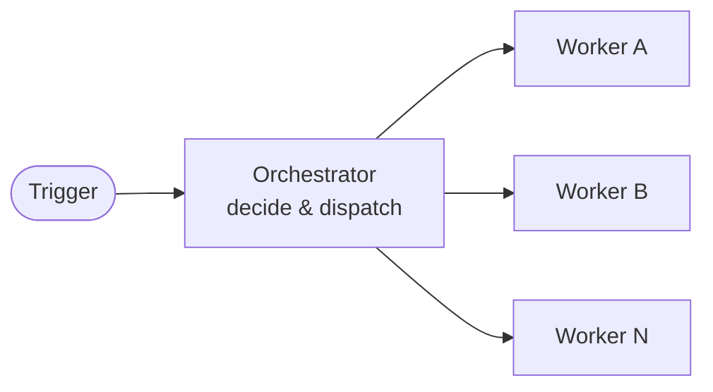

OrchestratorOps uses one workflow (the **orchestrator**) to decide what happens next and one or more **worker** workflows to do the concrete work with scoped permissions and tools. This makes multi-step automation easier to manage, observe, and resume.



## When to Use OrchestratorOps

Use OrchestratorOps when a single workflow run is too coarse — the work spans multiple repositories, requires different tools or permissions per step, benefits from parallel execution, or needs intermediate human review between phases. Common cases include multi-repo rollouts, phased dependency upgrades, and initiative-level automation that touches many issues or PRs.

## The Orchestrator/Worker Pattern

The **orchestrator** splits work into units and dispatches workers. **Workers** handle the concrete tasks — triage, code changes, or analysis — with only the permissions and tools they need. For visibility, both can optionally update a GitHub Project board.

## Dispatch Workers with `dispatch-workflow`

Allow dispatching specific workflows via GitHub's `workflow_dispatch` API:

```yaml
safe-outputs:
  dispatch-workflow:
    workflows: [repo-triage-worker, dependency-audit-worker]
    max: 10
```

During compilation, gh-aw validates that the target workflows exist and support `workflow_dispatch`. Workers receive a JSON payload and run asynchronously as independent workflow runs. Use this mode when work should continue independently of the orchestrator.

See [`dispatch-workflow` safe output](/gh-aw/reference/safe-outputs/#workflow-dispatch-dispatch-workflow).

## Call Workers with `call-workflow`

Call reusable workflows (`workflow_call`) via compile-time fan-out — no API call at runtime:

```yaml
safe-outputs:
  call-workflow:
    workflows: [spring-boot-bugfix, frontend-dep-upgrade]
    max: 1
```

The compiler validates that each worker declares `workflow_call`, generates a typed MCP tool from its inputs, and emits a conditional `uses:` job. At runtime, the selected worker runs inside the same workflow run, preserving `github.actor` and billing attribution.

Use `call-workflow` when actor attribution matters, workers must finish before the orchestrator concludes, or you want zero API overhead. Use `dispatch-workflow` when workers should run asynchronously, outlive the parent run, or need `workflow_dispatch` inputs.

See [`call-workflow` safe output](/gh-aw/reference/safe-outputs/#workflow-call-call-workflow).

## Passing Correlation IDs

If your workers need shared context, pass an explicit input such as `tracker_id` (string) and include it in worker outputs (e.g., writing it into a Project custom field).

## Learn More

For parallel processing at larger scale, see [BatchOps](/gh-aw/patterns/batch-ops/). For a central control plane across repositories, see [MultiRepoOps](/gh-aw/patterns/multi-repo-ops/). For ordered, sequential processing, see [WorkQueueOps](/gh-aw/patterns/workqueue-ops/). For progress tracking, see [Monitoring with Projects](/gh-aw/experimental/monitoring-with-projects/).

See [Safe Outputs (`dispatch-workflow`)](/gh-aw/reference/safe-outputs/#workflow-dispatch-dispatch-workflow) for asynchronous worker dispatch and [Safe Outputs (`call-workflow`)](/gh-aw/reference/safe-outputs/#workflow-call-call-workflow) for reusable workflow calls.
