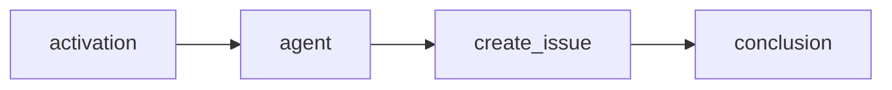
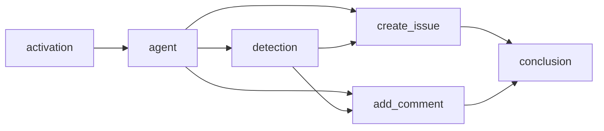
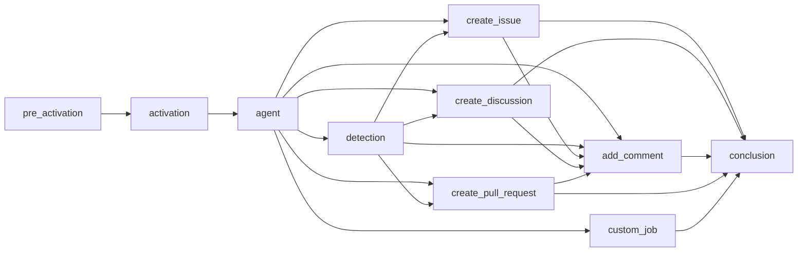
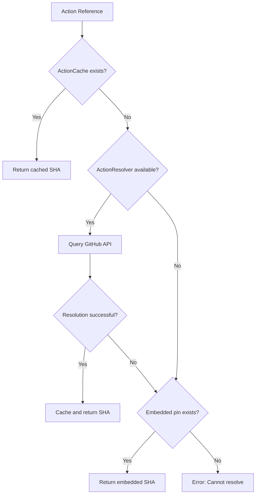
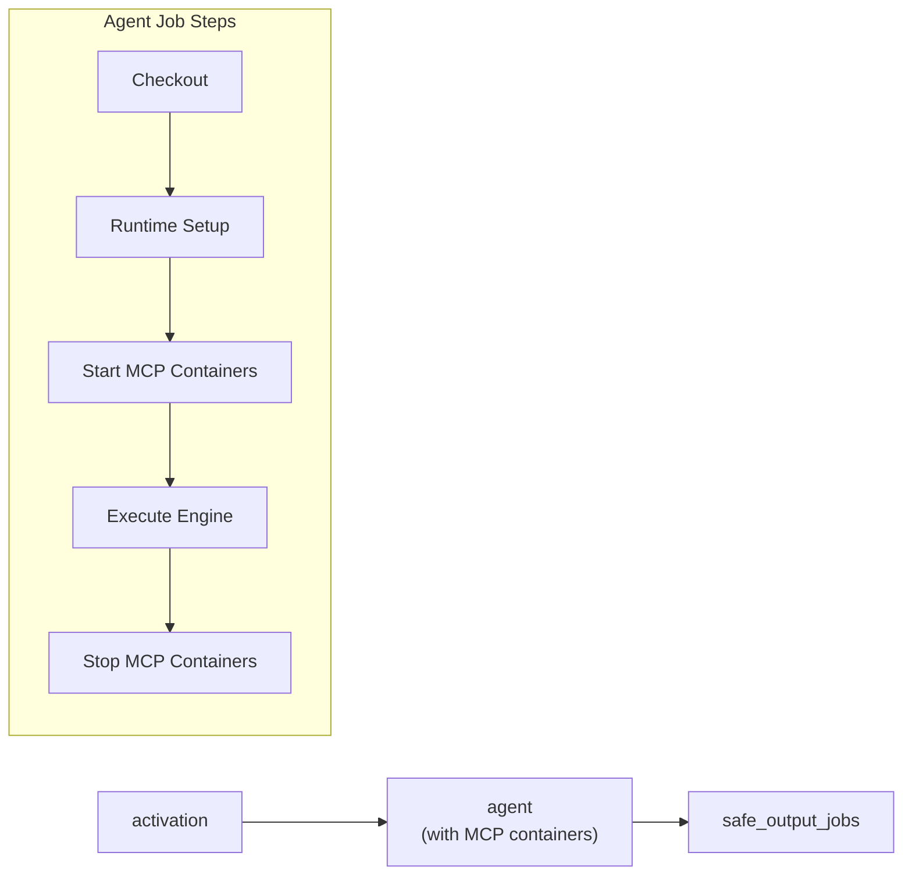
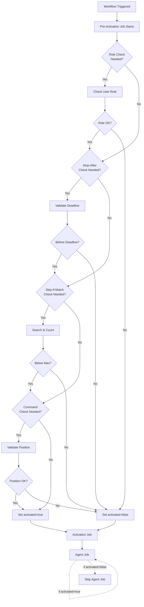
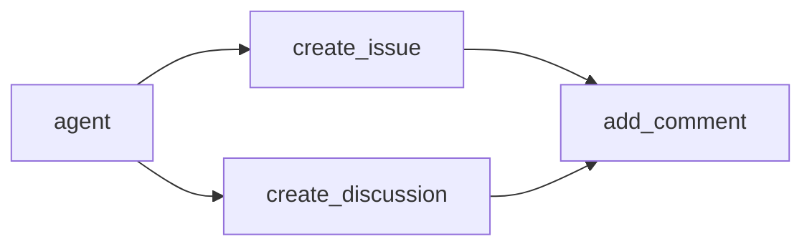

This guide documents the internal compilation process that transforms markdown workflow files into executable GitHub Actions YAML. Understanding this process helps when debugging workflows, optimizing performance, or contributing to the compiler.

## Overview

The compiler (`pkg/workflow/compiler.go`) transforms a markdown file with YAML frontmatter into a complete GitHub Actions workflow with multiple orchestrated jobs. This process involves:

1. **Parsing** - Extract frontmatter and markdown content
2. **Validation** - Verify configuration against JSON schemas
3. **Job Building** - Create specialized jobs for different workflow stages
4. **Dependency Management** - Establish job execution order
5. **YAML Generation** - Output final `.lock.yml` file

## Compilation Phases

### Phase 1: Parsing and Validation

The compiler reads the markdown file and:

- Extracts YAML frontmatter using `parser.ExtractFrontmatterFromContent()`
- Parses workflow configuration into `WorkflowData` structure
- Validates against `main_workflow_schema.json`
- Resolves imports from `imports:` field
- Validates expression safety (only allowed GitHub Actions expressions)

### Phase 2: Job Construction

The compiler builds multiple specialized jobs through `buildJobs()`:

```go
// From pkg/workflow/compiler_jobs.go
func (c *Compiler) buildJobs(data *WorkflowData, markdownPath string) error {
    // Build pre-activation if needed
    // Build activation job
    // Build main agent job
    // Build safe output jobs
    // Build safe-jobs
    // Build custom jobs
}
```

### Phase 3: Dependency Resolution

The `JobManager` validates and orders jobs:

- Checks all job dependencies exist
- Detects circular dependencies using DFS
- Computes topological execution order
- Generates Mermaid dependency graph

### Phase 4: Action Pinning

All GitHub Actions are pinned to commit SHAs for security:

1. Check `ActionCache` for cached resolution
2. Try dynamic resolution via `ActionResolver` (GitHub API)
3. Fall back to embedded `action_pins.json`
4. Add version comment (e.g., `actions/checkout@sha # v4`)

### Phase 5: YAML Generation

The compiler assembles the final workflow:

- Renders workflow header with metadata comments
- Includes job dependency Mermaid graph
- Generates jobs in alphabetical order
- Embeds original prompt as comment
- Writes `.lock.yml` file

## Job Types

The compiler creates different job types depending on workflow configuration. Each job serves a specific purpose in the workflow execution pipeline.

### Pre-Activation Job

**Job Name**: `pre_activation`

**Purpose**: Performs security and validation checks before workflow execution

**Created When**:
- Role checks are needed (`roles:` field configured)
- Stop-after deadline is set (`on.stop-after:` configured)
- Skip-if-match conditions exist
- Command trigger is used (`on.command:`)

**Responsibilities**:
- Validate user has required role (admin, maintainer, write)
- Check workflow hasn't exceeded stop-after deadline
- Evaluate skip-if-match conditions against issue/PR content
- Verify command appears in valid position in comment

**Outputs**:
- `activated`: `true` if all checks pass, `false` otherwise

**Dependencies**: None (runs first)

### Activation Job

**Job Name**: `activation`

**Purpose**: Prepares workflow context and computes sanitized text output

**Created When**: Always (required for all workflows)

**Responsibilities**:
- Checks timestamp of lock file to prevent stale workflow execution
- Computes sanitized text from triggering event (issue body, PR body, comment)
- Validates workflow_run repository safety (prevents cross-repo attacks)
- Evaluates runtime `if:` conditions

**Outputs**:
- `text`: Sanitized content from triggering event
- `activated`: `true` if pre-activation passed (when pre-activation exists)

**Dependencies**: `pre_activation` (if exists)

### Main Agent Job

**Job Name**: `agent`

**Purpose**: Executes AI agent with configured engine and tools

**Created When**: Always (core job)

**Steps**:
1. **Checkout** - Clones repository code
2. **Runtime Setup** - Installs Node.js, Python, Go, etc.
3. **Cache Restore** - Restores cache-memory if configured
4. **MCP Server Setup** - Starts Docker containers for MCP servers
5. **Tool Configuration** - Sets up GitHub, Playwright, bash tools
6. **Prompt Generation** - Creates multi-step prompt from markdown content
7. **Engine Execution** - Runs AI agent (Copilot, Claude, Codex)
8. **Output Upload** - Uploads agent output as artifact
9. **Cache Save** - Saves cache-memory for next run

**Environment Variables**:
```yaml
GH_AW_PROMPT: /tmp/gh-aw/aw-prompts/prompt.txt
GH_AW_SAFE_OUTPUTS: /tmp/gh-aw/safeoutputs/agent_output.json
GITHUB_TOKEN: ${{ secrets.GITHUB_TOKEN }}
```

**Dependencies**: `activation`

### Detection Job

**Job Name**: `detection`

**Purpose**: Scans agent output for security threats

**Created When**: `safe-outputs.threat-detection:` is configured

**Responsibilities**:
- Downloads agent output artifact
- Analyzes output for malicious patterns
- Validates patch safety
- Blocks workflow if threats detected

**Outputs**:
- `safe`: `true` if no threats found, `false` otherwise

**Dependencies**: `agent`

### Safe Output Jobs

These jobs process AI agent output to perform GitHub API operations with proper permission separation.

#### Create Issue Job

**Job Name**: `create_issue`

**Created When**: `safe-outputs.create-issue:` is configured

**Responsibilities**:
- Downloads agent output artifact
- Parses `create_issue` items from JSON
- Creates GitHub issues via JavaScript script
- Adds configured labels and title prefix
- Links issues to triggering context

**Permissions**: `issues: write`

**Dependencies**: `agent`, `detection` (if exists)

#### Create Discussion Job

**Job Name**: `create_discussion`

**Created When**: `safe-outputs.create-discussion:` is configured

**Responsibilities**:
- Downloads agent output artifact
- Parses `create_discussion` items from JSON
- Creates GitHub discussions via JavaScript script
- Sets discussion category
- Adds title prefix if configured

**Permissions**: `discussions: write`

**Dependencies**: `agent`, `detection` (if exists)

#### Add Comment Job

**Job Name**: `add_comment`

**Created When**: `safe-outputs.add-comment:` is configured

**Responsibilities**:
- Downloads agent output artifact
- Parses `add_comment` items from JSON
- Adds comments to issues/PRs via JavaScript script
- Links to created issues/discussions if they exist

**Permissions**: `issues: write`, `pull-requests: write`

**Dependencies**: `agent`, `detection` (if exists), `create_issue` (if exists), `create_discussion` (if exists), `create_pull_request` (if exists)

#### Create Pull Request Job

**Job Name**: `create_pull_request`

**Created When**: `safe-outputs.create-pull-request:` is configured

**Responsibilities**:
- Downloads agent output artifact
- Parses `create_pull_request` items with git patches
- Creates branch with cryptographic random name
- Applies patches using git CLI
- Creates pull request via JavaScript script
- Adds labels, reviewers, draft status

**Permissions**: `contents: write`, `pull-requests: write`

**Dependencies**: `agent`, `activation`, `detection` (if exists)

#### Other Safe Output Jobs

Similar patterns exist for:
- `create_pr_review_comment` - Review comments on PR code lines
- `create_code_scanning_alert` - SARIF-based code scanning alerts
- `add_labels` - Add labels to issues/PRs
- `assign_milestone` - Assign issues to milestones
- `update_issue` - Update issue status/title/body
- `push_to_pr_branch` - Push commits to PR branches
- `upload_assets` - Upload workflow artifacts
- `update_release` - Update GitHub release descriptions
- `create_agent_task` - Create GitHub Copilot agent tasks
- `update_project` - Manage project boards
- `missing_tool` - Report missing tool requests
- `noop` - Log completion messages

### Safe-Jobs

**Job Names**: User-defined

**Created When**: `safe-outputs.jobs:` is configured

**Purpose**: Custom jobs with full GitHub Actions syntax

**Example**:
```yaml
safe-outputs:
  jobs:
    deploy:
      runs-on: ubuntu-latest
      permissions:
        deployments: write
      steps:
        - name: Deploy
          run: ./deploy.sh
```

**Dependencies**: `agent`, `detection` (if exists)

### Custom Jobs

**Job Names**: User-defined

**Created When**: `jobs:` field is configured in frontmatter

**Purpose**: Additional workflow jobs with custom logic

**Example**:
```yaml
jobs:
  notify:
    runs-on: ubuntu-latest
    needs: agent
    steps:
      - name: Send notification
        run: echo "Workflow complete"
```

**Dependencies**: User-specified via `needs:` field

### Conclusion Job

**Job Name**: `conclusion`

**Purpose**: Aggregates workflow results and generates summary

**Created When**: Always (unless workflow has no safe outputs)

**Responsibilities**:
- Waits for all safe output jobs to complete
- Generates workflow summary with links to created items
- Reports errors if jobs failed
- Provides final status

**Dependencies**: All safe output jobs, `activation`

## Job Dependency Graphs

### Standard Workflow



This represents a basic workflow:
1. Activation prepares context
2. Agent executes with AI
3. Create issue processes output
4. Conclusion summarizes results

### Workflow with Threat Detection



When threat detection is enabled:
1. Detection job runs after agent completes
2. Safe output jobs depend on both agent AND detection
3. Safe outputs only run if detection passes
4. Conclusion waits for all outputs

### Complex Workflow with Pre-Activation



This complex workflow includes:
- Pre-activation for security checks
- Threat detection
- Multiple safe outputs with cross-dependencies
- Custom job in parallel
- Centralized conclusion

## Action Pinning

All GitHub Actions are pinned to specific commit SHAs for security and reproducibility.

### Why Pin Actions?

**Security**:
- Prevents supply chain attacks
- Tags can be moved to malicious commits
- SHA commits are immutable

**Reproducibility**:
- Ensures consistent behavior across runs
- Prevents breaking changes from action updates

### Action Pin Structure

Actions are referenced with SHA and version comment:

```yaml
uses: actions/checkout@b4ffde65f46336ab88eb53be808477a3936bae11 # v4
```

### Action Pins Data File

The compiler uses embedded action pins from `pkg/workflow/data/action_pins.json`:

```json
{
  "entries": {
    "actions/checkout@v4": {
      "repo": "actions/checkout",
      "version": "v4",
      "sha": "b4ffde65f46336ab88eb53be808477a3936bae11"
    },
    "actions/setup-node@v4": {
      "repo": "actions/setup-node",
      "version": "v4",
      "sha": "1e60f620b9541d16bece96c5465dc8fedd8a3f2c"
    }
  }
}
```

### Resolution Process



### Dynamic Resolution

The compiler uses `ActionResolver` to fetch latest SHAs from GitHub API:

```go
// From pkg/workflow/action_resolver.go
func (r *ActionResolver) ResolveSHA(repo, version string) (string, error) {
    // Query GitHub API for tag/branch
    // Extract commit SHA
    // Cache result in ActionCache
    // Return SHA
}
```

### Caching

Action resolutions are cached in `.github/aw/actions-lock.json`:

```json
{
  "entries": {
    "actions/checkout@v4": {
      "repo": "actions/checkout",
      "version": "v4",
      "sha": "b4ffde65f46336ab88eb53be808477a3936bae11",
      "resolved_at": "2024-11-20T10:30:00Z"
    }
  }
}
```

The cache is shared across all workflow compilations and persists between runs.

## Artifacts Created

### Agent Output Artifact

**Name**: `agent_output.json`

**Location**: `/tmp/gh-aw/safeoutputs/`

**Purpose**: Stores AI agent output for processing by safe output jobs

**Structure**:
```json
{
  "create_issue": [
    {
      "title": "Bug: Authentication fails",
      "body": "Detailed description...",
      "labels": ["bug", "high-priority"]
    }
  ],
  "add_comment": [
    {
      "target": "triggering",
      "body": "Analysis complete. Found 3 issues."
    }
  ]
}
```

**Lifecycle**:
1. Agent job writes output during execution
2. Agent job uploads as GitHub Actions artifact
3. Safe output jobs download artifact
4. Safe output jobs parse and process
5. Artifact auto-deleted after 90 days

### Prompt Artifact

**Name**: `prompt.txt`

**Location**: `/tmp/gh-aw/aw-prompts/`

**Purpose**: Stores generated prompt sent to AI agent

**Content**:
- Markdown instructions from workflow file
- Imported content from `imports:` field
- Context variables (issue number, repository, etc.)
- Tool usage instructions
- Safe output format specifications

**Usage**:
- Debugging workflow behavior
- Understanding what agent received
- Reproducing agent responses

### Firewall Logs

**Name**: Various log files in `firewall-logs/` directory

**Location**: `/tmp/gh-aw/firewall-logs/`

**Purpose**: Records network access by AI agent

**Created When**: `network.firewall:` is enabled (Copilot engine)

**Structure**: Squid proxy log format
```
timestamp client_ip:port domain dest_ip:port proto method status decision url user_agent
```

**Analysis**: The `gh aw logs` command parses firewall logs to show:
- Allowed domains and request counts
- Denied domains and request counts
- Network access patterns

### Cache-Memory Artifacts

**Name**: User-configurable (default: `cache-memory`)

**Location**: `/tmp/gh-aw/cache-memory/`

**Purpose**: Persistent memory storage for AI agents across runs

**Created When**: `tools.cache-memory:` is configured

**Structure**: Managed by `@modelcontextprotocol/server-memory`

**Lifecycle**:
1. Workflow restores cache at start
2. Memory MCP server mounts cache directory
3. Agent reads/writes memory files
4. Workflow saves cache at end
5. Next run restores from cache

### Safe Output Artifacts

**Names**: Various based on safe output type

**Examples**:
- `patches/*.patch` - Git patches for pull requests
- `sarif/*.sarif` - SARIF files for code scanning alerts
- `metadata/*.json` - Additional metadata for safe outputs

**Purpose**: Store data needed by safe output jobs

**Lifecycle**: Temporary, cleaned up after job completion

## MCP Server Integration

Model Context Protocol (MCP) servers provide tools to AI agents. The compiler integrates MCP servers into the workflow execution graph.

### MCP Configuration File

The compiler generates `mcp-config.json` based on `tools:` configuration:

```json
{
  "mcpServers": {
    "github": {
      "type": "local",
      "command": "npx",
      "args": [
        "@github/github-mcp-server",
        "--github-token",
        "${COPILOT_GITHUB_TOKEN}"
      ],
      "env": {
        "GITHUB_TOKEN": "${COPILOT_GITHUB_TOKEN}"
      }
    },
    "playwright": {
      "type": "local",
      "command": "npx",
      "args": [
        "@playwright/mcp@latest",
        "--allowed-hosts",
        "example.com,trusted.com"
      ]
    },
    "custom-api": {
      "type": "http",
      "url": "https://api.custom.com/mcp",
      "headers": {
        "Authorization": "Bearer ${API_KEY}"
      },
      "env": {
        "API_KEY": "${API_KEY}"
      }
    }
  }
}
```

### MCP Server Types

#### Local MCP Servers (Docker)

**Configuration**:
```yaml
mcp-servers:
  my-tool:
    command: "node"
    args: ["server.js"]
    env:
      API_KEY: ${{ secrets.API_KEY }}
```

**Deployment**:
1. Compiler generates Dockerfile
2. Dockerfile installs dependencies
3. Dockerfile runs command with args
4. Container started in agent job
5. Engine connects via stdio

#### HTTP MCP Servers

**Configuration**:
```yaml
mcp-servers:
  external-api:
    type: http
    url: "https://api.example.com/mcp"
    headers:
      Authorization: "Bearer ${{ secrets.API_TOKEN }}"
```

**Deployment**:
1. No container needed
2. Engine connects via HTTP
3. Headers passed with requests
4. Secrets injected from environment

### Tool Discovery

The compiler filters MCP tools based on `allowed:` configuration:

```yaml
mcp-servers:
  github:
    allowed:
      - get_repository
      - create_issue
      - list_pull_requests
```

This restricts the agent to only these three tools from the GitHub MCP server.

### Environment Variable Injection

**For Local MCP Servers**:
```yaml
mcp-servers:
  custom:
    command: "python"
    args: ["-m", "server"]
    env:
      DATABASE_URL: ${{ secrets.DB_URL }}
      API_KEY: ${{ secrets.API_KEY }}
```

Compiler generates:
1. Environment variables in agent job
2. Dockerfile with ENV directives
3. MCP config with `${VAR}` references
4. Container runtime passes variables

**For HTTP MCP Servers**:
```yaml
mcp-servers:
  api:
    type: http
    url: "https://api.example.com"
    headers:
      X-API-Key: ${{ secrets.API_KEY }}
```

Compiler generates:
1. Environment variable for secret
2. MCP config with `${API_KEY}` reference
3. Engine replaces variable when making requests

### MCP in Job Dependency Graph

MCP servers affect job structure:



MCP containers:
- Start before engine execution
- Run alongside engine process
- Provide tools via stdio or HTTP
- Stopped after engine completes

## Pre-Activation Job Necessity

The pre-activation job exists to enforce security and operational policies before expensive AI execution begins.

### Why Pre-Activation?

**Cost Optimization**:
- AI agent execution is expensive (API costs, compute time)
- Validation should happen before costs are incurred
- Early exit prevents wasted resources

**Security Enforcement**:
- Check user permissions before granting access
- Validate request origins and authenticity
- Prevent unauthorized workflow triggers

**Operational Control**:
- Honor stop-after deadlines
- Skip duplicate or redundant runs
- Control when and how workflows execute

### Role Checks

**Configuration**:
```yaml
roles: [admin, maintainer, write]
```

**Validation**:
1. Extract actor username from event
2. Query GitHub API for user's role
3. Compare against allowed roles list
4. Set `activated=false` if unauthorized

**Output**:
```yaml
outputs:
  activated: ${{ steps.check_role.outputs.activated }}
```

### Stop-After Validation

**Configuration**:
```yaml
on:
  schedule:
    - cron: "0 0 * * *"
  stop-after: "+30d"  # Stop after 30 days
```

**Validation**:
1. Parse stop-after expression (+30d, 2024-12-31, etc.)
2. Calculate deadline timestamp
3. Compare current time to deadline
4. Set `activated=false` if past deadline

**Use Case**: Temporary workflows for experiments, trials, or time-limited projects

### Skip-If-Match Conditions

**Configuration**:
```yaml
skip-if-match:
  query: "title:duplicate"
  max: 5
```

**Validation**:
1. Search GitHub for matching issues/PRs
2. Count matching results
3. Set `activated=false` if count >= max

**Use Case**: Prevent duplicate issue creation, avoid redundant analyses

### Command Position Validation

**Configuration**:
```yaml
on:
  command:
    name: my-bot
```

**Validation**:
1. Parse comment body for `/my-bot` command
2. Check if command appears in first 3 lines
3. Set `activated=false` if command is too far down

**Use Case**: Prevent accidental triggers from quoted commands, examples, or replies

### Pre-Activation Flow



The pre-activation job runs all configured checks in sequence. If any check fails, it sets `activated=false`, causing downstream jobs to skip execution.

## Compilation Command Reference

### Basic Compilation

```bash
# Compile all workflows in .github/workflows/
gh aw compile

# Compile specific workflow
gh aw compile my-workflow

# Compile with verbose output
gh aw compile --verbose
```

### Validation Options

```bash
# Compile with strict mode (enhanced security)
gh aw compile --strict

# Validate without generating files
gh aw compile --no-emit

# Run security scanners
gh aw compile --actionlint --zizmor --poutine
```

### Output Control

```bash
# Remove orphaned .lock.yml files
gh aw compile --purge

# Custom output directory
gh aw compile --output /path/to/output
```

## Debugging Compilation

### Verbose Logging

Enable debug logging to see internal compiler operations:

```bash
DEBUG=workflow:* gh aw compile my-workflow --verbose
```

This shows:
- Job creation and dependencies
- Action pin resolutions
- Tool configurations
- MCP server setups
- Step generation

### Inspect Generated Files

After compilation, examine the `.lock.yml` file:

1. **Header Comments**: Show imports, dependencies, and prompt
2. **Job Dependency Graph**: Mermaid diagram of job relationships
3. **Job Structure**: Steps, environment variables, permissions
4. **Action References**: Verify SHA pinning
5. **MCP Configuration**: Check tool setups

### Common Issues

**Circular Dependencies**:
```
Error: cycle detected in job dependencies: 
  job 'custom' has circular dependency through 'agent'
```

Fix: Review `needs:` clauses in custom jobs

**Missing Action Pin**:
```
Error: failed to resolve action: owner/repo@v1
```

Fix: Add pin to `action_pins.json` or enable dynamic resolution

**Invalid MCP Configuration**:
```
Error: tool 'my-tool' has invalid mcp configuration
```

Fix: Verify `command`, `args`, and `env` are correctly specified

## Performance Optimization

### Compilation Speed

Typical compilation times:
- Simple workflow: ~100ms
- Complex workflow with imports: ~500ms
- Workflow with dynamic action resolution: ~2s

**Optimization tips**:
- Use action cache (`.github/aw/actions-lock.json`)
- Minimize imports depth
- Pre-compile shared workflows

### Runtime Performance

**Job Parallelization**:
Safe output jobs run in parallel when no dependencies exist:



`create_issue` and `create_discussion` run simultaneously.

**Caching**:
- Enable `cache:` for dependencies
- Use `cache-memory:` for persistent agent memory
- Cache action resolutions

## Advanced Topics

### Custom Engine Integration

Add custom AI engines by implementing the `AgenticEngine` interface:

```go
type CustomEngine struct{}

func (e *CustomEngine) GetExecutionSteps(data *WorkflowData) ([]string, error) {
    // Return GitHub Actions steps
}

func (e *CustomEngine) GetJobEnv(data *WorkflowData) (map[string]string, error) {
    // Return environment variables
}
```

Register in `EngineRegistry`:
```go
registry.Register("custom", &CustomEngine{})
```

### Schema Extension

Add new frontmatter fields by:

1. Update `pkg/parser/schemas/main_workflow_schema.json`
2. Rebuild binary (`make build`)
3. Add handling in `ParseWorkflowFile()`
4. Update documentation

### Workflow Manifest Resolution

The compiler tracks imported files and includes them in the lock file header:

```yaml
# Resolved workflow manifest:
#   Imports:
#     - shared/mcp/github.md
#     - shared/security-notice.md
```

This enables:
- Dependency tracking
- Update detection
- Audit trails

## Best Practices

### Security

1. **Always use action pinning**: Never use floating tags
2. **Enable threat detection**: Add `safe-outputs.threat-detection:`
3. **Limit tool access**: Use `allowed:` to restrict MCP tools
4. **Review generated YAML**: Inspect `.lock.yml` before committing
5. **Run security scanners**: Use `--actionlint --zizmor --poutine`

### Maintainability

1. **Use imports for shared config**: Extract common tool setups
2. **Document complex workflows**: Add `description:` field
3. **Test iteratively**: Compile frequently during development
4. **Version lock files**: Commit `.lock.yml` to repository
5. **Track action pins**: Commit `.github/aw/actions-lock.json`

### Performance

1. **Enable caching**: Use `cache:` and `cache-memory:`
2. **Minimize imports**: Only import what's needed
3. **Optimize tool configs**: Limit `allowed:` tool lists
4. **Use safe-jobs for custom logic**: Avoid complex workflows

### Debugging

1. **Enable verbose logging**: `--verbose` flag shows details
2. **Check job dependencies**: Review Mermaid graph in header
3. **Inspect artifacts**: Download and examine agent output
4. **Review firewall logs**: Use `gh aw logs` to analyze network access
5. **Test with --no-emit**: Validate without creating files

## Related Documentation

- [Frontmatter Reference](/gh-aw/reference/frontmatter/) - All configuration options
- [Tools Reference](/gh-aw/reference/tools/) - Tool configuration guide
- [Safe Outputs Reference](/gh-aw/reference/safe-outputs/) - Output processing
- [Engines Reference](/gh-aw/reference/engines/) - AI engine configuration
- [Network Reference](/gh-aw/reference/network/) - Network permissions
