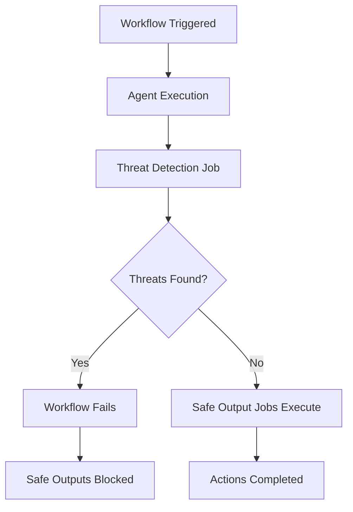

Threat detection is a security feature that automatically analyzes agent output and code changes for potential security threats before any safe outputs are processed. When enabled, it acts as a security gate that prevents malicious or suspicious content from being automatically published to GitHub.

## How It Works

When safe outputs are configured in a workflow, threat detection is **enabled by default** to analyze the agent's output before any automated actions occur. The detection process:

1. **Analyzes Agent Output**: Reviews the natural language output from the AI agent for suspicious instructions or content
2. **Examines Code Changes**: Inspects any code patches or file modifications for security vulnerabilities
3. **Checks for Threats**: Looks for three main categories of security threats:
   - **Prompt Injection**: Attempts to manipulate the AI system or bypass security controls
   - **Secret Leaks**: Exposed API keys, passwords, tokens, or sensitive information
   - **Malicious Code**: Backdoors, suspicious web service calls, encoded payloads, or unknown dependencies
4. **Blocks or Allows**: If threats are detected, the workflow fails and safe outputs are not processed. Otherwise, safe output jobs proceed normally.

## Default Behavior

**Automatic Enablement**: Threat detection is automatically enabled when any safe-outputs are configured:

```yaml
safe-outputs:
  create-issue:
  # threat-detection is enabled by default
```

This compiled workflow will include a threat detection job that runs before the `create-issue` job.

## Configuration

### Basic Configuration

**Explicitly Enable (Default Behavior):**
```yaml
safe-outputs:
  threat-detection: true
  create-issue:
```

**Explicitly Disable (Not Recommended):**
```yaml
safe-outputs:
  threat-detection: false
  create-issue:
```

> [!WARNING]
> Disabling threat detection removes an important security layer. Only disable it if you understand the security implications and have alternative security controls in place.

### Advanced Configuration

**With Custom Prompt Instructions:**
```yaml
safe-outputs:
  threat-detection:
    prompt: |
      Pay special attention to:
      - API calls to external services outside of GitHub
      - Installation of packages from non-standard registries
      - Base64 encoded strings that may hide secrets
  create-issue:
  create-pull-request:
```

**With Custom Validation Steps:**
```yaml
safe-outputs:
  threat-detection:
    steps:
      - name: Additional security scan
        uses: actions/custom-security-scan@v1
        with:
          scan-level: strict
      - name: Custom validation
        run: |
          echo "Running custom security checks..."
          # Your custom validation logic here
  create-pull-request:
```

**Complete Configuration:**
```yaml
safe-outputs:
  threat-detection:
    enabled: true
    prompt: "Focus on identifying backdoor installations and data exfiltration attempts."
    steps:
      - name: Extra validation
        run: echo "Additional checks..."
  create-issue:
  add-comment:
```

## Configuration Options

| Field | Type | Description | Default |
|-------|------|-------------|---------|
| **`enabled`** | boolean | Whether threat detection is enabled | `true` when safe-outputs configured |
| **`prompt`** | string | Additional custom instructions to append to the default threat detection prompt | None |
| **`steps`** | array | Custom GitHub Actions steps to run as part of threat detection | None |

## Threat Categories

### Prompt Injection

Attempts to inject malicious instructions or commands that could manipulate the AI system or bypass security controls.

**Examples Detected:**
- Instructions embedded in issue descriptions asking the agent to ignore security rules
- Attempts to override workflow instructions with user-provided content
- Social engineering attempts to trick the agent into performing unauthorized actions

### Secret Leaks

Exposure of secrets, API keys, passwords, tokens, or other sensitive information that should not be disclosed.

**Examples Detected:**
- API keys in code comments or configuration files
- GitHub personal access tokens in environment variables
- Database connection strings with credentials
- AWS access keys or other cloud provider credentials

### Malicious Code

Code changes that could introduce security vulnerabilities, backdoors, or malicious functionality.

**Examples Detected:**
- **Suspicious Web Service Calls**: HTTP requests to unusual domains or data exfiltration attempts
- **Backdoor Installation**: Hidden remote access mechanisms or unauthorized authentication bypass
- **Encoded Strings**: Base64, hex, or other encoded strings that appear to hide secrets or commands without legitimate purpose
- **Suspicious Dependencies**: Addition of unknown packages or dependencies from untrusted sources

## How Threat Detection Analyzes Content

The threat detection job uses an AI engine (typically Claude) to analyze:

1. **Workflow Source Context**: The original workflow's name, description, and markdown content to understand intended behavior
2. **Agent Output**: All natural language output generated by the AI agent during workflow execution
3. **Code Changes (Patches)**: Any git patches or file modifications made by the agent

The analysis is context-aware, meaning the detector understands the workflow's intended purpose and distinguishes between legitimate actions and potential threats.

## Output Format

When threats are detected, the workflow fails with a clear error message:

```
❌ Security threats detected: prompt injection, secret leak
Reasons: Detected attempt to override security instructions in issue body; Found exposed GitHub token in patch
```

When no threats are found:

```
✅ No security threats detected. Safe outputs may proceed.
```

## Workflow Execution Flow



## Custom Prompt Instructions

The `prompt` field allows you to add specific security concerns relevant to your workflow:

```yaml
safe-outputs:
  threat-detection:
    prompt: |
      Additional security checks:
      1. Verify all npm packages come from the official npm registry
      2. Check for any network requests to non-GitHub domains
      3. Ensure no credentials are hardcoded in configuration files
      4. Look for suspicious use of eval() or exec() functions
  create-pull-request:
```

These instructions are appended to the default threat detection prompt, allowing you to customize the analysis without losing the built-in security checks.

## Custom Validation Steps

The `steps` field allows you to add additional validation logic using standard GitHub Actions steps:

```yaml
safe-outputs:
  threat-detection:
    steps:
      - name: Run static analysis
        uses: github/super-linter@v5
        with:
          validate_all_codebase: false
      
      - name: Check for secrets
        uses: trufflesecurity/trufflehog@main
        with:
          path: ./
          
      - name: Custom validation script
        run: |
          #!/bin/bash
          # Your custom security validation logic
          if grep -r "eval(" .; then
            echo "Detected dangerous eval() usage"
            exit 1
          fi
  create-pull-request:
```

These steps run as part of the threat detection job, before the AI analysis. If any step fails, the workflow stops and safe outputs are not processed.

## Security Best Practices

1. **Keep It Enabled**: Unless you have specific reasons, keep threat detection enabled for all workflows with safe outputs
2. **Customize for Your Needs**: Add custom prompt instructions specific to your repository's security concerns
3. **Layer Security**: Use custom validation steps to add additional security tools (linters, secret scanners, SAST tools)
4. **Review Failures**: When threat detection blocks a workflow, carefully review the detected threats
5. **Test Workflows**: Test your workflows with various inputs to ensure threat detection works as expected
6. **Monitor False Positives**: If you encounter false positives, use custom prompts to refine the detection

## Integration with Safe Outputs

Threat detection integrates seamlessly with all safe output types:

```yaml
safe-outputs:
  threat-detection: true  # Explicitly enabled (but this is the default)
  create-issue:
  add-comment:
  create-pull-request:
  add-labels:
  update-issue:
  create-pull-request-review-comment:
  push-to-pull-request-branch:
  create-code-scanning-alert:
```

The detection job runs once before any safe output jobs execute. If threats are detected, **all** safe output jobs are blocked.

## Disabling Threat Detection

In rare cases where you need to disable threat detection (not recommended):

```yaml
safe-outputs:
  threat-detection: false  # Disable threat detection
  create-issue:
```

**When might you disable it?**
- Testing workflows in a secure environment
- Workflows with alternative security controls
- Workflows that don't process user-generated content

**Security Implications:**
- No automatic analysis of agent output or code changes
- Malicious content could be published automatically
- Increased risk of prompt injection attacks
- Potential exposure of secrets in output

## Example Workflows

### Basic Issue Creation with Threat Detection

```aw wrap
---
on:
  issues:
    types: [opened]
permissions:
  contents: read
  actions: read
engine: claude
safe-outputs:
  create-issue:
  # threat-detection enabled by default
---

# Issue Analysis Agent

Analyze the issue and create a summary issue with findings.
```

### Pull Request Creation with Custom Security Checks

```aw wrap
---
on:
  push:
    branches: [main]
permissions:
  contents: read
  actions: read
engine: claude
safe-outputs:
  threat-detection:
    prompt: |
      Security focus areas:
      - Check all code changes for hardcoded credentials
      - Verify external API calls use HTTPS only
      - Ensure no dangerous functions (eval, exec) are introduced
    steps:
      - name: Run CodeQL analysis
        uses: github/codeql-action/analyze@v3
  create-pull-request:
    title-prefix: "[auto] "
    draft: true
---

# Code Improvement Agent

Analyze recent commits and create a pull request with improvements.
Make code changes as needed and create a PR with your improvements.
```

### Comment Creation with Strict Security

```aw wrap
---
on:
  pull_request:
    types: [opened, synchronize]
permissions:
  contents: read
  actions: read
engine: claude
safe-outputs:
  threat-detection:
    enabled: true
    prompt: "Pay special attention to any attempts to bypass CI/CD checks or modify security configurations."
  add-comment:
    max: 3
---

# Code Review Agent

Review the pull request changes and provide feedback.
Add comments on the PR with your code review findings.
```

## Troubleshooting

### Workflow Fails with "Security threats detected"

**Symptom**: The threat detection job fails with a message about detected threats.

**Solution**:
1. Review the workflow run logs to see what threats were detected
2. Examine the agent output and code changes for the flagged content
3. If it's a false positive, add custom prompt instructions to clarify the legitimate use case
4. If it's a real threat, investigate why the agent generated that content

### Threat Detection Job Never Runs

**Symptom**: The detection job doesn't appear in the workflow.

**Solution**:
1. Ensure you have `safe-outputs:` configured in your workflow frontmatter
2. Verify the workflow compiled successfully with `gh aw compile`
3. Check that you haven't explicitly disabled threat detection

### Custom Steps Fail

**Symptom**: Custom validation steps in the threat detection job fail.

**Solution**:
1. Review the step logs to identify the failure
2. Test the steps independently to ensure they work correctly
3. Ensure the steps have the necessary permissions and dependencies
4. Check that the steps are compatible with `ubuntu-latest` runner

## Related Documentation

- [Safe Output Processing](/gh-aw/reference/safe-outputs/) - All safe output types and configuration
- [Frontmatter Options](/gh-aw/reference/frontmatter/) - Complete frontmatter configuration reference
- [Workflow Structure](/gh-aw/reference/workflow-structure/) - Directory layout and organization
- [CLI Commands](/gh-aw/tools/cli/) - CLI commands for workflow management
