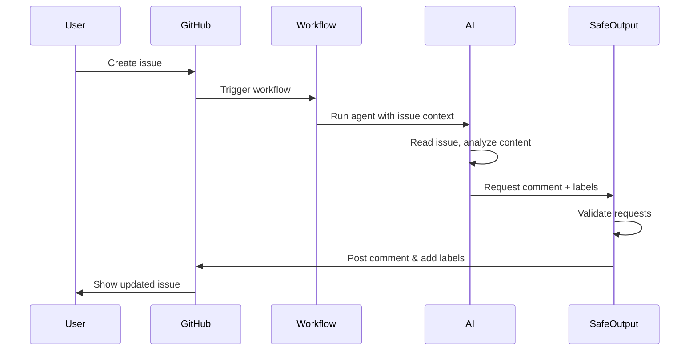

This guide walks you through creating your first agentic workflow from scratch, explaining each component and decision along the way. By the end, you'll understand how workflows work and be ready to create your own.

## What You'll Build

A simple workflow that:
- Runs when you create an issue
- Analyzes the issue content
- Adds a helpful comment with suggestions
- Adds appropriate labels

## Prerequisites Check

Before starting, verify you have everything:

```bash
gh --version      # Need version 2.0.0+
gh auth status    # Should show "Logged in"
gh aw --version   # Should show gh-aw version
```

If any command fails, see [Quick Start Prerequisites](/gh-aw/setup/quick-start/#prerequisites).

## Step 1: Create the Workflow File

Create a new file in your repository:

```bash
mkdir -p .github/workflows
touch .github/workflows/issue-helper.md
```

**Why `.github/workflows/`?**
- GitHub Actions looks for workflows in this directory
- The `.md` extension indicates this is an agentic workflow source file
- You'll also have a `.lock.yml` file after compilation (the actual GitHub Actions workflow)

## Step 2: Add the Frontmatter

Open `issue-helper.md` and add the configuration section (frontmatter):

```yaml
---
on:
  issues:
    types: [opened]
permissions:
  contents: read
  issues: read
safe-outputs:
  add-comment:
  add-labels:
    max: 3
---
```

**Let's break this down:**

### Trigger (`on:`)
```yaml
on:
  issues:
    types: [opened]
```
- **What**: Trigger when issues are created
- **Why**: We want to help with new issues
- **Alternatives**: `[edited]`, `[closed]`, `[labeled]`

### Permissions
```yaml
permissions:
  contents: read
  issues: read
```
- **What**: Read-only access to repository and issues
- **Why**: Security - AI can read but not directly modify anything
- **Note**: Write operations happen through safe-outputs only

### Safe Outputs
```yaml
safe-outputs:
  add-comment:
  add-labels:
    max: 3
```
- **What**: Pre-approved actions the AI can request
- **Why**: Controlled write operations without giving direct write access
- **How**: Separate job validates and executes the AI's requests

## Step 3: Write the Instructions

Below the frontmatter (after the closing `---`), add natural language instructions:

```markdown
# Issue Helper

Analyze this issue and help the author improve it.

## What to check

1. **Clarity**: Is the issue description clear and specific?
2. **Information**: Does it include necessary details (steps to reproduce, expected behavior, actual behavior)?
3. **Labels**: What labels would help categorize this issue?

## Your response

- Add a friendly comment with suggestions for improvement (if needed)
- Add 1-3 relevant labels based on the issue content
- Be encouraging and helpful - focus on improvements, not criticism

## Labels to consider

- `bug` - Something isn't working
- `enhancement` - New feature or request
- `documentation` - Improvements or additions to documentation
- `question` - Further information is requested
- `good first issue` - Good for newcomers
```

**Why natural language?**
- The AI interprets your intent, not rigid rules
- Adapts to different situations
- Easier to understand and modify

## Step 4: Compile the Workflow

Transform your markdown into a GitHub Actions workflow:

```bash
gh aw compile issue-helper
```

**Expected output:**
```text
✓ Compiled issue-helper.md → issue-helper.lock.yml
```

**What happened?**
1. Validated your frontmatter syntax
2. Checked security settings
3. Generated `issue-helper.lock.yml` (GitHub Actions workflow)
4. Applied security hardening

**Check the result:**
```bash
ls -la .github/workflows/
```

You should see both files:
- `issue-helper.md` - Your editable source (version control this)
- `issue-helper.lock.yml` - Generated GitHub Actions workflow (version control this too)

> [!CAUTION]
> Never Edit Lock Files
>
> Always edit the `.md` file and recompile. The `.lock.yml` file is auto-generated and your changes will be overwritten.

## Step 5: Commit and Push

Add your workflow to version control:

```bash
git add .github/workflows/issue-helper.md
git add .github/workflows/issue-helper.lock.yml
git commit -m "Add issue helper workflow"
git push
```

**Why commit both files?**
- `.md` file: Your source of truth for editing
- `.lock.yml` file: What GitHub Actions actually runs

## Step 6: Verify the Workflow

Check that GitHub recognizes your workflow:

```bash
gh aw status
```

**Expected output:**
```text
┌─────────────┬───────┬────────┬──────┬──────────────┬──────┬──────────┬──────────────┐
│Workflow     │Engine │Compiled│Status│Time Remaining│Labels│Run Status│Run Conclusion│
├─────────────┼───────┼────────┼──────┼──────────────┼──────┼──────────┼──────────────┤
│issue-helper │copilot│Yes     │active│-             │-     │-         │-             │
└─────────────┴───────┴────────┴──────┴──────────────┴──────┴──────────┴──────────────┘
```

> [!TIP]
> Workflow Not Listed?
>
> - Verify both files are committed and pushed
> - Check the Actions tab in your GitHub repository
> - Look for any error messages with `gh aw compile --verbose`

## Step 7: Test Your Workflow

Create a test issue to trigger your workflow:

1. Go to your repository on GitHub
2. Click "Issues" → "New issue"
3. Create an issue with minimal details (to test the helper):
   - **Title**: "Something doesn't work"
   - **Body**: "Help please"
4. Create the issue

**Watch it work:**

```bash
# Watch for the workflow run
gh aw status --watch

# View the workflow logs
gh aw logs issue-helper

# Check the issue for the comment
gh issue view <issue-number>
```

**Expected behavior:**
- Workflow triggers within seconds
- AI analyzes the issue
- Comment appears asking for more details
- Labels are added based on context

## Understanding What Happened

When you created the issue:



**Security layers:**
1. **Read-only agent**: AI can only read repository data
2. **Safe outputs**: AI requests actions, doesn't perform them directly
3. **Validation**: Separate job validates and sanitizes AI output
4. **Audit trail**: All actions logged in workflow runs

## Common Issues and Solutions

### Issue: Workflow doesn't trigger

**Check:**
```bash
# Verify workflow is enabled
gh aw status

# Check GitHub Actions tab for errors
gh api /repos/:owner/:repo/actions/workflows
```

**Solution:** Workflows may be disabled by default in some organizations. Enable it in the Actions tab.

### Issue: Authentication errors

**Error:** "COPILOT_GITHUB_TOKEN not found"

**Solution:** Add the token as a repository secret:
1. Create token at https://github.com/settings/personal-access-tokens/new
2. Add "Copilot Requests: Read" permission
3. Add as `COPILOT_GITHUB_TOKEN` secret in repository settings

See [Quick Start Step 4](/gh-aw/setup/quick-start/#step-4--add-an-ai-secret) for detailed instructions.

### Issue: Workflow runs but nothing happens

**Check if safe-outputs are in staged mode:**
```bash
cat .github/workflows/issue-helper.md | grep -A 5 "safe-outputs"
```

**Solution:** Add `staged: false` to actually execute actions:
```yaml
safe-outputs:
  staged: false
  add-comment:
  add-labels:
```

## Next Steps

Now that you've created your first workflow, explore these enhancements:

### Add More Capabilities

**Enable GitHub API access:**
```yaml
tools:
  github:
    toolsets: [default, labels]
```

**Add web search:**
```yaml
tools:
  web-search:
network:
  allowed:
    - defaults
```

**Allow file editing:**
```yaml
tools:
  edit:
  bash: ["cat", "ls", "grep"]
```

### Improve Instructions

**Add context:**
```markdown
## Repository context

This is a [description of your project]. Common issues include:
- Performance problems with [feature]
- Configuration errors in [area]
- Documentation gaps in [section]

Tailor your response based on this context.
```

**Add examples:**
```markdown
## Example good issue

Title: "Login button doesn't work on mobile Safari"
Body: "Steps to reproduce: 1. Open app on iPhone 13. 2. Tap login button. 3. Nothing happens.
Expected: Login form appears. Actual: No response. Version: iOS 16.5"
```

### Create More Workflows

Build on what you've learned:

**PR reviewer:**
```bash
gh aw add githubnext/agentics/pr-reviewer
```

**Daily status report:**
```bash
gh aw add githubnext/agentics/daily-team-status
```

**Documentation maintainer:**
```bash
gh aw add githubnext/agentics/docs-maintainer
```

## Learning Resources

### Understanding Concepts
- [How It Works](/gh-aw/introduction/how-it-works/) - Architecture and security
- [Workflow Structure](/gh-aw/reference/workflow-structure/) - Component reference

### Expanding Capabilities
- [Safe Outputs](/gh-aw/reference/safe-outputs/) - Available actions
- [Tools](/gh-aw/reference/tools/) - API and tool configuration
- [Triggers](/gh-aw/reference/triggers/) - Event configuration

### Troubleshooting
- [Common Issues](/gh-aw/troubleshooting/common-issues/) - Solutions to frequent problems
- [Error Reference](/gh-aw/troubleshooting/errors/) - Error explanations

### Community
- [GitHub Discussions](https://github.com/githubnext/gh-aw/discussions) - Ask questions
- [Examples](https://github.com/githubnext/agentics) - Browse sample workflows
- [CONTRIBUTING.md](https://github.com/githubnext/gh-aw/blob/main/CONTRIBUTING.md) - Contribute to the project

## Summary

You've learned how to:
- ✅ Create a workflow with frontmatter and instructions
- ✅ Compile markdown to GitHub Actions YAML
- ✅ Configure triggers, permissions, and safe-outputs
- ✅ Test and debug workflow execution
- ✅ Understand the security model

**Key concepts:**
- **Frontmatter**: Configuration in YAML format
- **Compilation**: Transforming `.md` to `.lock.yml`
- **Safe outputs**: Controlled write operations
- **Natural language**: Instructions for the AI agent

Ready to create more complex workflows? Explore the [Examples](/gh-aw/examples/scheduled/) section for inspiration.
