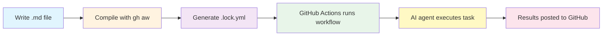

> [!WARNING]
> Using agentic workflows means giving AI agents the ability to make decisions and take actions in your repository. This requires careful attention to security considerations and human supervision.
> Review all outputs carefully and use time-limited trials to evaluate effectiveness for your team.

## Adding a Daily Status Workflow to Your Repo

This is a happy path guide to get you started with automated daily team status reports in an existing GitHub repository you have admin or write access to. If you stumble on one of these steps, go to the [Prerequisites](#prerequisites) section for setup instructions.

### Step 1 — Install the extension

Install the [GitHub CLI](https://cli.github.com/), then install the GitHub Agentic Workflows extension:

```bash wrap
gh extension install githubnext/gh-aw
```

**Verify the installation:**

```bash wrap
gh aw --version
```

**Expected output:**
```text
gh-aw version 0.x.x
```

> [!CAUTION]
> Working in GitHub Codespaces?
>
> If you're working in a GitHub Codespace, the extension installation *may* fail due to restricted permissions that prevent global npm installs. Use the standalone installer instead:
>
> ```bash wrap
> curl -sL https://raw.githubusercontent.com/githubnext/gh-aw/main/install-gh-aw.sh | bash
> ```
>

> [!TIP]
> Common Installation Issues
>
> **Extension not found after installation**: Run `gh extension list` to verify installation. If not listed, the installation failed silently. Try the standalone installer above.
>
> **Permission errors**: If you see permission errors during installation, ensure you have write access to `~/.local/share/gh/extensions/` or use the standalone installer.
>
> **Command not found**: Ensure GitHub CLI is in your PATH with `gh --version`. If not, [reinstall GitHub CLI](https://cli.github.com/).

### Step 2 — Initialize your repository

Initialize your repository to configure custom agents and MCP server:

```bash wrap
gh aw init
```

This command installs agents and tools for GitHub Copilot.

**What happens during initialization:**
- Creates `.github/agents/` directory with custom agent definitions
- Configures `.vscode/mcp.json` for Model Context Protocol servers
- Sets up project-specific configuration files

**Expected output:**
```text
✓ Created .github/agents/ directory
✓ Configured MCP servers
✓ Ready to create agentic workflows
```

> [!TIP]
> Repository Not Initialized
>
> **Error: "not a git repository"**: Run this command from the root of a Git repository. Use `git init` if you haven't initialized Git yet.
>
> **Permission denied**: Ensure you have write access to the repository.

### Step 3 — Add a sample workflow

Add a sample from the [agentics](https://github.com/githubnext/agentics) collection. From your repository root run:

```bash wrap
gh aw add githubnext/agentics/daily-team-status --create-pull-request
```

This creates a pull request that adds `.github/workflows/daily-team-status.md` and the [compiled](/gh-aw/reference/glossary/#compilation) (translated from markdown to GitHub Actions YAML) `.lock.yml` (the generated GitHub Actions workflow file). 
   - Review and merge the PR into your repo.
   - Pull the changes into your (local) repo.

**What the command does:**
1. Fetches the workflow from the agentics repository
2. Creates a new branch in your repository
3. Adds the workflow files to `.github/workflows/`
4. Opens a pull request for you to review

**Expected files created:**
- `.github/workflows/daily-team-status.md` (your editable workflow)
- `.github/workflows/daily-team-status.lock.yml` (compiled GitHub Actions workflow)

> [!TIP]
> Adding Workflows Without Pull Requests
>
> To add a workflow directly without creating a PR, omit the `--create-pull-request` flag:
>
> ```bash wrap
> gh aw add githubnext/agentics/daily-team-status
> ```
>
> This adds the files directly to your current branch.

### Step 4 — Add an AI secret

[Agentic workflows](/gh-aw/reference/glossary/#agentic-workflow) (AI-powered workflows) need to authenticate with an AI service to execute your natural language instructions. By default, they use **GitHub Copilot** as the coding agent (the AI system that executes your instructions).

To allow your workflows to use Copilot, you'll create a token and add it as a repository secret.

#### Create a Personal Access Token (PAT)

Create a [Personal Access Token](/gh-aw/reference/glossary/#personal-access-token-pat) to authenticate your workflows with GitHub Copilot:

1. Visit <https://github.com/settings/personal-access-tokens/new>
2. Configure the token:
   - **Token name**: "Agentic Workflows Copilot"
   - **Expiration**: 90 days (recommended for testing)
   - **Resource owner**: Your personal account (required for Copilot Requests permission)
   - **Repository access**: "Public repositories" (required for Copilot Requests permission to appear)
3. Add permissions:
   - In **"Account permissions"** (not Repository permissions), find **"Copilot Requests"**
   - Set to **"Access: Read"**
4. Click **"Generate token"** and copy it immediately (you won't see it again)

> [!TIP]
> Can't find Copilot Requests permission?
>
> Requires an active [GitHub Copilot subscription](https://github.com/settings/copilot), a fine-grained token (not classic), personal account as Resource owner, and "Public repositories" or "All repositories" selected. Contact your GitHub administrator if Copilot is managed by your organization.
>

> [!CAUTION]
> Token Security Best Practices
>
> **Never commit tokens to your repository**: Always use repository secrets for tokens.
>
> **Use short expiration periods**: Start with 90 days for testing. Once you're confident, you can create longer-lived tokens.
>
> **Limit permissions**: Only grant the "Copilot Requests: Read" permission needed for workflows.
>
> **Rotate regularly**: Set a calendar reminder to regenerate tokens before they expire.

#### Add the token to your repository

Store the token as a repository secret:

1. Go to **your repository** → **Settings** → **Secrets and variables** → **Actions**
2. Click **New repository secret**
3. Set **Name** to `COPILOT_GITHUB_TOKEN` and paste the token in **Secret**
4. Click **Add secret**

Repository secrets are encrypted and only accessible to workflows in your repository. See [GitHub Copilot CLI documentation](https://github.com/github/copilot-cli?tab=readme-ov-file#authenticate-with-a-personal-access-token-pat) for more details.

> [!CAUTION]
> Repository Settings Not Available
>
> **Can't access repository settings**: You need admin or write access to the repository. Contact the repository owner to grant you access or add the secret for you.
>
> **Organization-owned repositories**: Your organization may have restrictions on secrets. Check with your organization administrator if you can't add secrets.

#### Verify your setup

Before running workflows, verify everything is configured correctly:

```bash wrap
gh aw status
```

**Expected output:**

```text
┌─────────────────┬───────┬────────┬──────┬──────────────┬──────┬──────────┬──────────────┐
│Workflow         │Engine │Compiled│Status│Time Remaining│Labels│Run Status│Run Conclusion│
├─────────────────┼───────┼────────┼──────┼──────────────┼──────┼──────────┼──────────────┤
│daily-team-status│copilot│No      │active│30d 22h       │-     │-         │-             │
└─────────────────┴───────┴────────┴──────┴──────────────┴──────┴──────────┴──────────────┘
```

This confirms the workflow is compiled, enabled, and scheduled correctly.

> [!TIP]
> Troubleshooting
>
> If the workflow isn't listed, run `gh aw compile` and verify `.github/workflows/daily-team-status.md` exists. If errors occur when running, verify the `COPILOT_GITHUB_TOKEN` secret is set with "Copilot Requests" permission and hasn't expired. Run `gh aw secrets bootstrap --engine copilot` to check configuration.
>

### Step 5 — Trigger a workflow run

Trigger the workflow immediately in GitHub Actions (this may fail in a codespace):

```bash wrap
gh aw run daily-team-status
```

**Expected output:**
```text
✓ Workflow triggered successfully
→ View run at: https://github.com/owner/repo/actions/runs/123456789
```

After a few moments, check the status:

```bash wrap
gh aw status
```

Once complete, a new issue will be created in your repository with a daily team status report! The report will be automatically generated by the AI based on recent activity in your repository, including issues, PRs, discussions, releases, and code changes.

**Monitoring workflow execution:**

```bash wrap
# Watch workflow status in real-time
gh aw status --watch

# View workflow logs
gh aw logs daily-team-status
```

> [!TIP]
> Workflow Fails to Trigger
>
> **Error: "workflow not enabled"**: Go to your repository's Actions tab and manually enable the workflow. GitHub may require manual approval for first-time workflows.
>
> **Error: "COPILOT_GITHUB_TOKEN not found"**: Verify the secret name is exactly `COPILOT_GITHUB_TOKEN` (case-sensitive) in repository settings.
>
> **Workflow runs but fails**: Check the workflow logs with `gh aw logs daily-team-status` for detailed error messages. Common issues include token expiration or insufficient permissions.

## Prerequisites

Before installing, ensure you have:

- ✅ **GitHub CLI** (`gh`) - A command-line tool for GitHub operations. [Install here](https://cli.github.com) v2.0.0+ and authenticate with `gh auth login`
- ✅ **GitHub account** with admin or write access to a repository
- ✅ **[GitHub Actions](https://docs.github.com/en/actions)** (GitHub's automation platform) enabled in your repository
- ✅ **Git** installed on your machine
- ✅ **Operating System:** Linux, macOS, or Windows with WSL

**Verify your setup:**

```bash
gh --version      # Should show version 2.0.0 or higher
gh auth status    # Should show "Logged in to github.com"
git --version     # Should show git version 2.x or higher
```

## How Agentic Workflows Work

Before installing anything, it helps to understand the workflow lifecycle:



**The workflow lifecycle:**

1. **Author**: Write a `.md` file with natural language instructions and YAML [frontmatter](/gh-aw/reference/glossary/#frontmatter) (configuration at the top between `---` markers)
2. **Compile**: Run `gh aw compile` to translate markdown to GitHub Actions YAML
3. **Generate**: The compiler creates a [`.lock.yml` file](/gh-aw/reference/glossary/#workflow-lock-file-lockyml) with security hardening
4. **Trigger**: GitHub Actions runs the workflow based on your triggers (schedule, events, manual)
5. **Execute**: An AI agent (Copilot, Claude, etc.) interprets your instructions
6. **Output**: Results are posted to GitHub (issues, PRs, comments) via [safe outputs](/gh-aw/reference/safe-outputs/)

**Why two files?**

- **`.md` file**: Human-friendly markdown with natural language instructions and simple YAML [frontmatter](/gh-aw/reference/glossary/#frontmatter) (configuration at the top between `---` markers). This is what you write and edit.
- **[`.lock.yml` file](/gh-aw/reference/glossary/#workflow-lock-file-lockyml)**: Machine-ready GitHub Actions YAML with security hardening applied. This is what GitHub Actions runs.
- **[Compilation](/gh-aw/reference/glossary/#compilation)**: The `gh aw compile` command translates your markdown into validated, secure GitHub Actions YAML.

Think of it like writing code in a high-level language (Python, JavaScript) that gets compiled to machine code. You write natural language, GitHub runs the compiled workflow.

> [!CAUTION]
> Important
> **Never edit [`.lock.yml` files](/gh-aw/reference/glossary/#workflow-lock-file-lockyml) directly.** These are auto-generated. Always edit the `.md` file and recompile with `gh aw compile`.

## Understanding Your First Workflow

The daily team status workflow creates a status report daily and posts it as an issue. The workflow file has two parts:

- **[Frontmatter](/gh-aw/reference/glossary/#frontmatter)** (YAML configuration section between `---` markers) — Configures when the workflow runs and what it can do
- **Markdown instructions** — Natural language task descriptions for the AI

```aw wrap
---
on:
  schedule: daily
  workflow_dispatch:
permissions:
  contents: read
  issues: read
  pull-requests: read
network: defaults
tools:
  github:
safe-outputs:
  create-issue:
    title-prefix: "[team-status] "
    labels: [report, daily-status]
    close-older-issues: true
---

# Daily Team Status

Create an upbeat daily status report for the team as a GitHub issue.

## What to include

- Recent repository activity (issues, PRs, discussions, releases, code changes)
- Team productivity suggestions and improvement ideas
- Community engagement highlights
- Project investment and feature recommendations

## Style

- Be positive, encouraging, and helpful 🌟
- Use emojis moderately for engagement
- Keep it concise - adjust length based on actual activity

## Process

1. Gather recent activity from the repository
2. Create a new GitHub issue with your findings and insights
```

**Key configuration elements:**

- **[`schedule: daily`](/gh-aw/reference/schedule-syntax/)** — Runs once per day at a randomized time to distribute load
- **[`tools:`](/gh-aw/reference/tools/)** — Capabilities the AI can use (like GitHub API access)
- **[`safe-outputs:`](/gh-aw/reference/safe-outputs/)** (pre-approved GitHub operations) — Allows creating issues without giving the AI write permissions

## Customize Your Workflow

Edit the `.md` file and recompile with `gh aw compile`. For AI-assisted customization, you can use the custom agents installed by `gh aw init`.

### Using VS Code with GitHub Copilot

In VS Code with GitHub Copilot Chat, use the `/agent` command to access the `create-agentic-workflow` agent:

```
/agent
> select create-agentic-workflow
> edit @.github/workflows/daily-team-status.md
```

### Using Interactive Copilot CLI

To use the interactive Copilot CLI session with custom agents:

```bash wrap
npm install -g @github/copilot-cli
copilot
```

Then in the interactive Copilot session, use the `/agent` command:
```
/agent
> select create-agentic-workflow
> edit @.github/workflows/daily-team-status.md
```

## What's next?

Now that you have a working agentic workflow, explore these resources to deepen your knowledge:

### Beginner Path
1. **[Understanding Your Workflow](/gh-aw/introduction/how-it-works/)** - Learn how agentic workflows work under the hood
2. **[Workflow Examples](/gh-aw/examples/scheduled/)** - Browse more example workflows for inspiration
3. **[Customizing Workflows](/gh-aw/setup/agentic-authoring/)** - Learn to modify workflows with AI assistance

### Intermediate Path
1. **[Safe Outputs Reference](/gh-aw/reference/safe-outputs/)** - Control what actions workflows can take
2. **[Tools Configuration](/gh-aw/reference/tools/)** - Add capabilities like GitHub API access and web browsing
3. **[Trigger Configuration](/gh-aw/reference/triggers/)** - Set up workflows for different events

### Advanced Path
1. **[Security Guide](/gh-aw/guides/security/)** - Understand security architecture and best practices
2. **[MCP Servers](/gh-aw/guides/mcps/)** - Extend workflows with custom tools
3. **[Network Configuration](/gh-aw/guides/network-configuration/)** - Control network access for workflows

### Quick Reference

**Common commands you'll use:**
```bash wrap
gh aw compile                    # Compile all workflows
gh aw compile workflow-name      # Compile specific workflow
gh aw status                     # Check workflow status
gh aw run workflow-name          # Trigger a workflow manually
gh aw logs workflow-name         # View workflow logs
gh aw mcp list                   # List MCP servers in workflows
```

**Troubleshooting resources:**
- [Common Issues](/gh-aw/troubleshooting/common-issues/) - Solutions to frequent problems
- [Error Reference](/gh-aw/troubleshooting/errors/) - Detailed error explanations
- [GitHub Discussions](https://github.com/githubnext/gh-aw/discussions) - Ask questions and share experiences

### Sample Workflows to Try

Explore the [agentics](https://github.com/githubnext/agentics) repository for ready-to-use workflows:

```bash wrap
# Research and analysis
gh aw add githubnext/agentics/research-assistant

# Issue triage automation
gh aw add githubnext/agentics/issue-triage

# PR review assistant
gh aw add githubnext/agentics/pr-reviewer

# Documentation maintenance
gh aw add githubnext/agentics/docs-maintainer
```

Each workflow includes inline documentation explaining its purpose and configuration.
