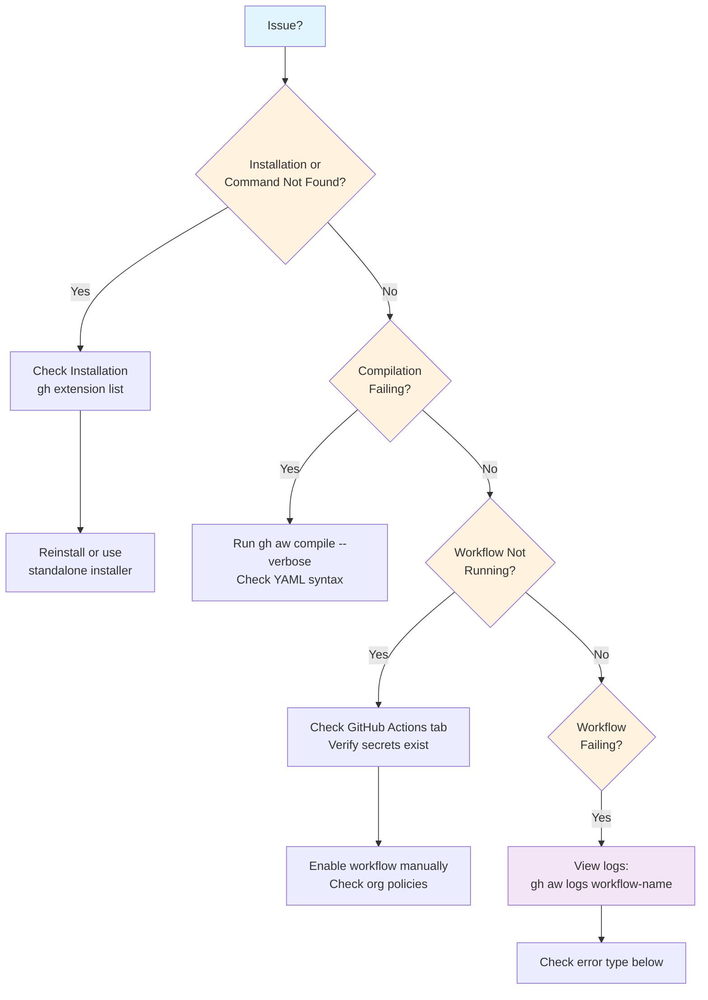
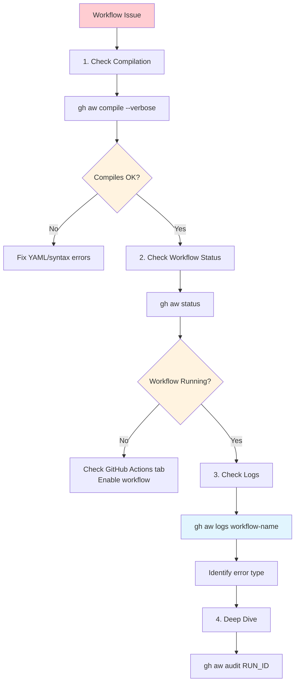

This reference documents frequently encountered issues when working with GitHub Agentic Workflows, organized by workflow stage and component.

## Quick Diagnostic Guide

Use this flowchart to quickly identify and resolve common issues:



## Installation Issues

### Extension Installation Fails

If `gh extension install githubnext/gh-aw` fails with authentication or permission errors (common in Codespaces outside the githubnext organization), use the standalone installer:

```bash wrap
curl -sL https://raw.githubusercontent.com/githubnext/gh-aw/main/install-gh-aw.sh | bash
```

After installation, the binary is installed to `~/.local/share/gh/extensions/gh-aw/gh-aw` and can be used with `gh aw` commands just like the extension installation.

**Diagnostic commands:**
```bash wrap
# Check if extension is installed
gh extension list | grep gh-aw

# Verify GitHub CLI version (requires 2.0.0+)
gh --version

# Check authentication status
gh auth status
```

**Expected output after successful installation:**
```text
$ gh aw --version
gh-aw version 0.x.x
```

### Extension Not Found After Installation

If you installed the extension but `gh aw` command is not found:

1. Verify installation: `gh extension list`
2. If not listed, reinstall: `gh extension install githubnext/gh-aw`
3. If issues persist, use the standalone installer (see above)

### Codespace Authentication Issues

GitHub Codespaces may have limited permissions for installing GitHub CLI extensions. If you encounter authentication errors:

1. Try the standalone installer (recommended for Codespaces)
2. Or grant additional permissions to your Codespace token

## Organization Policy Issues

### Custom Actions Not Allowed in Enterprise Organizations

**Error Message:**

```text
The action githubnext/gh-aw/actions/setup@a933c835b5e2d12ae4dead665a0fdba420a2d421 is not allowed in {ORG} because all actions must be from a repository owned by your enterprise, created by GitHub, or verified in the GitHub Marketplace.
```

**Cause:** Your enterprise organization has policies that restrict which GitHub Actions can be used. By default, workflows compiled by gh-aw use the custom action `githubnext/gh-aw/actions/setup` which may not be allowed by your organization's policy.

**Solution:** Enterprise administrators need to allow the `githubnext/gh-aw` repository in the organization's action policies. There are two approaches:

#### Option 1: Allow Specific Repositories (Recommended)

Add `githubnext/gh-aw` to your organization's allowed actions list:

1. Navigate to your organization's settings: `https://github.com/organizations/YOUR_ORG/settings/actions`
2. Under **Policies**, select **Allow select actions and reusable workflows**
3. In the **Allow specified actions and reusable workflows** section, add:
   ```text
   githubnext/gh-aw@*
   ```
4. Save the changes

For more details, see GitHub's documentation on [managing GitHub Actions permissions for your organization](https://docs.github.com/en/organizations/managing-organization-settings/disabling-or-limiting-github-actions-for-your-organization#allowing-select-actions-and-reusable-workflows-to-run).

#### Option 2: Configure Organization-Wide Policy File

If your enterprise uses a centralized `policies/actions.yml` file, add the gh-aw repository to the allowlist:

```yaml
# policies/actions.yml
allowed_actions:
  - "actions/*"  # GitHub-created actions
  - "githubnext/gh-aw@*"  # Allow gh-aw custom actions
```

Commit this file to your organization's `.github` repository. For more information about policy files, see GitHub's documentation on [creating a default community health file](https://docs.github.com/en/communities/setting-up-your-project-for-healthy-contributions/creating-a-default-community-health-file).

#### Verification

After updating the policy:

1. Wait a few minutes for the policy to propagate
2. Re-run your workflow
3. If issues persist, verify the policy was applied: `https://github.com/organizations/YOUR_ORG/settings/actions`

> [!TIP]
> Security Consideration
> The gh-aw custom actions are open source and can be audited at [github.com/githubnext/gh-aw/tree/main/actions](https://github.com/githubnext/gh-aw/tree/main/actions). The actions are pinned to specific commit SHAs in compiled workflows for security and reproducibility.

## Workflow Compilation Issues

### Workflow Won't Compile

If `gh aw compile` fails, check YAML frontmatter syntax (proper indentation with spaces, colons with spaces after them), verify required fields like `on:` are present, and ensure field types match the schema. Use `gh aw compile --verbose` for detailed error messages.

**Example issue and solution:**

**Problem:**
```yaml
# ❌ Incorrect - missing space after colon
on:push
permissions:
  contents:read
```

**Solution:**
```yaml
# ✅ Correct - proper spacing
on: push
permissions:
  contents: read
```

**Diagnostic steps:**
```bash wrap
# Compile with verbose output to see detailed errors
gh aw compile --verbose

# Validate YAML syntax
cat .github/workflows/my-workflow.md | grep -A 20 "^---$"

# Check for common syntax issues
grep -n ":[^ ]" .github/workflows/my-workflow.md
```

**Common compilation errors:**
- **"frontmatter not properly closed"**: Missing closing `---` delimiter
- **"failed to parse frontmatter"**: Invalid YAML syntax (check indentation)
- **"unknown property"**: Typo in field name (see suggestions in error message)
- **"must be an integer"**: Wrong type (e.g., `"10"` instead of `10`)

### Lock File Not Generated

If `.lock.yml` isn't created, fix compilation errors first (`gh aw compile 2>&1 | grep -i error`) and verify write permissions on `.github/workflows/`.

**Diagnostic commands:**
```bash wrap
# Check for compilation errors
gh aw compile 2>&1 | grep -i error

# Verify directory permissions
ls -la .github/workflows/

# Check if .md file exists
ls -la .github/workflows/*.md
```

**Expected output after successful compilation:**
```text
$ gh aw compile my-workflow
✓ Compiled my-workflow.md → my-workflow.lock.yml
```

### Orphaned Lock Files

Remove old `.lock.yml` files after deleting `.md` files with `gh aw compile --purge`.

## Import and Include Issues

### Import File Not Found

Import paths are relative to repository root. Verify the file exists and is committed (`git status`). Example paths: `.github/workflows/shared/tools.md` (from repo root) or `shared/security-notice.md` (relative to `.github/workflows/`).

### Multiple Agent Files Error

Import only one file from `.github/agents/` per workflow. Use other imports for shared content like tools.

### Circular Import Dependencies

If compilation hangs, check for import files that import each other. Remove circular references by reviewing the import chain.

## Tool Configuration Issues

### GitHub Tools Not Available

Configure GitHub tools using `toolsets:` (recommended) or verify tool names from the [tools reference](/gh-aw/reference/tools/):

```yaml wrap
tools:
  github:
    toolsets: [repos, issues]  # Recommended: use toolsets
```

> [!TIP]
> Migrate to Toolsets
> If you're using the `allowed:` pattern with GitHub tools, consider migrating to `toolsets:` for better maintainability. Tool names may change between Model Context Protocol (MCP) server versions, but toolsets provide a stable API. See [Migration from Allowed to Toolsets](/gh-aw/guides/mcps/#migration-from-allowed-to-toolsets).

### Toolset Missing Expected Tools

If tools you expect are not available after configuring toolsets:

1. **Verify the right toolset**: Check the [toolset contents](/gh-aw/reference/tools/#toolset-contents) to find which toolset contains your tool
2. **Add additional toolsets**: Combine toolsets as needed (e.g., `toolsets: [default, actions]`)
3. **Inspect configuration**: Run `gh aw mcp inspect <workflow>` to see available tools

### MCP Server Connection Failures

Verify the MCP server package is installed and configuration syntax is valid. Ensure required environment variables are set:

```yaml wrap
mcp-servers:
  my-server:
    command: "npx"
    args: ["@myorg/mcp-server"]
    env:
      API_KEY: "${{ secrets.MCP_API_KEY }}"
```

### Playwright Network Access Denied

Add blocked domains to the `allowed_domains` list:

```yaml wrap
tools:
  playwright:
    allowed_domains: ["github.com", "*.github.io"]
```

## Permission Issues

### Write Operations Fail

Grant required permissions in the `permissions:` section or use safe-outputs (recommended):

```yaml wrap
# Direct write
permissions:
  contents: read
  issues: write
  pull-requests: write

# Safe-outputs (recommended)
permissions:
  contents: read
safe-outputs:
  create-issue:
  add-comment:
```

**Example scenario:**

**Problem:** Workflow tries to create an issue but fails with permission error.

**Error in logs:**
```text
Error: Resource not accessible by integration
```

**Solution 1 - Use safe-outputs (recommended):**
```yaml wrap
permissions:
  contents: read  # Read-only by default
safe-outputs:
  create-issue:
    title-prefix: "[bot] "
    labels: [automation]
```

**Solution 2 - Grant write permissions:**
```yaml wrap
permissions:
  contents: read
  issues: write  # Explicitly grant write access
```

**Diagnostic commands:**
```bash wrap
# Check workflow permissions in lock file
grep -A 10 "permissions:" .github/workflows/my-workflow.lock.yml

# View workflow run to see permission errors
gh aw logs my-workflow

# Verify safe-outputs configuration
gh aw mcp inspect my-workflow
```

### Safe Outputs Not Creating Issues

Disable staged mode to create issues (not just preview):

```yaml wrap
safe-outputs:
  staged: false
  create-issue:
    title-prefix: "[bot] "
    labels: [automation]
```

**Example scenario:**

**Problem:** Workflow completes successfully but no issue is created.

**Cause:** Safe-outputs are in staged mode by default, which means they only preview without actually creating issues.

**Check if staged mode is enabled:**
```bash wrap
# Look for "staged: true" in workflow configuration
cat .github/workflows/my-workflow.md | grep -A 5 "safe-outputs"
```

**Expected behavior:**
- **Staged mode (default)**: Preview issue in logs, no actual issue created
- **Non-staged mode**: Issue actually created in repository

**Solution:**
```yaml wrap
# Before (staged mode - default)
safe-outputs:
  create-issue:

# After (non-staged mode - creates real issues)
safe-outputs:
  staged: false
  create-issue:
```

### Token Permission Errors

Add permissions to `GITHUB_TOKEN` or use a custom token:

```yaml wrap
# Increase GITHUB_TOKEN permissions
permissions:
  contents: write
  issues: write

# Or use custom token
safe-outputs:
  github-token: ${{ secrets.CUSTOM_PAT }}
  create-issue:
```

### Project Field Type Errors

If you receive errors like "The field of type repository is currently not supported" when using `update-project`:

**Problem**: GitHub Projects has built-in field types (like REPOSITORY) that are reserved and cannot be created or updated via the API. Using field names that match these reserved types causes errors.

**Solution**: Use different field names to avoid conflicts with GitHub's built-in types:

```yaml wrap
# ❌ Wrong - "repository" conflicts with REPOSITORY built-in type
safe-outputs:
  update-project:
    fields:
      repository: "myorg/myrepo"

# ✅ Correct - Use alternative field names
safe-outputs:
  update-project:
    fields:
      repo: "myorg/myrepo"              # Short form
      source_repository: "myorg/myrepo" # Descriptive
      linked_repo: "myorg/myrepo"       # Clear alternative
```

**Reserved field names to avoid**:
- `repository` (REPOSITORY type - not supported via API)

If a field already exists with an unsupported type, delete it in the GitHub Projects UI and recreate it with a different name.

## Engine-Specific Issues

### Copilot CLI Not Found

The compiled workflow should automatically include CLI installation steps. If missing, verify compilation succeeded.

### Model Not Available

Use the default model or specify an available one:

```yaml wrap
engine: copilot  # Default model

# Or specify model
engine:
  id: copilot
  model: gpt-4
```

## Context Expression Issues

### Unauthorized Expression

Use only [allowed expressions](/gh-aw/reference/templating/) like `github.event.issue.number`, `github.repository`, or `needs.activation.outputs.text`. Expressions like `secrets.GITHUB_TOKEN` or `env.MY_VAR` are not allowed.

### Sanitized Context Empty

`needs.activation.outputs.text` is only populated for issue, PR, or comment events (e.g., `on: issues:`) but not for other triggers like `push:`.

## Build and Test Issues

### Documentation Build Fails

Install dependencies, check for malformed frontmatter or MDX syntax, and fix broken links:

```bash wrap
cd docs
rm -rf node_modules package-lock.json
npm install
npm run build
```

### Tests Failing After Changes

Format code and check for issues before running tests:

```bash wrap
make fmt
make lint
make test-unit
```

## Network and Connectivity Issues

### Firewall Denials for Package Registries

If you're experiencing firewall denials when installing packages from npm, PyPI, Docker Hub, or other registries, add the appropriate ecosystem identifier to your network configuration:

```yaml wrap
network:
  allowed:
    - defaults       # Basic infrastructure
    - python        # For PyPI and pip
    - node          # For npm, yarn, pnpm
    - containers    # For Docker Hub, GHCR
    - go            # For Go modules
```

See the [Network Configuration Guide](/gh-aw/guides/network-configuration/) for complete examples, ecosystem domain lists, and troubleshooting steps.

### URLs Appearing as "(redacted)"

If URLs in workflow outputs or sanitized content show as `(redacted)`, the domain is not in the allowed list. Content sanitization automatically filters URLs from untrusted domains to prevent data exfiltration.

Add the domain to your workflow's `network:` configuration:

```yaml wrap
network:
  allowed:
    - defaults              # Basic infrastructure
    - "api.example.com"     # Add your domain here
```

Default allowed domains include GitHub domains (`github.com`, `githubusercontent.com`, etc.). For more configuration options, see [Network Permissions](/gh-aw/reference/network/).

### Cannot Download Remote Imports

Verify network access and GitHub authentication:

```bash wrap
curl -I https://raw.githubusercontent.com/githubnext/gh-aw/main/README.md
gh auth status
```

### MCP Server Connection Timeout

Use a local MCP server if HTTP connections timeout:

```yaml wrap
mcp-servers:
  my-server:
    command: "node"
    args: ["./server.js"]
```

## Cache Issues

### Cache Not Restoring

Verify cache key patterns match and note that caches expire after 7 days:

```yaml wrap
cache:
  key: deps-${{ hashFiles('package-lock.json') }}
  restore-keys: deps-
```

### Cache Memory Not Persisting

Configure cache properly for the memory MCP server:

```yaml wrap
tools:
  cache-memory:
    key: memory-${{ github.workflow }}-${{ github.run_id }}
```

## Debugging Strategies

Enable verbose compilation (`gh aw compile --verbose`), set `ACTIONS_STEP_DEBUG = true` for debug logging, inspect generated lock files (`cat .github/workflows/my-workflow.lock.yml`), check MCP configuration (`gh aw mcp inspect my-workflow`), and review logs (`gh aw logs my-workflow` or `gh aw audit RUN_ID`).

### Step-by-Step Debugging Process



**1. Compile and validate:**
```bash wrap
# Basic compilation
gh aw compile my-workflow

# Verbose compilation with detailed error messages
gh aw compile my-workflow --verbose

# Compile all workflows and show what changed
gh aw compile
```

**2. Check workflow status:**
```bash wrap
# View all workflows
gh aw status

# Check specific workflow
gh aw status my-workflow

# Watch for updates (useful for scheduled workflows)
gh aw status --watch
```

**3. Examine workflow logs:**
```bash wrap
# Get logs for most recent run
gh aw logs my-workflow

# Get logs for specific run ID
gh aw logs my-workflow --run-id 123456

# Show only failed jobs
gh aw logs my-workflow --failed
```

**4. Deep diagnostic analysis:**
```bash wrap
# Audit specific workflow run
gh aw audit 123456

# Inspect MCP server configuration
gh aw mcp inspect my-workflow

# Check network configuration
cat .github/workflows/my-workflow.lock.yml | grep -A 20 "network"
```

### Common Debugging Scenarios

#### Scenario 1: Workflow Triggers But Fails Immediately

**Symptoms:**
- Workflow shows as "failed" in Actions tab within seconds
- Error mentions authentication or secrets

**Debug steps:**
```bash wrap
# 1. Check if secret is set
gh secret list

# 2. View workflow run
gh aw logs my-workflow

# 3. Look for authentication errors
gh aw logs my-workflow | grep -i "auth\|token\|secret"
```

**Common causes:**
- `COPILOT_GITHUB_TOKEN` secret not set or expired
- Secret has insufficient permissions (needs "Copilot Requests: Read")
- Token expired (check expiration date)

#### Scenario 2: Workflow Runs But Produces No Output

**Symptoms:**
- Workflow completes successfully
- No issues, PRs, or comments created
- Safe-outputs seem to do nothing

**Debug steps:**
```bash wrap
# 1. Check if safe-outputs are in staged mode
cat .github/workflows/my-workflow.md | grep -A 10 "safe-outputs"

# 2. Look for preview output in logs
gh aw logs my-workflow | grep -i "preview\|staged"

# 3. Verify repository features are enabled
# (Issues must be enabled for create-issue to work)
```

**Common causes:**
- Safe-outputs in staged mode (set `staged: false`)
- Repository features disabled (enable Issues, Discussions, etc.)
- Insufficient permissions (check `permissions:` section)

#### Scenario 3: Tool or MCP Server Not Found

**Symptoms:**
- Error mentions missing tools or MCP server connection failure
- "Tool not found" in logs

**Debug steps:**
```bash wrap
# 1. Inspect MCP configuration
gh aw mcp inspect my-workflow

# 2. Check available tools
gh aw mcp list

# 3. Verify tool configuration in workflow
cat .github/workflows/my-workflow.md | grep -A 10 "tools:"
```

**Common causes:**
- Toolset not enabled (add to `toolsets:` array)
- MCP server not configured properly
- Network access blocked (add domains to `network.allowed`)

### Enable Debug Logging in GitHub Actions

Add debug logging to see detailed execution steps:

**In GitHub repository settings:**
1. Go to **Settings** → **Secrets and variables** → **Actions**
2. Add repository variable: `ACTIONS_STEP_DEBUG = true`
3. Re-run workflow to see debug output

**Expected result:**
- Detailed step-by-step execution logs
- Environment variable values
- Internal command outputs

### Inspect Generated Lock Files

The `.lock.yml` file contains the actual workflow that GitHub Actions runs:

```bash wrap
# View entire lock file
cat .github/workflows/my-workflow.lock.yml

# Check specific sections
cat .github/workflows/my-workflow.lock.yml | grep -A 20 "permissions:"
cat .github/workflows/my-workflow.lock.yml | grep -A 20 "env:"

# Find action versions and pinned SHAs
cat .github/workflows/my-workflow.lock.yml | grep "uses:"
```

> [!CAUTION]
> Never edit `.lock.yml` files directly
>
> Lock files are auto-generated. Always edit the `.md` source file and recompile with `gh aw compile`.

## Operational Runbooks

For systematic investigation and resolution of workflow health issues, see:

- [**Workflow Health Monitoring Runbook**](https://github.com/githubnext/gh-aw/blob/main/.github/aw/runbooks/workflow-health.md) - Comprehensive guide for diagnosing missing-tool errors, authentication failures, and configuration issues

The runbook includes step-by-step procedures, case studies from real incidents, and quick reference commands for workflow troubleshooting.

## Getting Help

Review [reference docs](/gh-aw/reference/workflow-structure/), search [existing issues](https://github.com/githubnext/gh-aw/issues), enable debugging with verbose flags, or create a new issue with reproduction steps. See also: [Error Reference](/gh-aw/troubleshooting/errors/) and [Frontmatter Reference](/gh-aw/reference/frontmatter/).
