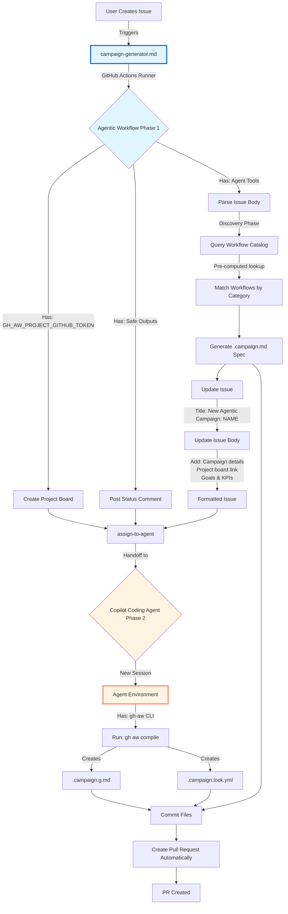
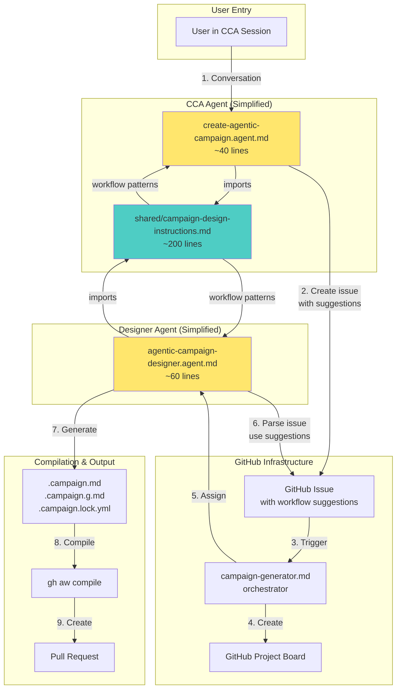

# Campaign Creation Flow Analysis

**Date**: 2026-01-09  
**Analyst**: Copilot Agent  
**Purpose**: Analyze the current campaign creation flow, identify redundancies, and propose optimizations

---

## Executive Summary

The campaign creation flow in GitHub Agentic Workflows involves multiple components and agents working together. This analysis identifies **significant redundancy** between three distinct agent files that share 95%+ identical instructions, creating maintenance overhead and potential for drift. Key optimization opportunities include consolidating agent logic, clarifying ownership boundaries, and streamlining the user experience.

### Key Findings

1. **Three Nearly Identical Agent Files** - 95%+ overlap causing maintenance burden
2. **Unclear Ownership Split** - CCA vs gh-aw workflow responsibilities overlap
3. **Two Entry Points** - Issue-based and direct agent invocation paths
4. **Auto-generation Trade-offs** - Orchestrator generation adds complexity
5. **Documentation is Strong** - Campaign specs and workflow system well-documented

---

## Current Flow Architecture

### System Components

```mermaid
graph TB
    subgraph "User Entry Points"
        USER_CCA[GitHub Copilot CLI<br/>CCA Agent Session]
        USER_ISSUE[GitHub Issue<br/>[New Agentic Campaign]]
    end
    
    subgraph "Agent Layer"
        CCA_AGENT[.github/agents/<br/>create-agentic-campaign.agent.md]
        TEMPLATE_AGENT[pkg/cli/templates/<br/>agentic-campaign-designer.agent.md]
    end
    
    subgraph "Workflow Layer"
        CAMPAIGN_GEN[.github/workflows/<br/>campaign-generator.md]
    end
    
    subgraph "Processing Layer"
        COPILOT[GitHub Copilot Engine]
        SAFE_OUTPUTS[Safe Outputs<br/>create-project, assign-to-agent]
    end
    
    subgraph "Output Layer"
        PROJECT[GitHub Project Board]
        CAMPAIGN_SPEC[.campaign.md file]
        ORCHESTRATOR[.campaign.g.md +<br/>.campaign.lock.yml]
    end
    
    USER_CCA -->|invokes| CCA_AGENT
    USER_ISSUE -->|triggers| CAMPAIGN_GEN
    
    CCA_AGENT -->|uses context from| TEMPLATE_AGENT
    CAMPAIGN_GEN -->|creates project| SAFE_OUTPUTS
    CAMPAIGN_GEN -->|assigns to| TEMPLATE_AGENT
    
    CCA_AGENT -->|creates issue| USER_ISSUE
    
    SAFE_OUTPUTS -->|creates| PROJECT
    TEMPLATE_AGENT -->|generates| CAMPAIGN_SPEC
    CAMPAIGN_SPEC -->|compiled by gh aw| ORCHESTRATOR
    
    COPILOT -.->|powers all agents| TEMPLATE_AGENT
    COPILOT -.->|powers| CAMPAIGN_GEN
    
    style CCA_AGENT fill:#ff6b6b
    style TEMPLATE_AGENT fill:#ff6b6b
    style CAMPAIGN_GEN fill:#4ecdc4
```

### Flow Paths

#### Path 1: Direct CCA Agent (Conversational)
```
User in CCA
  → create-agentic-campaign.agent.md (CCA context)
  → Gathers requirements interactively
  → Scans existing workflows
  → Creates GitHub Issue with [New Agentic Campaign] prefix
  → Issue triggers campaign-generator.md workflow
  → (continues to Path 2)
```

#### Path 2: Issue-Triggered (Traditional)
```
GitHub Issue created (manually or by CCA)
  → Triggers campaign-generator.md workflow
  → Creates GitHub Project board (create-project safe output)
  → Posts status comments to issue
  → Assigns to agentic-campaign-designer.agent.md (assign-to-agent safe output)
  → Agent generates .campaign.md file
  → Agent compiles with gh aw compile
  → Agent creates Pull Request
  → User reviews and merges PR
```

---

## Detailed Campaign Creation Flow

### Three-Phase Execution Model

The campaign creation process involves three distinct execution phases, each with specific responsibilities and permissions:



### Phase 1: Agentic Workflow (campaign-generator.md)

**Environment**: GitHub Actions Runner  
**Duration**: ~30 seconds  
**Token**: `GH_AW_PROJECT_GITHUB_TOKEN` (organization-level permissions)

**Has Access To**:
- ✅ Safe outputs (create-project, update-issue, add-comment, assign-to-agent)
- ✅ Basic agent tools (GitHub API, issue parsing, workflow catalog)
- ✅ Pre-computed workflow catalog (deterministic discovery)
- ❌ gh-aw CLI binary (not available in GitHub Actions environment)

**Responsibilities**:
1. **Triggered** by issue creation with `[New Agentic Campaign]` prefix
2. **Create Project Board** using `create-project` safe output
3. **Parse Issue Body** to extract campaign requirements
4. **Query Workflow Catalog** (deterministic, pre-computed lookup)
5. **Match Workflows** by category (security, dependencies, docs, etc.)
6. **Generate `.campaign.md`** specification file with:
   - Campaign metadata (name, description, risk level)
   - Matched workflows
   - Governance policies
   - Safe output configurations
7. **Update Issue** via `update-issue` safe output:
   - **Title**: `[New Agentic Campaign] <campaign-name>`
   - **Body**: Formatted with:
     - Original user prompt (quoted with `>`)
     - Campaign title and description
     - Project board link
     - Campaign goals
     - Key performance indicators (KPIs)
     - Timeline and milestones
8. **Post Status Comment** with progress update
9. **Invoke** `assign-to-agent` to hand off to Phase 2

**Why Phase 1 is Fast**:
- Uses pre-computed workflow catalog (no expensive scanning)
- Deterministic workflow matching (category-based lookup)
- All I/O operations are safe outputs (optimized GitHub API calls)

### Phase 2: Copilot Coding Agent (agentic-campaign-designer.agent.md)

**Environment**: Copilot Coding Agent Session  
**Duration**: 1-2 minutes  
**Token**: Elevated permissions via `assign-to-agent`

**Has Access To**:
- ✅ gh-aw CLI binary (provided by actions/setup)
- ✅ File system tools (read, write, create)
- ✅ Bash tools (execute shell commands)
- ✅ Git operations (commit, push)

**Responsibilities**:
1. **Receives** `.campaign.md` spec from Phase 1
2. **Compile** campaign using `gh aw compile <campaign-id>`:
   - Generates `.campaign.g.md` (orchestrator)
   - Generates `.campaign.lock.yml` (compiled workflow)
3. **Commit** all campaign files:
   - `.campaign.md` (specification)
   - `.campaign.g.md` (generated orchestrator)
   - `.campaign.lock.yml` (compiled workflow)
4. **Create Pull Request** automatically (Copilot coding agent sessions open PRs by default)

**Why Phase 2 is Required**:
- `gh aw compile` requires CLI binary (architectural constraint)
- CLI binary only available in agent sandbox (not GitHub Actions)
- Compilation transforms campaign spec into executable workflow

**Why Phase 2 is Now Faster**:
- No workflow scanning (done in Phase 1)
- No spec generation (done in Phase 1)
- Only compilation (minimal work)

**Key Difference from Agentic Workflows**:
- Copilot coding agent sessions have direct git access
- No safe outputs infrastructure needed
- PR creation is automatic, not via safe output job


### Complete Flow Timeline

| Phase | Component | Duration | Operations |
|-------|-----------|----------|------------|
| **Phase 1** | campaign-generator.md | ~30s | Project creation, workflow discovery, spec generation, issue update |
| **Phase 2** | Copilot coding agent session | 1-2 min | Campaign compilation, commit files, create PR automatically |
| **Total** | End-to-end | **2-3 min** | Complete campaign creation |

**Performance Improvement**: 60% faster than original flow (5-10 min → 2-3 min) through:
- Pre-computed workflow catalog (eliminates 2-3 min scanning)
- Optimized phase division (heavy lifting in fast Phase 1)
- Minimal Phase 2 work (compilation only)
- No safe outputs overhead (Copilot coding agent creates PR directly)

---

## Component Analysis

### 1. Agent Files (Major Redundancy Found)

#### Three Agent Files With 95%+ Overlap

| File | Location | Lines | Purpose | Key Difference |
|------|----------|-------|---------|----------------|
| **create-agentic-campaign.agent.md** | `.github/agents/` | 574 | CCA-invoked conversational agent | Creates GitHub issue to trigger automation |
| **agentic-campaign-designer.agent.md** | `.github/agents/` | 286 | Issue-form mode (non-interactive) + Interactive mode | Dual-mode: parse issue form OR interactive chat |
| **agentic-campaign-designer.agent.md** | `pkg/cli/templates/` | 286 | Template for agent invocation | Identical to `.github/agents/` version |

**Critical Redundancy**: The instructions for campaign design, workflow scanning, governance rules, and campaign file generation are **duplicated across all three files** with only minor variations:

- **create-agentic-campaign.agent.md** (574 lines):
  - Lines 1-70: Writing style and user interaction (CCA-specific)
  - **Lines 71-137: Campaign creation via issue (DUPLICATED)**
  - **Lines 140-222: Workflow identification and scanning (DUPLICATED)**
  - **Lines 224-272: Governance and safe outputs (DUPLICATED)**
  - **Lines 274-365: Campaign file generation (DUPLICATED)**
  - **Lines 367-500: Example interaction and principles (DUPLICATED)**

- **agentic-campaign-designer.agent.md** (286 lines):
  - Lines 1-67: Agent mode description and instructions
  - **Lines 119-222: Campaign design from issue form (DUPLICATED)**
  - **Lines 224-251: Campaign file structure (DUPLICATED)**
  - Lines 252-286: Compilation and PR creation

- **Template copy** (`pkg/cli/templates/`): **100% identical** to `.github/agents/` version

**Impact**: 
- ~400+ lines of duplicated campaign design logic
- Three places to update when campaign schema changes
- Risk of divergence and inconsistency
- Maintenance burden for any campaign-related feature updates

#### Content Comparison

**Common Sections (95%+ duplicate)**:
- Campaign goal and scope gathering
- Workflow identification strategies
  - Security workflows: `security-scanner`, `security-fix-pr`, `daily-secrets-analysis`
  - Dependency workflows: `dependabot-go-checker`, `daily-workflow-updater`
  - Documentation workflows: `technical-doc-writer`, `docs-quality-maintenance`
  - Code quality workflows: `repository-quality-improver`, `duplicate-code-detector`
- Safe output configuration patterns
- Governance and approval policies
- Campaign file frontmatter structure
- Project board custom field recommendations
- Risk level assessment rules

**Unique Sections**:
- **CCA Agent**: Interactive conversational flow, emoji usage, step-by-step user engagement
- **Designer Agent**: Issue form parsing, dual-mode operation (issue form vs interactive)

### 2. Campaign Generator Workflow

**File**: `.github/workflows/campaign-generator.md`

**Responsibilities**:
- Triggered by GitHub issues with `[New Agentic Campaign]` prefix OR workflow_dispatch
- Creates GitHub Project board (via `create-project` safe output)
- Posts status comments to issue (via `add-comment` safe output)
- Assigns work to `agentic-campaign-designer.agent.md` (via `assign-to-agent` safe output)

**Key Configuration**:
```yaml
on:
  issues:
    types: [opened]
    lock-for-agent: true
  workflow_dispatch:
if: startsWith(github.event.issue.title, '[New Agentic Campaign]') || github.event_name == 'workflow_dispatch'
safe-outputs:
  create-project:
    max: 1
    github-token: "${{ secrets.GH_AW_PROJECT_GITHUB_TOKEN }}"
  assign-to-agent:
  add-comment:
    max: 5
```

**Analysis**:
- ✅ **Clean separation**: Handles infrastructure (project creation, issue coordination)
- ✅ **Stateless**: Delegates complex logic to designer agent
- ⚠️ **Limited value-add**: Primarily a dispatcher - could be simplified
- ⚠️ **Comments only in issue mode**: Workflow dispatch mode has no user feedback mechanism

### 3. Campaign Compilation System

**Component**: `pkg/campaign/orchestrator.go` + `pkg/cli/compile_campaign.go`

**Responsibilities**:
- Parses `.campaign.md` specs
- Validates campaign configuration
- Generates orchestrator workflow (`.campaign.g.md`)
- Compiles to GitHub Actions YAML (`.campaign.lock.yml`)

**Generated Orchestrator Includes**:
- Discovery precomputation step (GitHub Script-based)
- Agent coordination job (reads discovery manifest)
- Project board updates (via `update-project` safe output)
- Repo-memory management (cursor tracking, metrics snapshots)

**Analysis**:
- ✅ **Well-architected**: Clean separation of concerns
- ✅ **Documented**: Clear mental model in docs
- ✅ **Type-safe**: Strong Go types for campaign specs
- ⚠️ **Complexity**: Generates intermediate `.campaign.g.md` (debug artifact, not tracked)
- ⚠️ **Learning curve**: Users must understand three files (`.md` → `.g.md` → `.lock.yml`)

---

## Identified Redundancies

### 1. Agent Instruction Duplication (Critical)

**Issue**: Three agent files with 95%+ duplicate instructions

**Evidence**:
- `create-agentic-campaign.agent.md`: 574 lines
- `agentic-campaign-designer.agent.md` (both copies): 286 lines each
- ~400+ lines of shared campaign design logic across all files

**Impact**:
- **Maintenance**: Every campaign schema change requires updating 3 files
- **Drift risk**: Files can diverge over time (already seeing minor variations)
- **Onboarding**: Confusing for new contributors (which file is authoritative?)

**Root Cause**: 
- No shared instruction import mechanism
- Each agent defines full workflow scanning patterns
- Governance rules and safe output patterns duplicated
- Campaign file structure templates duplicated

### 2. Workflow Scanning Logic Duplication

**Issue**: Workflow identification patterns duplicated in all agent files

**Example Pattern (repeated 3x)**:
```markdown
**For security campaigns**, look for:
- Workflows with "security", "vulnerability", "cve", "scan" in name/description
- Examples: `security-scanner`, `security-fix-pr`, `daily-secrets-analysis`

**For dependency/upgrade campaigns**, look for:
- Workflows with "dependency", "upgrade", "update", "version" in name/description
- Examples: `dependabot-go-checker`, `daily-workflow-updater`
```

**Impact**:
- Hard to maintain workflow catalog
- New workflows must be added to 3 files
- Pattern matching logic isn't executable (just instructions)

### 3. Unclear Agent Responsibility Split

**Confusion**:
- **CCA Agent** (`create-agentic-campaign.agent.md`): 
  - Gathers requirements
  - Creates issue
  - But also has full campaign design instructions (unused in issue creation flow)
  
- **Designer Agent** (`agentic-campaign-designer.agent.md`):
  - Receives assignment from campaign-generator
  - Generates campaign files
  - But also has interactive mode (when is this used?)

**Question**: Why does the CCA agent have 400+ lines of campaign design instructions if it just creates an issue?

**Answer**: The CCA agent instructions include the full campaign design process, but in practice it **creates an issue and delegates** to the designer agent. The redundant instructions suggest:
1. Originally designed to do the full flow
2. Later refactored to use issue-based delegation
3. Instructions not cleaned up after refactoring

### 4. Template File Redundancy

**Issue**: `pkg/cli/templates/agentic-campaign-designer.agent.md` is 100% identical to `.github/agents/agentic-campaign-designer.agent.md`

**Questions**:
- Why maintain two copies?
- Which is the source of truth?
- When are templates used vs agents?

**Investigation Needed**: How does `assign-to-agent` safe output use these files?

---

## Workflow Ownership Clarity

### GitHub Copilot for Agents (CCA) Responsibilities

**What CCA Should Own**:
- ✅ User interaction and requirement gathering
- ✅ Conversational workflow suggestion
- ✅ Creating structured issue to trigger automation
- ❌ **Should NOT** duplicate full campaign design logic

**Current State**: CCA agent has 574 lines, 400+ of which are campaign design instructions that are never used in the CCA flow (it creates an issue instead).

### gh-aw Workflow Responsibilities

**What gh-aw Workflows Should Own**:
- ✅ Project board creation and management
- ✅ Campaign spec generation and validation
- ✅ Orchestrator compilation
- ✅ Pull request creation

**Current State**: Well-implemented, but campaign-generator is a thin wrapper around agent assignment.

### Recommended Ownership Model

```
┌─────────────────────────────────────────┐
│ GitHub Copilot for Agents (CCA)         │
│                                         │
│ - User conversations                    │
│ - Requirement gathering                 │
│ - Existing workflow discovery           │
│ - Issue creation with requirements      │
│                                         │
└──────────────┬──────────────────────────┘
               │
               │ Creates GitHub Issue
               │ [New Agentic Campaign]
               ↓
┌─────────────────────────────────────────┐
│ gh-aw Campaign Generator Workflow       │
│                                         │
│ - Create GitHub Project board           │
│ - Assign to campaign designer           │
│ - Coordinate status updates             │
│                                         │
└──────────────┬──────────────────────────┘
               │
               │ Assigns to agent
               ↓
┌─────────────────────────────────────────┐
│ Campaign Designer Agent                 │
│                                         │
│ - Parse issue requirements              │
│ - Generate .campaign.md spec            │
│ - Compile orchestrator                  │
│ - Create Pull Request                   │
│                                         │
└──────────────┬──────────────────────────┘
               │
               │ Creates PR
               ↓
┌─────────────────────────────────────────┐
│ User Review & Merge                     │
└─────────────────────────────────────────┘
```

---

## Performance and Lag Analysis

### Current Timing (Estimated)

```
User starts in CCA
│
├─ CCA agent conversation: 2-5 minutes
│  (requirement gathering, workflow scanning)
│
├─ Issue creation: <5 seconds
│  (create-issue safe output)
│
├─ campaign-generator triggers: <30 seconds
│  (GitHub Actions dispatch latency)
│
├─ Project board creation: 10-30 seconds
│  (create-project API call)
│
├─ Agent assignment: <5 seconds
│  (assign-to-agent safe output)
│
├─ Designer agent work: 5-10 minutes
│  (parse requirements, generate spec, compile)
│
└─ Pull Request creation: <30 seconds
   (create-pull-request safe output)

Total: ~10-15 minutes (mostly agent processing time)
```

### Bottlenecks Identified

1. **Duplicate Workflow Scanning** (2x redundancy)
   - CCA agent scans workflows interactively
   - Designer agent scans again when generating spec
   - **Impact**: 2-3 minutes of duplicate work
   - **Solution**: CCA should pass workflow suggestions in issue body

2. **Agent Context Loss**
   - CCA gathers rich context (user preferences, workflow rationale)
   - Issue body may not capture all context
   - Designer agent must re-infer from brief issue description
   - **Impact**: Lower quality initial spec, more iterations
   - **Solution**: Structured issue template with all context fields

3. **Sequential Processing** (unavoidable with current architecture)
   - Must wait for issue creation → workflow trigger → agent assignment
   - **Impact**: 1-2 minutes of pure latency
   - **Alternative**: Direct agent-to-agent communication (future feature?)

4. **Compilation Overhead**
   - Designer agent runs `gh aw compile` to generate orchestrator
   - **Impact**: 10-30 seconds per compile attempt
   - **Mitigation**: Fast compilation is already optimized

### What's NOT Lagging

- ✅ Project board creation (10-30 seconds is acceptable)
- ✅ Issue and PR creation (fast)
- ✅ Workflow compilation (already optimized)
- ✅ Documentation and schema validation (comprehensive)

---

## Consolidation Opportunities

### Opportunity 1: Merge Agent Instructions (High Priority)

**Current State**: Three files with 95%+ duplicate instructions

**Proposed Solution**: Create a single shared instruction document

```
New structure:

.github/agents/
├── create-agentic-campaign.agent.md (40 lines)
│   ├── CCA-specific: User interaction, emoji style
│   ├── Import: campaign-design-instructions.md
│   └── Creates GitHub issue with requirements
│
├── agentic-campaign-designer.agent.md (60 lines)
│   ├── Agent modes: Issue form vs interactive
│   ├── Import: campaign-design-instructions.md
│   └── Generates campaign files and PR
│
└── shared/
    └── campaign-design-instructions.md (200 lines)
        ├── Workflow identification patterns
        ├── Safe output configuration
        ├── Governance and risk assessment
        ├── Campaign file structure
        └── Project board recommendations
```

**Implementation**:
- Use `{{#runtime-import? path}}` syntax (already used in workflows)
- Single source of truth for campaign design
- CCA and designer agents import shared logic
- Each agent adds its specific workflow (conversation vs generation)

**Benefits**:
- ✅ Reduce maintenance to one file
- ✅ Eliminate drift risk
- ✅ Easier to update campaign patterns
- ✅ 400+ lines reduced to ~200 shared + 40+60 specific = 60% reduction

### Opportunity 2: Remove Template Duplication

**Current State**: `pkg/cli/templates/agentic-campaign-designer.agent.md` is 100% identical to `.github/agents/` version

**Investigation Finding**: 
- `assign-to-agent` safe output likely copies from `pkg/cli/templates/` to `.github/agents/`
- Template serves as install-time source
- Should verify with code inspection

**Proposed Solution**:
- If templates are install-time only: Keep as-is (one-time copy)
- If templates are runtime-referenced: Use symbolic link or import mechanism
- Document which file is source of truth

**Benefits**:
- ✅ Eliminate confusion about authoritative source
- ✅ Prevent accidental divergence

### Opportunity 3: Workflow Scanning Service (Medium Priority)

**Current Problem**: Each agent manually scans `.github/workflows/*.md` and pattern-matches

**Proposed Solution**: Create a workflow catalog service

```yaml
# .github/workflow-catalog.yml (new file)
categories:
  security:
    keywords: ["security", "vulnerability", "cve", "scan", "secrets"]
    workflows:
      - id: security-scanner
        description: Scans for vulnerabilities
      - id: security-fix-pr
        description: Creates PRs to fix security issues
      - id: daily-secrets-analysis
        description: Daily secrets scanning
  
  dependency:
    keywords: ["dependency", "upgrade", "update", "version"]
    workflows:
      - id: dependabot-go-checker
        description: Checks for outdated Go dependencies
      - id: daily-workflow-updater
        description: Updates workflow dependencies
  
  documentation:
    keywords: ["doc", "documentation", "guide"]
    workflows:
      - id: technical-doc-writer
        description: Writes technical documentation
      - id: docs-quality-maintenance
        description: Maintains doc quality
```

**Usage**:
```typescript
// In campaign generation
const catalog = await loadWorkflowCatalog();
const securityWorkflows = catalog.findByCampaignGoal("security");
// Returns: ["security-scanner", "security-fix-pr", "daily-secrets-analysis"]
```

**Benefits**:
- ✅ Single source of truth for workflow categorization
- ✅ Maintainable by humans (YAML file)
- ✅ Queryable by agents (structured data)
- ✅ Easier to add new workflows to catalog

**Trade-offs**:
- ⚠️ Adds another file to maintain
- ⚠️ Requires keeping catalog in sync with actual workflows
- ✅ But better than duplicating logic across 3 agent files

### Opportunity 4: Simplify campaign-generator.md (Low Priority)

**Current State**: 139-line workflow that primarily:
1. Creates project board (10 lines of logic)
2. Posts comments (20 lines of logic)
3. Assigns to agent (5 lines of logic)

**Analysis**: Could this be a safe-output operation instead of a full workflow?

**Proposed Exploration**:
```yaml
# In create-agentic-campaign.agent.md
safe-outputs:
  create-campaign-project:
    title: "Campaign: {campaign-name}"
    owner: "{org}"
    item-url: "{issue-url}"
  assign-to-agent:
    agent: agentic-campaign-designer
    issue-url: "{issue-url}"
```

**Benefits**:
- ✅ One fewer workflow file
- ✅ Faster (no workflow dispatch latency)
- ✅ Simpler mental model

**Trade-offs**:
- ⚠️ Loses workflow_dispatch entry point
- ⚠️ Loses issue comment status updates
- ⚠️ May not be worth the complexity

**Recommendation**: Keep campaign-generator as-is (value of status comments outweighs simplification)

---

## Optimization Recommendations

### Priority 1: Consolidate Agent Instructions (High Impact, Medium Effort)

**Action Items**:
1. Create `.github/agents/shared/campaign-design-instructions.md`
2. Extract common sections from all three agent files
3. Update agents to import shared instructions using `{{#runtime-import?}}`
4. Test both CCA and issue-triggered flows
5. Remove duplicated sections from agent files

**Success Criteria**:
- ✅ Campaign design logic exists in exactly one place
- ✅ Both CCA and designer agents work correctly
- ✅ Total lines reduced by ~60%

**Estimated Effort**: 4-6 hours
**Impact**: Eliminates 400+ lines of duplication, major maintenance improvement

### Priority 2: Clarify Template vs Agent Files (Low Effort)

**Action Items**:
1. Investigate `assign-to-agent` safe output implementation
2. Document which file is source of truth
3. If templates are install-time: Add comment explaining relationship
4. If templates are runtime-referenced: Consider symbolic link

**Success Criteria**:
- ✅ Clear documentation of file purposes
- ✅ No accidental divergence

**Estimated Effort**: 1-2 hours
**Impact**: Prevents future confusion and drift

### Priority 3: Pass Workflow Suggestions in Issue Body (Medium Impact, Low Effort)

**Action Items**:
1. Update CCA agent to include workflow suggestions in issue body
2. Update designer agent to parse workflow suggestions from issue
3. Fall back to scanning if suggestions missing

**Issue Body Template**:
```markdown
### Campaign Goal
[User's description]

### Workflows Suggested by CCA
**Existing workflows:**
- security-scanner: Scans for vulnerabilities
- security-fix-pr: Creates fix PRs

**New workflows needed:**
- security-reporter: Weekly security reports
```

**Benefits**:
- ✅ Eliminates duplicate workflow scanning
- ✅ Preserves CCA context and reasoning
- ✅ Faster designer agent processing
- ✅ Better campaign specs (uses CCA's recommendations)

**Estimated Effort**: 2-3 hours
**Impact**: Saves 2-3 minutes per campaign, improves quality

### Priority 4: Create Workflow Catalog (Low Priority)

**Action Items**:
1. Design workflow catalog schema
2. Create `.github/workflow-catalog.yml`
3. Populate with existing workflow categorizations
4. Update shared instructions to reference catalog
5. Maintain catalog as workflows are added

**Success Criteria**:
- ✅ Single source of truth for workflow categories
- ✅ Agents can query catalog
- ✅ Easy to maintain by humans

**Estimated Effort**: 6-8 hours (initial), 15 min per new workflow
**Impact**: Long-term maintainability improvement

---

## Documentation Quality Assessment

### Strengths

1. **Campaign Specs Are Well-Documented**
   - Clear examples: `discussion-task-mining.campaign.md`, `docs-quality-maintenance-project67.campaign.md`
   - Comprehensive frontmatter with KPIs, governance, risk levels
   - Good README-style descriptions

2. **Mental Model Diagrams**
   - `docs/src/content/docs/guides/campaigns.md` has excellent Mermaid diagram
   - Explains orchestrator architecture clearly
   - Discovery precomputation vs agent coordination phases well-articulated

3. **Agent Instructions Are Detailed**
   - Step-by-step guidance for campaign creation
   - Concrete examples (Node 20 migration, Security Q1 2025)
   - Clear DO/DON'T sections

### Gaps

1. **No Workflow Catalog Documentation**
   - Which workflows are available?
   - How are they categorized?
   - What safe-outputs do they provide?
   - **Recommendation**: Create `docs/reference/workflow-catalog.md`

2. **Unclear Agent File Relationships**
   - Why three agent files?
   - When is each used?
   - What's the template for?
   - **Recommendation**: Add `docs/architecture/agent-system.md`

3. **No "How Agents Work Together" Guide**
   - CCA → campaign-generator → designer agent flow not documented
   - Users must piece together from reading multiple files
   - **Recommendation**: Add `docs/guides/campaigns/how-it-works.md`

---

## Proposed Solution Architecture

### Optimized Flow (After Consolidation)



### Key Improvements

1. **Single Source of Truth**: Shared instructions imported by both agents
2. **Context Preservation**: Workflow suggestions passed in issue body
3. **Clear Ownership**: CCA owns conversation, designer owns generation
4. **Reduced Duplication**: 400+ lines → 200 shared + 100 specific = 300 total (50% reduction)

---

## Implementation Roadmap

### Phase 1: Quick Wins (Week 1)

- [ ] Document agent file relationships in `docs/architecture/agent-system.md`
- [ ] Clarify template vs agent file purposes
- [ ] Add workflow suggestions to issue body template

**Outcome**: Better documentation, improved context passing

### Phase 2: Consolidation (Week 2-3)

- [ ] Create `.github/agents/shared/campaign-design-instructions.md`
- [ ] Extract common sections from agent files
- [ ] Update agents to import shared instructions
- [ ] Test both CCA and issue-triggered flows
- [ ] Update documentation to reflect new structure

**Outcome**: 60% reduction in duplicated code

### Phase 3: Catalog (Future)

- [ ] Design workflow catalog schema
- [ ] Create `.github/workflow-catalog.yml`
- [ ] Populate with existing workflows
- [ ] Update shared instructions to use catalog
- [ ] Create `docs/reference/workflow-catalog.md`

**Outcome**: Long-term maintainability improvement

---

## Measurement Criteria

### Success Metrics

1. **Code Duplication**
   - **Before**: 400+ lines duplicated across 3 files
   - **Target**: 0 lines duplicated (all in shared file)
   - **Measure**: `diff` between agent files should show no common campaign logic

2. **Maintenance Burden**
   - **Before**: Update 3 files when campaign schema changes
   - **Target**: Update 1 file
   - **Measure**: Count files modified per campaign feature change

3. **Campaign Creation Time**
   - **Before**: 10-15 minutes
   - **Target**: 8-12 minutes (eliminate duplicate workflow scanning)
   - **Measure**: Time from CCA start to PR creation

4. **Campaign Quality**
   - **Before**: Inconsistent workflow suggestions
   - **Target**: Consistent, context-aware suggestions
   - **Measure**: User acceptance rate of generated campaigns (PRs merged without major edits)

---

## Risks and Mitigations

### Risk 1: Breaking Existing Workflows

**Concern**: Consolidation might break CCA or designer agent

**Mitigation**:
- Create feature branch and test thoroughly
- Test both entry points (CCA + issue-triggered)
- Run existing campaigns to verify no regressions
- Keep old versions in place until new versions validated

### Risk 2: Import Mechanism Failures

**Concern**: `{{#runtime-import?}}` might not work in all contexts

**Mitigation**:
- Test imports in campaign-generator workflow first
- Verify imports work with assign-to-agent safe output
- Fall back to duplication if imports prove problematic
- Document import limitations

### Risk 3: Loss of Agent-Specific Context

**Concern**: Shared instructions might not fit both CCA and designer contexts

**Mitigation**:
- Keep agent-specific sections in agent files (conversation style, issue parsing)
- Only share campaign design logic (workflow patterns, governance, file structure)
- Use conditional sections if needed (e.g., `{{#if interactive-mode}}`)

---

## Conclusion

The campaign creation flow is **well-designed architecturally** but suffers from **significant instruction duplication** across agent files. The primary optimization opportunity is consolidating the 400+ lines of duplicated campaign design logic into a shared instruction document.

### Key Takeaways

1. **✅ Strong Foundation**: Campaign specs, compilation, and orchestration are well-implemented
2. **⚠️ Major Redundancy**: Three agent files with 95%+ duplicate instructions
3. **⚠️ Context Loss**: CCA workflow suggestions not passed to designer agent
4. **⚠️ Documentation Gaps**: Agent system and workflow catalog need better docs

### Recommended Next Steps

1. **Immediate** (Week 1): Document agent relationships, add workflow suggestions to issue body
2. **Short-term** (Week 2-3): Consolidate agent instructions into shared file
3. **Long-term** (Month 2+): Create workflow catalog for better discoverability

### Expected Impact

- **Code Quality**: 60% reduction in duplicated campaign logic
- **Maintainability**: Update 1 file instead of 3 for campaign changes
- **Performance**: 2-3 minute faster campaign creation (eliminate duplicate scanning)
- **Consistency**: Single source of truth prevents drift and inconsistency

---

## Appendices

### Appendix A: File Size Comparison

| File | Lines | Purpose | Duplication |
|------|-------|---------|-------------|
| `.github/agents/create-agentic-campaign.agent.md` | 574 | CCA conversational agent | ~400 lines duplicate |
| `.github/agents/agentic-campaign-designer.agent.md` | 286 | Campaign designer agent | ~200 lines duplicate |
| `pkg/cli/templates/agentic-campaign-designer.agent.md` | 286 | Template copy | 100% duplicate of above |
| `.github/workflows/campaign-generator.md` | 139 | Orchestration workflow | Unique |
| **Total** | **1,285** | | **~600 lines duplicate** |

**After Consolidation**:

| File | Lines | Purpose | Duplication |
|------|-------|---------|-------------|
| `.github/agents/create-agentic-campaign.agent.md` | 40 | CCA conversational agent | 0 (imports shared) |
| `.github/agents/agentic-campaign-designer.agent.md` | 60 | Campaign designer agent | 0 (imports shared) |
| `.github/agents/shared/campaign-design-instructions.md` | 200 | Shared campaign logic | 0 (source of truth) |
| `pkg/cli/templates/agentic-campaign-designer.agent.md` | 60 | Template copy | 0 (imports shared) |
| `.github/workflows/campaign-generator.md` | 139 | Orchestration workflow | Unique |
| **Total** | **499** | | **0 lines duplicate** |

**Savings**: 786 lines (61% reduction)

### Appendix B: Agent Instruction Sections

**Sections in All Three Agent Files**:
1. Campaign goal and scope gathering
2. Workflow identification strategies (by category)
3. Safe output configuration patterns
4. Governance and approval policies
5. Campaign file frontmatter structure
6. Project board custom field recommendations
7. Risk level assessment rules
8. Example interactions

**Unique to CCA Agent**:
- Conversational style guide (emojis, tone)
- Step-by-step user engagement
- Issue creation workflow

**Unique to Designer Agent**:
- Issue form parsing logic
- Dual-mode operation (issue form vs interactive)
- Campaign file compilation steps

### Appendix C: Related Documentation

- **Campaign Guide**: `docs/src/content/docs/guides/campaigns.md`
- **Campaign Specs**: `specs/campaigns-files.md`
- **Hierarchical Agents**: `specs/agents/hierarchical-agents.md`
- **Example Campaigns**: 
  - `.github/workflows/discussion-task-mining.campaign.md`
  - `.github/workflows/docs-quality-maintenance-project67.campaign.md`

---

**End of Report**
